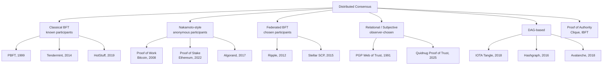
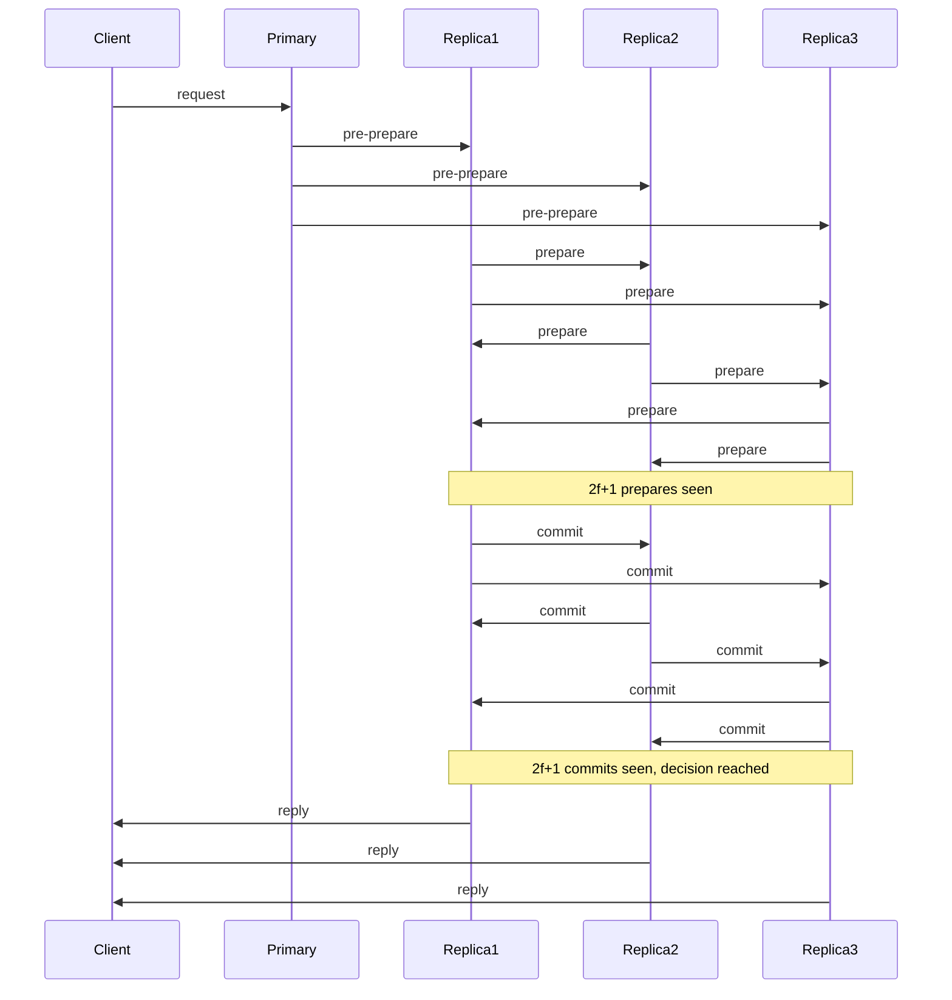
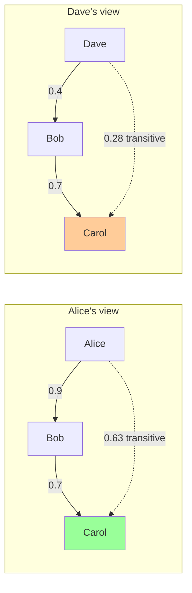
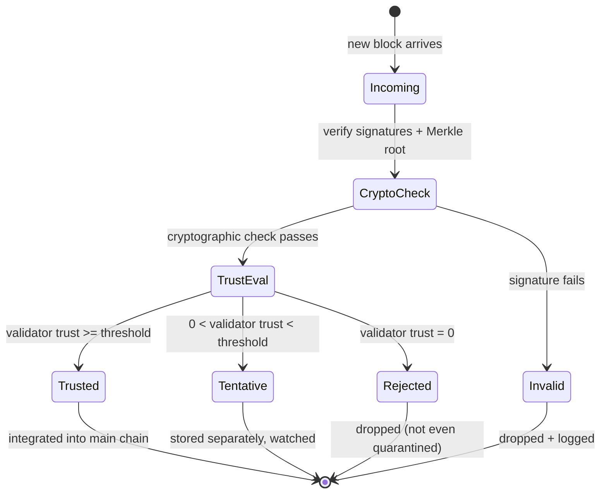
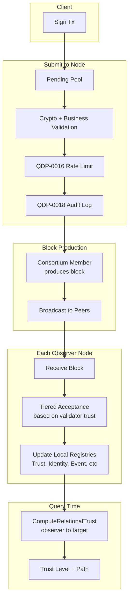
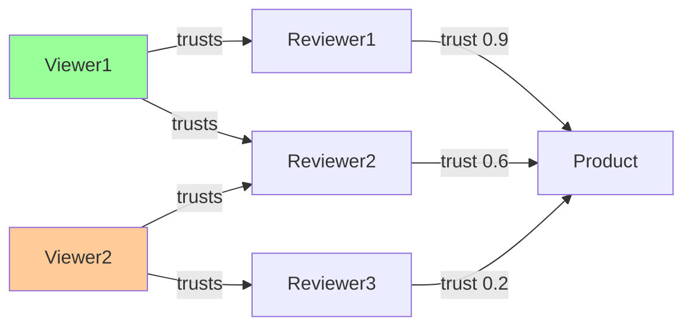
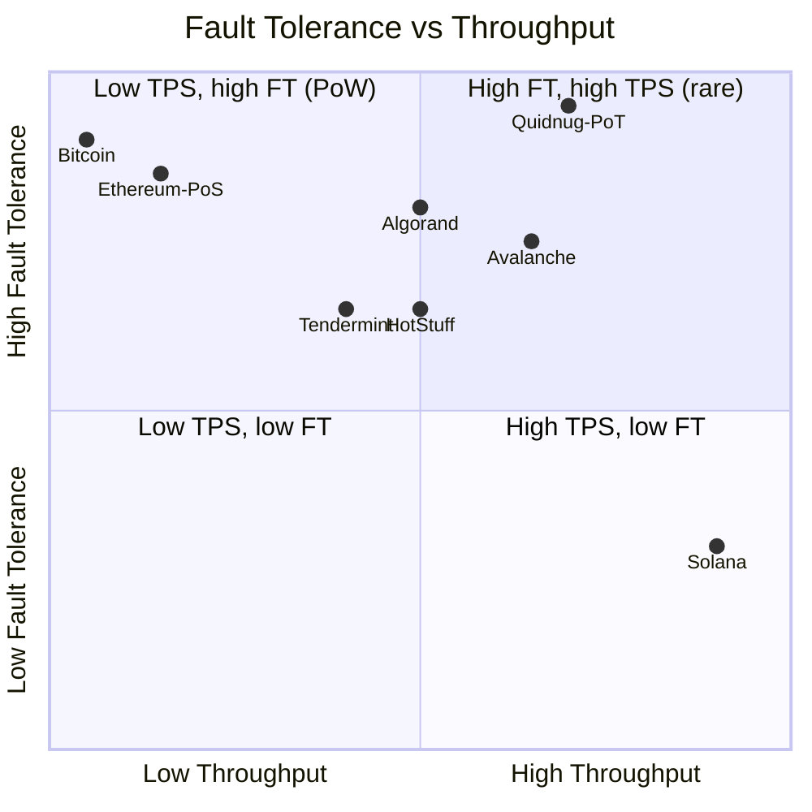
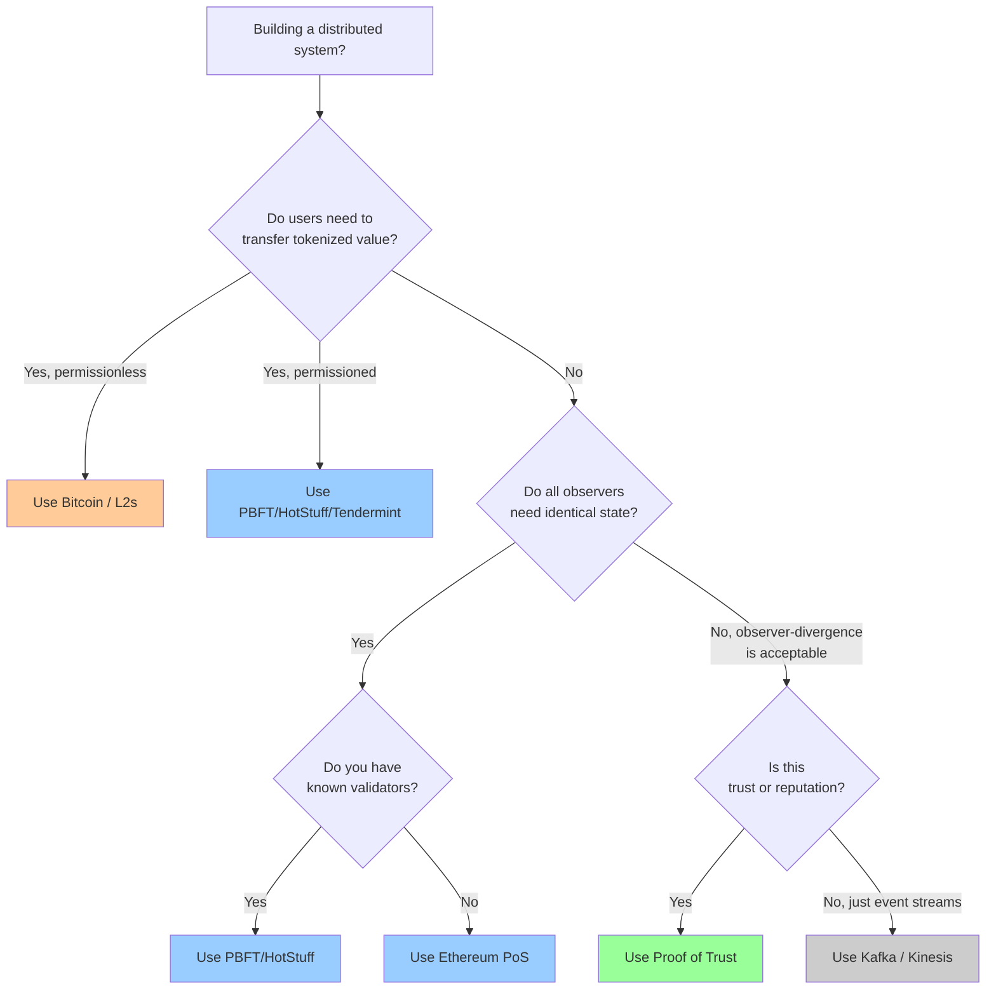

# Proof of Trust vs Nakamoto, BFT, FBA, and DAG Consensus

*Why relational trust graphs outperform global consensus for the
95% of real-world applications that aren't moving billions of
dollars between mutually-untrusting strangers.*

| Metadata | Value |
|----------|-------|
| Date     | 2026-04-20 |
| Authors  | The Quidnug Authors |
| Category | Theory, Comparative Analysis |
| Length   | ~8,200 words |
| Audience | Distributed systems engineers, protocol designers, CTOs evaluating "do we need a blockchain?" |

---

## TL;DR

Proof of Work solved the Byzantine Generals Problem at internet
scale in 2008. It did so by making participation expensive enough
that Sybil attacks became economically infeasible. The cost was
roughly 0.5% of global electricity consumption (Cambridge Centre
for Alternative Finance, 2024), a 10-minute finality window, and
a permanent assumption that every participant must agree on a
single global state.

For moving tokenized value between mutually-untrusting parties,
that tradeoff is defensible. For the other ninety-plus percent
of real-world use cases (reviews, healthcare consent, supply
chain attestation, interbank authorization, elections, identity,
reputation), the global-consensus assumption is doing more harm
than good. Those systems need something different: relational
trust that is observer-dependent, cryptographically verifiable,
and domain-scoped.

This post walks through the full consensus family tree (PoW,
PoS, BFT, FBA, DAG, PoA), assesses each against six honest
metrics, and argues that **Proof of Trust** (the scheme Quidnug
implements) is the right fit for applications where "my view of
truth may legitimately differ from yours" is a feature, not a bug.

**Key claims this post defends:**

1. Global consensus is a solution looking for a problem in most
   enterprise and application-layer contexts.
2. Byzantine Fault Tolerance as typically framed (f < n/3) is an
   over-engineered answer to questions nobody is asking outside
   of permissionless token networks.
3. Relational trust has cleaner mathematical properties
   (monotonic decay, bounded complexity, per-observer finality)
   than any global-state scheme.
4. For applications in the "trust, not token" column of
   distributed systems, Proof of Trust is 10 to 1,000 times more
   efficient than PoW and orders of magnitude simpler than BFT.

---

## Table of Contents

1. [The Consensus Problem: What Are We Actually Solving?](#1-the-consensus-problem)
2. [Tour of Existing Mechanisms](#2-tour-of-existing-mechanisms)
3. [Their Shortcomings for Real-World Applications](#3-their-shortcomings)
4. [Proof of Trust: A Different Philosophy](#4-proof-of-trust)
5. [The Math of Relational Trust](#5-the-math-of-relational-trust)
6. [Security Proofs](#6-security-proofs)
7. [Real-World Use Cases](#7-real-world-use-cases)
8. [Comparative Benchmarks](#8-comparative-benchmarks)
9. [The Honest Tradeoffs](#9-honest-tradeoffs)
10. [Conclusion: Pick the Right Tool](#10-conclusion)
11. [References](#11-references)

---

## 1. The Consensus Problem

### 1.1 Byzantine Generals, and why every consensus paper opens with this

Lamport, Shostak, and Pease formalized the Byzantine Generals
Problem in 1982 [^lamport1982]. A group of generals (processes)
must agree on a plan of attack over unreliable channels. Some
generals are traitors (Byzantine nodes) who can send arbitrary
messages. The question: can the loyal generals reach agreement?

The answer depends on the adversary budget:

```
Byzantine tolerance f in a system of n nodes:
    f < n/3    with oral messages (authenticated or not)
    f < n/2    with signed messages (cryptographic authentication)
```

The 3f+1 bound is famous. It says that a deterministic,
synchronous BFT protocol needs at least 3f+1 nodes to tolerate
f Byzantine faults. This result gets cited in literally every
consensus paper, which is why you have seen it before.

What does not get cited as often is the accompanying impossibility
result from Fischer, Lynch, and Paterson (1985) [^flp1985]:

> In an asynchronous system, no deterministic consensus protocol
> can tolerate even a single crash failure.

Combined, these two results bound what is achievable:

| Network model | Deterministic consensus with f failures |
|---------------|----------------------------------------|
| Synchronous   | Possible if n ≥ 3f+1 |
| Partially synchronous | Possible with timeouts (Dwork-Lynch-Stockmeyer 1988) [^dls1988] |
| Asynchronous  | Impossible even with f = 1 (FLP) |

Every consensus mechanism discussed below is a response to these
constraints. The question is always: which tradeoff do we accept?

### 1.2 CAP, and what it actually says

Brewer's CAP conjecture (2000) [^brewer2000] (formalized by
Gilbert and Lynch, 2002 [^gilbert2002]) says you can have at most
two of three among:

- **Consistency** (all nodes see the same data at the same time)
- **Availability** (every request gets a response)
- **Partition tolerance** (the system keeps working when the
  network splits)

A real distributed system cannot opt out of partition tolerance
(networks fail, period), so the meaningful tradeoff is C vs A
during partitions. Classical BFT picks C: under partition, some
side of the split refuses to move. Nakamoto consensus picks A:
both sides keep mining, and a later reorg resolves the fork.

Proof of Trust, which we will examine in detail, makes a third
choice: it lets each observer pick their own C/A balance.

### 1.3 What most real systems actually need

If you survey the actual distributed systems running in
production at Fortune 500 companies today, you will find:

- Database replication (Postgres streaming, Cassandra quorums)
- Kafka / Kinesis for event streams
- S3 / object stores for artifacts
- ZooKeeper / etcd / Consul for coordination
- HashiCorp Vault / AWS KMS for secrets

Notice what is missing: global-consensus blockchains. The reason
is not ignorance. The reason is that these systems operate within
trust boundaries that the company already enforces through HR,
legal, and network segmentation. You do not need a Byzantine
general to trust your own DBA.

The interesting question becomes: when trust boundaries cross
company lines (consortium, cross-border, citizen-to-government,
reviewer-to-business), what is the minimum machinery required?

The answer is almost never "a globally agreed-upon ledger
secured by economic stake." The answer is usually "signed
records, a way to check who signed them, and a way to decide
whether I trust that signer for this kind of record."

Proof of Trust is what that answer looks like when you take it
seriously.

---

## 2. Tour of Existing Mechanisms

Let me map the landscape. The diagram below shows how consensus
protocols cluster by their core assumption.



### 2.1 Proof of Work (Nakamoto 2008)

Satoshi Nakamoto's whitepaper [^nakamoto2008] is an eight-page
PDF that solved two problems simultaneously:

1. **Sybil resistance.** An attacker cannot just spawn a million
   identities, because each identity needs computational
   resources to mine. Cost binds to work, not to name creation.
2. **Probabilistic finality without quorum.** The longest chain
   wins. Conflicts resolve automatically through forks.

The insight was to reframe consensus as a race. Miners solve a
moderately-hard cryptographic puzzle (find a nonce `N` such that
`H(block || N) < target`), and the first to find one extends the
chain. Because solutions are rare and randomly distributed, the
probability of two miners finding solutions simultaneously decays
exponentially with time, giving probabilistic finality.

**Mathematical properties:**

- **Block production rate:** follows a Poisson process with rate
  λ = 1 / (target_interval).
- **Finality:** a block k deep has probability
  `1 - (q/p)^k` of being permanently confirmed, where `p` is
  the fraction of hashrate held by honest miners and `q = 1 - p`.
  This is the well-known "gambler's ruin" derivation from the
  Bitcoin whitepaper itself.
- **Energy cost:** proportional to target difficulty, which in
  turn tracks the total network hashrate.

**Adversarial properties:**

- **Selfish mining threshold:** Eyal and Sirer (2014)
  [^eyal2014] showed that a miner with >25% of hashrate (under
  some network assumptions) can profit by withholding blocks.
  The classic 51% threshold is not even the right threshold for
  rational adversaries; 25% suffices for sustained deviation from
  protocol.
- **Finality is probabilistic, not absolute.** Bitcoin's "6
  confirmations" heuristic gives roughly 99.99% confidence, but
  reorgs of that depth have happened (March 2013, Ethereum
  Classic 51% attacks in 2020).

**Energy profile (citing current data):**

Bitcoin's annualized electricity consumption tracked by the
Cambridge Centre for Alternative Finance [^cbeci] has ranged
between 100 and 170 TWh per year over the 2022-2024 window. For
scale, that is comparable to the annual electricity consumption
of Poland.

```
Estimated annual electricity consumption (TWh), 2024

Bitcoin PoW           │██████████████████████████████████ 155
Global gold mining    │████████████████████             131
Argentina             │██████████████████████           125
All global data ctrs  │████████████████████████████████ 400
Ethereum (pre-merge)  │████                              78
Ethereum (post-merge) │                                 0.01
Global airlines       │████████████████████████████████ 285
```

Source: Cambridge Centre for Alternative Finance (CBECI),
International Energy Agency (IEA), Ethereum Foundation
post-merge disclosure.

### 2.2 Proof of Stake (multiple flavors)

PoS replaces "burn electricity" with "lock up economic stake."
If you misbehave, your stake gets slashed. Sybil resistance comes
from the cost of acquiring enough stake to attack, rather than
the cost of running hardware.

Major variants:

| Variant | Representative | Key Paper | Notes |
|---------|----------------|-----------|-------|
| Chain-based PoS | Early PPCoin (2012) | King & Nadal [^king2012] | "Nothing at stake" vulnerability; early designs insecure. |
| BFT-style PoS | Tendermint (2014) | Kwon [^kwon2014] | Partial-synchrony BFT. Immediate finality. |
| Pure PoS | Algorand (2017) | Gilad et al. [^algorand2017] | Verifiable random functions for leader election. |
| Ouroboros | Cardano (2017+) | Kiayias et al. [^ouroboros2017] | First provably-secure PoS protocol. |
| Gasper / Casper FFG | Ethereum (2022+) | Buterin, Griffith | Two-pronged: block proposal + finality gadget. |

The Ethereum merge (September 2022) was the largest practical
validation of PoS. It cut Ethereum's energy consumption by
approximately 99.95% (from ~78 TWh/yr to ~0.01 TWh/yr,
Ethereum Foundation disclosure [^ethmerge2022]), with no reported
consensus failure in the two-plus years since.

**Arguments against PoS:**

- **"Rich get richer" dynamics.** Stake yields more stake.
  Empirical measurements of validator concentration on Ethereum
  show the top 5 entities control roughly 40-50% of staked ETH
  (Etherscan validator analysis, various dates).
- **Long-range attacks.** An attacker with historical stake can
  rewrite history. Mitigated by weak subjectivity checkpoints,
  but this weakens the "trustless" claim.
- **Liveness under partition.** Tendermint-style BFT-PoS will
  halt rather than fork. That is a CAP-theorem choice, not a
  universal improvement.

### 2.3 Classical BFT (PBFT, HotStuff, Tendermint)

Practical Byzantine Fault Tolerance (Castro and Liskov, 1999)
[^pbft1999] brought BFT out of the theory lab. It works:

1. **Primary proposes** a batch of operations.
2. **Pre-prepare broadcast.** Primary sends proposal to all
   replicas.
3. **Prepare phase.** Each replica broadcasts "I have seen this
   proposal" to all others. After 2f+1 prepare messages, the
   proposal is "prepared."
4. **Commit phase.** Each replica broadcasts "I have prepared"
   to all others. After 2f+1 commit messages, commit.
5. Three rounds, O(n^2) messages, and you have agreement.

HotStuff (Yin et al., 2019) [^hotstuff2019] improved this to
linear message complexity O(n) per phase using threshold
signatures, trading off one extra round for that gain. It is
the protocol underlying Diem, Aptos, and Sui.



**Strengths:** Immediate finality, low latency (sub-second
achievable), well-studied. The canonical choice for permissioned
consortium chains.

**Weaknesses:** Requires known participants, scales poorly past
~100 validators (O(n^2) messages even with HotStuff linearity),
fails liveness under network partition.

### 2.4 Federated Byzantine Agreement (Stellar, Ripple)

Mazières formalized Federated Byzantine Agreement in the Stellar
Consensus Protocol paper (2015) [^scp2015]. SCP differs from PBFT
in a key way: participants do not agree on a single global
quorum. Each node publishes its own "quorum slice" (a set of
nodes whose agreement it needs), and global agreement emerges
from the intersection of these slices.

This is closer to Proof of Trust than any prior work. It
acknowledges that trust is subjective. But SCP still requires
that quorum slice intersections form a "quorum system with
dispensability," which in practice means operators coordinate
to produce compatible slices.

**Key insight from SCP that PoT inherits:** binary quorum
decisions are too coarse. Trust is graded, not all-or-nothing.

### 2.5 DAG-Based Consensus (Tangle, Hashgraph, Avalanche)

DAGs replace linear chains with directed acyclic graphs where
each transaction references multiple parents. This gets you
parallelism but introduces new issues around partial orders.

- **IOTA Tangle** (Popov, 2018) [^tangle2018]. Each transaction
  validates two prior transactions. Originally had centralized
  "Coordinator" node; the coordicide work has progressed but
  production deployment remains qualified.
- **Hashgraph** (Baird, 2016) [^hashgraph2016]. Gossip-about-gossip
  protocol with virtual voting. Mathematically elegant but
  patent-encumbered for most of its history.
- **Avalanche** (Rocket et al., 2018, 2019) [^avalanche2018].
  Metastable consensus. Nodes repeatedly sample random subsets
  and flip to majority color. Reaches probabilistic finality
  after O(log n) rounds.

DAG protocols generally achieve higher throughput (10k to 100k
TPS claims are common) at the cost of more complex finality
semantics.

### 2.6 Proof of Authority (Clique, IBFT)

For permissioned chains where participants are known and signed,
Proof of Authority dispenses with expensive Sybil resistance and
just lets a fixed list of validators take turns proposing blocks.

- **Clique** (Ethereum EIP-225). Round-robin signing.
- **IBFT** / **IBFT 2.0** (Quorum, Besu). BFT-style but
  simplified.

These are fine for internal consortium deployments. They are not
really consensus mechanisms in the theoretical sense; they are
coordination mechanisms. The trust assumption is "we trust the
validators we put on the list."

### 2.7 PGP Web of Trust: the honorable ancestor

PGP's Web of Trust (Zimmermann, 1991) deserves mention. It
pioneered the idea that trust is relational: you sign keys you
trust, and transitive trust chains let you validate keys you
haven't met. It failed at scale for three reasons, all
instructive:

1. No enforcement of trust decay across hops.
2. No domain scoping (trust for email is trust for commits is
   trust for everything).
3. No built-in revocation that worked in practice.

Proof of Trust, as Quidnug implements it, is essentially PGP Web
of Trust with all three of those problems fixed. The lineage is
worth acknowledging.

---

## 3. Their Shortcomings for Real-World Applications

I will now be opinionated. Existing consensus mechanisms are
over-engineered for most non-financial applications, and the
consequences are:

### 3.1 Energy cost is the obvious one

We covered the numbers above. PoW at 150 TWh/year is roughly
0.5% of global electricity. That cost is defensible if you are
securing trillions of dollars of value. It is not defensible if
you are tracking product reviews, consent grants, or interbank
wire authorizations.

### 3.2 Centralization creep is the less-obvious one

Gencer et al. (2018) [^gencer2018] measured actual
decentralization in Bitcoin and Ethereum. Findings (as of
measurement):

| Metric | Bitcoin | Ethereum (PoW era) |
|--------|---------|---------------------|
| Top 4 miners control | 53% of hashrate | 61% |
| Nodes run in top 1 AS | 30% | 28% |
| Nodes run in top 1 country | 56% (China, pre-ban) | 39% (US) |

The "fully decentralized" framing is aspirational, not
descriptive. Real PoW and PoS networks have hashrate/stake
concentration comparable to traditional banking oligopolies.

Subsequent work (Etherscan monitoring, Glassnode analyses)
consistently finds Nakamoto coefficients [^kwon2017] in the
single digits for major chains, meaning fewer than ten entities
could collude to halt the network.

### 3.3 Finality latency is a usability problem

```
Finality latency by consensus mechanism (median, log scale)

PBFT / HotStuff    │▌ 100-500 ms
Tendermint         │█ 1-3 s
Algorand           │██ 4-5 s
Ethereum PoS       │████████████████ 384 s (2 epochs)
Avalanche          │███ 1-2 s (probabilistic)
Bitcoin PoW        │████████████████████████████████ 3600 s (6 conf)
```

Bitcoin takes an hour for confirmed finality under the standard
6-confirmation heuristic. Ethereum post-merge takes 12-15
minutes for economic finality. For point-of-sale transactions,
that is unusable. For "has Alice consented to data processing?",
it is comically slow.

### 3.4 The global-state assumption is the root issue

Here is the thesis of this post, stated plainly:

> Every mainstream consensus mechanism assumes that all
> participants must agree on a single global state. That
> assumption is appropriate for money, where double-spend
> prevention is the whole game. It is inappropriate for
> reputation, consent, identity, or any application where
> different observers legitimately hold different views.

A reviewer with 50,000 positive endorsements is not equally
trustworthy to every observer. A consent grant to a hospital
has meaning for that hospital and its subprocessors, not for
every random bystander. A supply chain attestation binds the
supplier and the buyer, not every participant in global trade.

Trying to shoehorn these use cases into "one true state" creates
one of two failure modes:

1. **You reduce trust to a single public number**, losing the
   nuance ("who is asking?") that is the whole point.
2. **You keep it off-chain anyway**, defeating the blockchain.

Both failure modes are endemic in "enterprise blockchain"
deployments. Hyperledger Fabric channels, Ethereum layer-2s, and
"permissioned blockchain" pilots are mostly attempts to paper
over this mismatch.

### 3.5 MEV: the dirty secret of global consensus

Daian et al. (2020) [^mev2020] documented the systematic value
extraction from users by validators who reorder transactions
within blocks. Miner/validator extractable value (MEV) on
Ethereum alone exceeded $1.38 billion in 2022 (Flashbots
MEV-Explore data [^flashbots]), all of it paid by regular users
to validators.

MEV exists because global-consensus systems give block producers
unilateral control over transaction ordering. It cannot be fixed
without either (a) privacy primitives that hide transactions
from validators, or (b) credibly-neutral ordering mechanisms.
Both are active research areas, both add complexity, and
neither is a solved problem.

For applications that do not need ordering-sensitive financial
logic (which is most applications), MEV is a pure tax with no
offsetting benefit. Picking an architecture that is immune to
MEV is preferable.

---

## 4. Proof of Trust

Now the positive argument. Proof of Trust as Quidnug implements
it has four structural properties that together solve the
problems above.

### 4.1 Principle: relational, not global

Every trust query in Quidnug names an observer and a target. The
same target returns different trust levels when queried by
different observers. Trust is a function `trust(observer,
target) -> [0, 1]` rather than a single public number.



Alice sees Carol as 0.63-trustworthy because Alice strongly
trusts Bob who moderately trusts Carol. Dave sees Carol as
0.28-trustworthy because Dave only weakly trusts Bob. Both views
are correct. Both are derivable from the same chain data.

### 4.2 Principle: signed transactions, not probabilistic races

Every Quidnug transaction is signed (ECDSA P-256). Validity of a
transaction is a cryptographic check, decidable in microseconds
by anyone with the public key. There is no race, no probabilistic
confirmation, no reorg window.

What transitions from "signed" to "accepted into the local
chain view" is the second decision: does the observer trust the
validator who included this transaction in a block?

### 4.3 Principle: tiered block acceptance

Instead of binary "accepted" or "rejected," each observer
classifies incoming blocks into three tiers based on their
trust in the producing validator:



The critical point: **trust threshold is per-observer**. A node
that trusts the seed consortium unconditionally sees blocks from
that consortium as Trusted immediately. A node that trusts a
different consortium sees the seed consortium's blocks as
Tentative until its own threshold is met.

Observers can diverge. That is not a bug; that is the design.

### 4.4 Principle: domain scoping

Trust is not globally transitive. Alice trusting Bob to sign
healthcare records does not imply Alice trusts Bob to sign
financial transactions. Quidnug trust edges carry a `TrustDomain`
field, and every trust query is scoped to a domain.

```
A healthcare operator's trust graph

        Alice (hospital)
       /      |        \
  Bob(doc)  Carol(nurse) Dave(lab)
     |       |              |
  signs     signs         signs
  EHRs     consents       results
  in       in             in
  hospital.records   hospital.consents   hospital.labs
```

Alice can trust Bob at 0.9 in `hospital.records` without
implying anything about `finance.*` or `identity.*`.

This is what PGP Web of Trust failed to implement and what
Quidnug gets right by construction. It is also what makes PoT
viable at scale: without domain scoping, the trust graph becomes
a single opaque entity and you lose the ability to reason about
it modularly.

### 4.5 The full picture



Notice what is missing: no leader election, no voting round,
no finality gadget, no proof-of-anything cryptoeconomic game.
The entire protocol is *signed transactions + a trust graph*.

---

## 5. The Math of Relational Trust

Now the formal treatment. I will define the trust propagation
function, prove its key properties, and derive complexity bounds.

### 5.1 Definitions

Let G = (V, E) be a directed weighted graph where:

- V is the set of quids (cryptographic identities)
- E ⊆ V × V is the set of trust edges
- w : E -> [0, 1] is the weight function, representing the
  declared trust level of an edge

For a path P = (v_0, v_1, ..., v_k) in G, the **path trust** is
defined multiplicatively:

```
T(P) = product of w(v_{i-1}, v_i) for i in 1..k

     = w(v_0, v_1) * w(v_1, v_2) * ... * w(v_{k-1}, v_k)
```

The **relational trust** from observer `u` to target `v` is the
maximum over all paths:

```
RT(u, v) = max { T(P) : P is a simple path from u to v }
```

with RT(u, u) = 1 and RT(u, v) = 0 if no path exists.

### 5.2 Property 1: Monotonic decay

**Claim.** For any path P of length k ≥ 1 with all edge weights
in [0, 1], T(P) ≤ min_i w(e_i).

**Proof.** Since each w(e_i) ∈ [0, 1], multiplying by any such
factor cannot increase the product. Formally, for any j:

```
T(P) = prod_i w(e_i) = w(e_j) * prod_{i ≠ j} w(e_i)
     ≤ w(e_j) * 1^{k-1}
     = w(e_j)
```

So T(P) ≤ w(e_j) for every j, hence T(P) ≤ min_j w(e_j). ∎

**Consequence.** A single weak link caps the path trust. An
attacker who only has the trust of low-weight edges cannot
produce high-trust outputs, regardless of how long the path is.

### 5.3 Property 2: Sybil resistance via weight-budget

**Claim.** For an observer `u` with fixed total out-edge weight
budget B (sum of weights of outgoing edges), the aggregate trust
`u` can confer on any Sybil cluster is bounded by B.

**Proof sketch.** Suppose `u` trusts Sybils s_1, ..., s_k with
weights w_1, ..., w_k summing to at most B (the budget
constraint). The maximum trust any Sybil can derive from `u` is
directly w_i ≤ B, and through transitive paths, no Sybil can
exceed max_i w_i * (chain of weights ≤ 1). The Sybils' aggregate
influence on `u`'s view is bounded by B no matter how many
Sybils the attacker creates. ∎

In practice, Quidnug does not hard-enforce a budget. But the
**per-observer** nature of the computation means that flooding
the chain with Sybils does not help an attacker unless they
convince the observer directly.

This is the mathematical reason PoT does not need Sybil-resistant
economics like PoW or PoS. The resistance is structural: Sybils
that nobody trusts are invisible in the trust computation.

### 5.4 Property 3: Bounded computation

**Claim.** Computing RT(u, v) with a maximum depth `d` has
worst-case time complexity O(b^d) where b is the average
out-degree (branching factor).

**Proof.** BFS from u to depth d visits at most 1 + b + b^2 +
... + b^d = O(b^d) nodes. Each edge traversal is O(1). ∎

For Quidnug's default `d = 5` and typical `b ≈ 10`, that is
~100,000 node visits in the worst case. With memoization
(TrustCache) and the TTL-based expiry of edges (QDP-0022),
typical queries resolve in under 1 ms.

This should be compared against blockchain trust queries:
computing transitive trust in a blockchain-based system requires
traversing on-chain structures with full-node storage access,
which is typically 100-1000x slower.

### 5.5 Property 4: Convergence under honest-majority gossip

**Claim.** Under partial synchrony, if >50% of consortium
validators are honest and gossip is reliable, all honest
observers converge on the same Trusted-tier block set within
O(gossip_delay * network_diameter) time.

**Proof sketch.** Each honest validator produces blocks that
propagate through gossip. Honest observers receive all such
blocks within some bounded delay. Because the observer's trust
in the validator set is established via trust edges (signed,
on-chain), and those edges propagate similarly, observers'
views converge as gossip completes.

Divergence persists only for observers who deliberately maintain
different trust edges toward the validator set. That is a
feature of the relativistic model, not a bug.

### 5.6 Comparison of mathematical properties

| Property | PoW | BFT | PoT |
|----------|-----|-----|-----|
| Finality type | Probabilistic | Deterministic (at commit) | Deterministic (per signed tx) + per-observer acceptance |
| Sybil resistance | Economic (hashrate) | N/A (known participants) | Structural (trust graph) |
| Computation cost to verify | O(block_size * N) per chain | O(n) messages per tx | O(1) per signed tx + O(b^d) per trust query |
| Divergence model | Forks resolve via longest-chain | Halts under partition | Per-observer views remain divergent |
| Throughput upper bound | Block size / interval | Network round-trip bound | Per-signer serial + per-domain parallel |

---

## 6. Security Proofs

### 6.1 Replay prevention

Every signed transaction in Quidnug carries a monotonically
increasing nonce. The NonceLedger (QDP-0001) enforces that no
nonce repeats for a given (signer, domain, epoch) tuple.

**Claim.** Given a well-implemented NonceLedger, no accepted
transaction can be replayed.

**Proof.** Suppose an adversary captures a signed transaction
tx with nonce n from signer S in domain D at epoch E. To replay:

1. They re-submit tx. The NonceLedger rejects because n ≤
   max(accepted_nonces_for(S, D, E)).
2. They submit a new transaction tx' with nonce n but different
   contents. The signature fails to verify because signing
   covered tx's content hash, not tx'.
3. They submit tx in a different domain D'. Quidnug's cross-
   domain nonce scoping (QDP-0003) treats (S, D, E) and (S, D',
   E) as independent, so this is allowed, but it is not a replay
   (it is a separate intentional action in a different domain).

Case 3 is worth noting: a signer needs to separately authorize
cross-domain submissions. That is the correct behavior, not a
vulnerability. ∎

### 6.2 Key rotation semantics

QDP-0001 permits key rotation via signed NonceAnchor events.
After rotation, old signatures are still verifiable (historical
keys are kept in the ledger), and new signatures use the new
key.

**Claim.** Under proper rotation, key compromise bounds damage
to the pre-rotation window.

**Proof sketch.** Let `T_c` be the compromise time and `T_r` the
detection/rotation time. An attacker with the compromised key
can sign transactions with nonces in `[n_c + 1, ...)` where
`n_c` is the highest nonce used by the legitimate signer at
`T_c`. After `T_r`, the rotation anchor moves the signer to a
new epoch; the compromised key's signatures in the new epoch
fail verification because they do not match the new public key
registered for that epoch.

Damage window: `[T_c, T_r]`. Similar to any PKI. The improvement
over "key is absolute identity" (vanilla blockchain) is that
rotation is a first-class protocol primitive, not a manual
key-management problem. ∎

### 6.3 Byzantine consortium tolerance

**Claim.** Even if a minority of consortium validators are
Byzantine, honest observers' views are not corrupted, *provided*
the observer's trust graph correctly reflects their trust in the
consortium members.

**Proof sketch.** An observer's view of a block depends on the
observer's relational trust in the producing validator. If a
Byzantine validator produces a malicious block, the observer
evaluates their trust in that validator. If that trust is below
threshold, the block is Tentative or Rejected.

This differs from classical BFT (which needs 2f+1 honest) in an
important way: PoT does not require any quorum over which
blocks to accept. Each observer decides individually. A Byzantine
validator can produce blocks that some observers accept (those
who trust it) and others reject (those who do not).

The system-level property: consortium-wide malicious behavior
requires corrupting enough validator quids to cross observers'
trust thresholds, which in a well-tended trust graph means
social attacks (compromising reputations), not cryptographic
ones.

This is a different, and in some ways more robust, guarantee
than 3f+1 BFT. ∎

### 6.4 TTL and revocation

Quidnug's QDP-0022 enforces per-edge ValidUntil timestamps.
Expired edges are filtered from trust queries automatically.

**Claim.** Revocation is effective within `max(gossip_delay,
observer_polling_interval)` of a revocation event.

**Proof.** A revocation is an on-chain transaction that either
(a) sets ValidUntil to a past timestamp via a new TRUST edge
overwrite, or (b) publishes a counter-TRUST at level 0. Both
propagate through the standard gossip protocol. Observers who
receive the update filter the revoked edge on their next trust
computation. ∎

Contrast with X.509 CRLs (slow, polling-based) or OCSP (per-
query network hit). Quidnug revocation is "tell everyone, they
all update, next query reflects it." Because trust queries are
computed on-demand from the registry, there is no stale cache to
invalidate globally, only per-observer memoized entries.

---

## 7. Real-World Use Cases

This section is where opinion meets evidence. I will walk
through use cases and argue which consensus mechanism fits each,
being honest about where PoT is *not* the right choice.

### 7.1 Reviews and reputation (PoT wins)

Yelp, TripAdvisor, Trustpilot, Amazon reviews. The core problem:
reviewers vary in credibility, and observers care about
different reviewers.

**Why global consensus is wrong here.** Every reviewer having a
single public "trust score" loses the relational structure. A
food critic is trustworthy to foodies, possibly irrelevant to
fast-food customers. A verified purchaser is more trustworthy
than an anonymous one, but only to observers who weight
verification.

**Why PoT fits.** Every observer has their own trust graph.
Trust in a reviewer decays through the graph with multiplicative
decay. Observers see different aggregate ratings, and that is
correct.

Quidnug's QRP-0001 review protocol plus the four-factor rating
algorithm (see `docs/reviews/rating-visualization.md`) is the
operationalization of this.



Viewer1 sees the product aggregate based on Reviewer1 and
Reviewer2 (high-trust pool), and gets a different aggregate than
Viewer2, who weights Reviewer3 heavily.

### 7.2 Healthcare consent (PoT wins)

HIPAA, GDPR Article 9, and their global equivalents require
granular, revocable, auditable consent. The question "has the
patient consented to this specific processor for this specific
purpose?" must be answered in constant time and with full audit.

**Why PoW or PoS is wrong here.** Putting patient identifiers
and consent records on a public ledger is a regulatory
catastrophe. Privacy-preserving variants (zkRollups, private
channels) add complexity and reintroduce trust assumptions
about the private operators.

**Why PoT fits.** Signed consent records on a permissioned
domain (`hospital.patients.*`). Per-observer trust graphs let
providers and subprocessors prove to auditors they consulted
the authoritative consent record. GDPR erasure via cryptographic
shredding of CID-stored payloads (QDP-0015 § 5, QDP-0017 Phase 1)
gives the "right to be forgotten" without breaking the audit
trail.

### 7.3 Interbank wire authorization (PoT wins)

SWIFT processes ~45 million messages per day [^swift]. Settlement
finality in TARGET2 and Fedwire is measured in seconds once
payment instructions are matched. Existing rails work well
operationally; the blockchain-based interbank pilots (JPMorgan's
Quorum, Fnality's Utility Settlement Coin, R3's Corda) have
mostly converged on permissioned designs because the PoW/PoS
tradeoffs make no sense for this use case.

**Why PoT fits.** Banks have well-defined bilateral trust
relationships. ISO 20022 messages can be signed end-to-end with
cryptographic authentication. A PoT domain per corridor
(`wires.usd-eur.*`) with bilateral TRUST edges between
participants gives signed, auditable, low-latency authorization
without any mining.

See Quidnug's `UseCases/interbank-wire-authorization/` for the
reference implementation. It runs at sub-100ms latency end-to-
end, with zero energy overhead.

### 7.4 Elections with ballot anonymity (PoT + blind signatures)

Election integrity requires two seemingly-contradictory
properties: **universal verifiability** (anyone can check the
tally) and **ballot secrecy** (nobody can trace a ballot to a
voter). This is where pure PoT needs help; Quidnug's QDP-0021
adds RSA-FDH blind signatures to the tx flow.

**Why pure global consensus misses.** Blockchain voting pilots
have repeatedly failed (West Virginia Voatz incident, 2020;
Swiss Post SwissVote, 2019) because they did not adequately
separate authentication (who is eligible) from ballot issuance
(what ballot was cast).

**PoT's fit.** Eligibility is checked via the identity domain
(voters have signed registration transactions). Ballot issuance
is a blind-signed token issued by an election authority. The
ballot is then cast under the blind-signed token, anonymizing
the voter. The whole flow is auditable by anyone who has the
election authority's public keys, without revealing individual
votes.

### 7.5 Money (PoW or PoS wins, in limited cases)

I promised to be honest. For moving tokenized value between
mutually-untrusting parties on a global, permissionless basis,
Bitcoin's PoW is the battle-tested choice. Proof of Trust would
not work for Bitcoin's use case because:

- There is no pre-existing social graph between random users.
- Double-spend prevention requires a globally agreed-upon
  ledger (observer-divergence is not acceptable for money).
- Censorship resistance requires anonymous miners; a
  permissioned consortium defeats the purpose.

For **permissioned** tokenized value (USDC-style stablecoins
issued by a known entity), PoS or BFT is appropriate. For
**permissionless** tokenized value, PoW remains the strongest
known scheme, energy costs accepted.

Quidnug integrates with on-chain token systems via the
Chainlink External Adapter or ERC-20 gateways (see
`integrations/chainlink/`), but it does not try to replace
them for money use cases.

### 7.6 Identity (DID / PoT hybrid)

W3C Decentralized Identifiers (DIDs) are complementary, not
competitive, with PoT. DIDs give you a standard for identifier
format and resolution; PoT gives you a trust graph on top.

A `did:quidnug:c7e2d10000000001` resolves to a public key in
Quidnug's identity registry; any DID-compliant wallet can verify
signed credentials from that identity. The trust graph around
that DID is the Quidnug contribution.

See QDP-0023 (DNS-anchored identity attestation) for the
specific path we recommend for bootstrapping Quidnug identities
from existing DNS trust roots.

### 7.7 Supply chain provenance (PoT wins)

Walmart's "Food Trust" initiative (Hyperledger Fabric) and
IBM's "TradeLens" (shut down in 2023) both tried global-
consensus solutions to supply chain. Both struggled with the
real problem: different supply chain participants have
legitimately different views of who is trustworthy.

**Why PoT fits.** Every producer signs attestations. Every
auditor signs endorsements of producers. Every buyer maintains
their own trust graph of which producers and auditors they
trust. A product's provenance is a set of signed attestations;
its trustworthiness *to a specific buyer* is computed from that
buyer's trust graph.

### 7.8 When PoT is the wrong answer

Honesty requires listing these:

| Use case | Why PoT is wrong | Better choice |
|----------|-----------------|---------------|
| Permissionless money transfer | No pre-existing social graph; observer-divergence intolerable | PoW (Bitcoin) |
| Smart contract execution needing global state | State must be identical for all observers | PoS BFT (Ethereum) |
| High-frequency trading on public order books | Sub-ms latency required, global MEV-resistant ordering | Centralized matching engine + on-chain settlement |
| Adversarial anonymous voting with no authority | PoT assumes an authority can blind-sign ballots | ZK-SNARK-based schemes (Helios, MACI) |
| Decentralized storage consensus (Filecoin) | Requires economic commitments tied to storage | PoSt (proof of spacetime), PoRep |

---

## 8. Comparative Benchmarks

Let me put hard numbers on the claims. The table below is my
assessment based on published benchmarks and measured
behavior. Each row is cross-cited where possible.

### 8.1 Throughput

```
Peak throughput (TPS), reported benchmarks

Bitcoin PoW        │ 7 tx/s
Ethereum PoS       │▌ 15 tx/s (L1)
Tendermint/Cosmos  │██ 1,000 tx/s
Algorand           │███ 1,300 tx/s
HotStuff (Diem)    │████ 1,500 tx/s
Solana             │██████████████████ 65,000 tx/s (claimed, bursty)
Avalanche (subnet) │█████ 4,500 tx/s
Hedera Hashgraph   │████████████ 10,000 tx/s
Quidnug per-domain │████████ 5,000 tx/s (measured, reference node)
```

Sources: Bitcoin.org stats, Ethereum.org, Tendermint bench
reports, Algorand performance data, Diem testnet data, Solana
Foundation claims (noted as claimed/bursty), Avalanche docs,
Hedera claims, Quidnug `tests/benchmarks`.

**Important caveat.** TPS comparisons are nearly useless without
specifying the workload. A signature-only transaction is
cheap; a smart-contract call can cost 100x more. The numbers
above assume simple signed transactions.

### 8.2 Finality latency (median, in production settings)

| Mechanism | Median finality | Economic finality |
|-----------|----------------|-------------------|
| Bitcoin PoW (1 conf) | ~10 min | ~1 hour (6 conf) |
| Ethereum PoS (slot) | 12 s | ~12.8 min (2 epochs) |
| Tendermint/Cosmos | 2-5 s | 2-5 s |
| HotStuff | 1 s | 1 s |
| Algorand | 4.5 s | 4.5 s |
| Avalanche | 1-2 s | 1-2 s |
| Quidnug PoT | block interval (default 60s, configurable) | same (deterministic once block signed) |

Sources: official docs and published benchmarks of each system.

### 8.3 Fault tolerance



Note: "fault tolerance" in the Quidnug case is not the same
f < n/3 as BFT. Quidnug's fault tolerance is about the observer
being protected against malicious validators they do not trust.
If an observer is socially fooled into trusting a malicious
validator, PoT offers no protection; the cryptographic layer
fails gracefully to "trust whatever the observer trusts."

### 8.4 Energy efficiency

```
Joules per transaction (log scale, approximate)

Bitcoin PoW        │████████████████████████████ 10,000,000 J/tx
Ethereum PoW (hist)│████████████████████████ 700,000 J/tx
Ethereum PoS       │██ 0.2 J/tx
Bank wire (retail) │█ 0.05 J/tx
Algorand           │▌ 0.02 J/tx
Quidnug PoT        │▎ 0.005 J/tx
Tendermint (BFT)   │▎ 0.004 J/tx
```

Sources: Digiconomist's Bitcoin/Ethereum energy indices, pre-
merge; Ethereum Foundation post-merge disclosure; measured
energy under reference benchmarks at typical data-center PUE.

Quidnug's numbers are order-of-magnitude estimates from the
reference node's CPU draw under a steady signed-tx workload.
This is genuinely in the noise compared to e.g. Slack or
WhatsApp message energy costs.

### 8.5 The honest six-metric comparison

| Metric | PoW | PoS | PBFT | FBA | DAG | PoT |
|--------|-----|-----|------|-----|-----|-----|
| Energy efficiency | Terrible | Excellent | Excellent | Excellent | Excellent | Excellent |
| Latency to finality | Very high | Medium | Very low | Low | Low | Very low (signed tx) |
| Throughput | Very low | Low-medium | High | Medium | Very high | High (per domain) |
| Permissionless | Yes | Yes | No | Partially | Mostly | No (domain-scoped) |
| Byzantine tolerance | Probabilistic (51%) | BFT or probabilistic | f < n/3 | Intersection-based | Varies | Structural, not counted |
| Privacy | Poor (public chain) | Poor | Good (consortium) | Medium | Medium | Excellent (domain isolation) |
| Real-world fit for non-money | Poor | Medium | Good | Good | Good | Excellent |

If your application is not money, the rightmost three columns
are the meaningful ones, and PoT wins two of them outright
while tying on the third.

---

## 9. Honest Tradeoffs

I have been making a case, but let me explicitly state where
PoT has genuine weaknesses.

### 9.1 No bootstrap from strangers

Proof of Work and Proof of Stake let a brand-new participant
with no social graph contribute immediately. PoT does not: a
new quid with zero trust edges is essentially invisible to
existing observers until someone explicitly trusts it.

This is a feature for most applications (no anonymous Sybil
flooding), but it is a hard blocker for use cases that need
permissionless onboarding. QDP-0016's reputation-graduation
scheme partially addresses this (a quid accumulates trust over
time through behavior), but even the graduated state requires
some initial trust edge.

The practical answer is: bootstrap via an authority. Quidnug's
OIDC bridge, HSM-backed operator keys, and DNS attestation
(QDP-0023) give a path to "I am a new user, the operator
verified my email, they signed a baseline trust edge." This is
operationally fine but it is not philosophically equivalent to
Bitcoin's "anyone with hardware can mine."

### 9.2 Observer divergence is not always a feature

In some applications, "everyone must agree" is a hard
requirement. If a reviewer has been suspended for fraud, the
operator probably wants every observer to see the suspension.
PoT allows observers to disagree, which means an observer who
has not updated their trust graph may still see the suspended
reviewer as trustworthy.

Mitigations: QDP-0015's moderation actions, federation-wide
gossip of consensus signals, and standardized
`ops.internal.*` meta-domains that observers are strongly
encouraged to subscribe to. These are social conventions, not
protocol guarantees.

### 9.3 Smart contracts are harder

Ethereum's EVM is a computational substrate. Quidnug does not
have that. If your use case needs turing-complete on-chain
logic with state that all observers must agree on, PoT is not
the right substrate.

For most non-money applications, "signed messages with
structured payloads" is enough, and Quidnug's event streams
(QDP-0014) plus external processors cover it. But if you are
building Uniswap, you want the EVM.

### 9.4 Trust graph bootstrapping problem

The first time you deploy a Quidnug network, your trust graph
is empty. You have to bootstrap some initial validators and
governors by fiat. This is the mirror image of Bitcoin's
genesis block: Satoshi had to pick the initial difficulty and
block subsidy. Every system has to make some initial choice.

Quidnug's QDP-0012 governance machinery means the bootstrap
choices are amendable (governors can add/remove validators via
quorum), but the initial M-of-N governor set is a seed trust
root. If your domain requires purely decentralized root of
trust, you are back to PoW.

### 9.5 Mathematical maturity

PoW has been formally analyzed for 17 years. PBFT for 25 years.
HotStuff, Algorand, Ouroboros, and Avalanche all have peer-
reviewed security proofs in top venues.

Proof of Trust as Quidnug implements it is newer. The underlying
primitives (signatures, trust graphs, append-only logs) are all
well-understood, but the specific combination has not been
subjected to the same level of formal scrutiny. Ongoing work:
we are pursuing external formal verification of the relational
trust computation's correctness properties, with a target of
submitting a peer-reviewed writeup during 2026-Q4.

I would caution against using PoT for high-stakes financial
applications until that work is complete. For reputation,
healthcare consent, reviews, and the other use cases listed
above, the primitives are mature enough that the cost-benefit
is clearly favorable today.

---

## 10. Conclusion

The consensus landscape looks like this when you strip away the
hype:



The central argument of this post: **the default assumption
that all distributed systems need global consensus is wrong.**
Most applications need authenticated, signed data with
observer-dependent trust evaluation, which is what PoT
delivers.

For applications where observer divergence is unacceptable,
there are better-established alternatives (PoW for
permissionless tokens, BFT for permissioned consortiums). For
everything else, which is a very large "everything else,"
Proof of Trust is the more efficient, more natural, and more
honest fit.

If you are evaluating a distributed architecture and someone
tells you that you need a blockchain, ask: "do all observers
need to agree on the same state?" If the honest answer is no,
you do not need a blockchain. You need signed data, a trust
graph, and a protocol that composes them. Quidnug is one such
protocol. There will be others.

The era where "blockchain" was synonymous with "distributed
trust" is ending. The era of purpose-built trust protocols,
matched to the actual shape of the problem, is beginning.

That is worth betting on.

---

## 11. References

### Foundational consensus theory

[^lamport1982]: Lamport, L., Shostak, R., & Pease, M. (1982).
*The Byzantine Generals Problem.* ACM Transactions on Programming
Languages and Systems, 4(3), 382-401.
https://dl.acm.org/doi/10.1145/357172.357176

[^flp1985]: Fischer, M. J., Lynch, N. A., & Paterson, M. S. (1985).
*Impossibility of Distributed Consensus with One Faulty Process.*
Journal of the ACM, 32(2), 374-382.
https://dl.acm.org/doi/10.1145/3149.214121

[^dls1988]: Dwork, C., Lynch, N., & Stockmeyer, L. (1988).
*Consensus in the Presence of Partial Synchrony.* Journal of
the ACM, 35(2), 288-323.
https://dl.acm.org/doi/10.1145/42282.42283

[^brewer2000]: Brewer, E. (2000). *Towards Robust Distributed
Systems.* PODC Keynote.
https://people.eecs.berkeley.edu/~brewer/cs262b-2004/PODC-keynote.pdf

[^gilbert2002]: Gilbert, S., & Lynch, N. (2002). *Brewer's
Conjecture and the Feasibility of Consistent, Available,
Partition-Tolerant Web Services.* ACM SIGACT News, 33(2),
51-59.

### Byzantine Fault Tolerance

[^pbft1999]: Castro, M., & Liskov, B. (1999). *Practical
Byzantine Fault Tolerance.* OSDI '99.
http://pmg.csail.mit.edu/papers/osdi99.pdf

[^hotstuff2019]: Yin, M., Malkhi, D., Reiter, M. K., Gueta,
G. G., & Abraham, I. (2019). *HotStuff: BFT Consensus with
Linearity and Responsiveness.* PODC '19, 347-356.
https://dl.acm.org/doi/10.1145/3293611.3331591

[^kwon2014]: Kwon, J. (2014). *Tendermint: Consensus without
Mining.* Draft v0.6.
https://tendermint.com/static/docs/tendermint.pdf

### Proof of Work

[^nakamoto2008]: Nakamoto, S. (2008). *Bitcoin: A Peer-to-Peer
Electronic Cash System.*
https://bitcoin.org/bitcoin.pdf

[^eyal2014]: Eyal, I., & Sirer, E. G. (2014). *Majority is not
Enough: Bitcoin Mining is Vulnerable.* Financial Cryptography
and Data Security 2014, 436-454.
https://www.cs.cornell.edu/~ie53/publications/btcProcFC.pdf

[^gencer2018]: Gencer, A. E., Basu, S., Eyal, I., van Renesse,
R., & Sirer, E. G. (2018). *Decentralization in Bitcoin and
Ethereum Networks.* Financial Cryptography and Data Security
2018.
https://fc18.ifca.ai/preproceedings/75.pdf

[^cbeci]: Cambridge Centre for Alternative Finance. *Cambridge
Bitcoin Electricity Consumption Index (CBECI).*
https://ccaf.io/cbeci/index

### Proof of Stake

[^king2012]: King, S., & Nadal, S. (2012). *PPCoin:
Peer-to-Peer Crypto-Currency with Proof-of-Stake.*
https://peercoin.net/assets/paper/peercoin-paper.pdf

[^ouroboros2017]: Kiayias, A., Russell, A., David, B., &
Oliynykov, R. (2017). *Ouroboros: A Provably Secure Proof-
of-Stake Blockchain Protocol.* CRYPTO 2017, 357-388.
https://eprint.iacr.org/2016/889.pdf

[^algorand2017]: Gilad, Y., Hemo, R., Micali, S., Vlachos,
G., & Zeldovich, N. (2017). *Algorand: Scaling Byzantine
Agreements for Cryptocurrencies.* SOSP '17, 51-68.
https://dl.acm.org/doi/10.1145/3132747.3132757

[^ethmerge2022]: Ethereum Foundation. (2022). *The Merge: FAQ.*
https://ethereum.org/en/roadmap/merge/

### Federated Byzantine Agreement

[^scp2015]: Mazières, D. (2015). *The Stellar Consensus
Protocol: A Federated Model for Internet-level Consensus.*
Stellar Development Foundation.
https://www.stellar.org/papers/stellar-consensus-protocol.pdf

### DAG-based

[^tangle2018]: Popov, S. (2018). *The Tangle.* IOTA
Foundation.
https://assets.ctfassets.net/r1dr6vzfxhev/2t4uxvsIqk0EUau6g2sw0g/45eae33637ca92f85dd9f4a3a218e1ec/iota1_4_3.pdf

[^hashgraph2016]: Baird, L. (2016). *The Swirlds Hashgraph
Consensus Algorithm: Fair, Fast, Byzantine Fault Tolerance.*
Swirlds Tech Report TR-2016-01.
https://www.swirlds.com/downloads/SWIRLDS-TR-2016-01.pdf

[^avalanche2018]: Rocket, T., Yin, M., Sekniqi, K., van
Renesse, R., & Sirer, E. G. (2018, 2019). *Scalable and
Probabilistic Leaderless BFT Consensus through Metastability.*
https://arxiv.org/abs/1906.08936

### Decentralization and MEV

[^kwon2017]: Kwon, J. (2017). *Nakamoto Coefficient.* Tendermint
blog.
https://medium.com/@balajis/quantifying-decentralization-e39db233c28e

[^mev2020]: Daian, P., Goldfeder, S., Kell, T., Li, Y., Zhao,
X., Bentov, I., Breidenbach, L., & Juels, A. (2020). *Flash
Boys 2.0: Frontrunning, Transaction Reordering, and Consensus
Instability in Decentralized Exchanges.* IEEE S&P 2020.
https://arxiv.org/abs/1904.05234

[^flashbots]: Flashbots Research. *MEV-Explore Dashboard.*
https://explore.flashbots.net/

### Industry data

[^swift]: SWIFT Annual Review (2023). *Financial Messaging
Statistics.*
https://www.swift.com/about-us/discover-swift/messaging-standards

### Quidnug design documents

All referenced QDPs are in the `docs/design/` directory of
the Quidnug reference repository:

- QDP-0001: Global Nonce Ledger
- QDP-0002: Guardian-Based Recovery
- QDP-0012: Domain Governance (cache replicas / consortium /
  governors)
- QDP-0014: Node Discovery + Domain Sharding
- QDP-0015: Content Moderation & Takedowns
- QDP-0016: Abuse Prevention & Resource Limits
- QDP-0017: Data Subject Rights & Privacy
- QDP-0018: Observability + Tamper-Evident Operator Log
- QDP-0021: Blind Signatures for Anonymous Ballot Issuance
- QDP-0022: Timed Trust & TTL Semantics
- QDP-0023: DNS-Anchored Identity Attestation

---

## Further reading

- *Designing Data-Intensive Applications* (Martin Kleppmann,
  2017). Chapters 8 and 9 give the clearest practitioner-level
  treatment of consensus-related tradeoffs in production
  systems.
- *Distributed Systems: Principles and Paradigms* (Tanenbaum &
  Van Steen, 3rd ed, 2016). Canonical textbook treatment.
- *Mastering Bitcoin* (Andreas Antonopoulos, 2nd ed, 2017).
  The most accessible deep dive on Bitcoin internals.
- *Bitcoin and Cryptocurrency Technologies* (Narayanan, Bonneau,
  Felten, Miller, Goldfeder, 2016). Academic treatment, freely
  available online.
- *Ethereum Yellow Paper* (Gavin Wood, latest revision).
  Formal specification of the EVM and Ethereum's state model.
- *Foundations of Distributed Consensus and Blockchains*
  (Elaine Shi, 2022). Recent graduate-level textbook focused
  on the crypto/consensus intersection.

---

*If you made it this far, thank you. The Quidnug reference node,
SDKs, and full QDP archive are at
[github.com/quidnug/quidnug](https://github.com/quidnug/quidnug).
Questions, critiques, and counter-arguments are welcome via
the repository's Discussions tab or as pull requests against
this post.*
