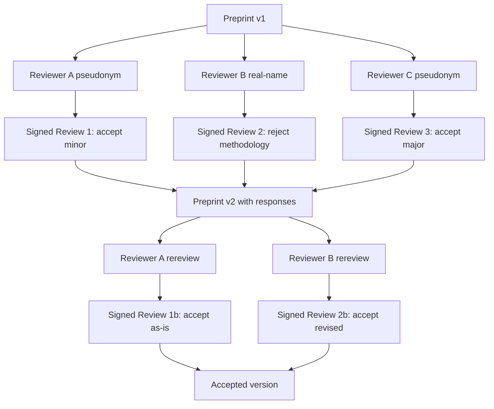
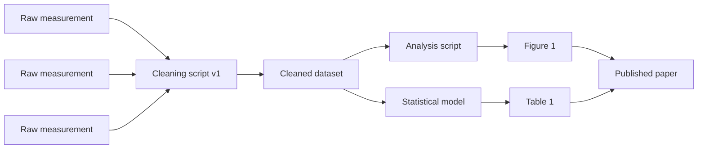

# The Reproducibility Crisis Needs Tamper-Evident Peer Review

*Why 39% of psychology studies replicate, why 70% of researchers have failed to reproduce a colleague's work, and how signed attestation chains fix what traditional peer review can't.*

| Metadata | Value |
|----------|-------|
| Date     | 2026-04-23 |
| Authors  | The Quidnug Authors |
| Category | Science, Reputation Systems, Peer Review |
| Length   | ~7,200 words |
| Audience | Researchers, journal editors, research infrastructure teams, policy staff at funding agencies |

---

## TL;DR

Ioannidis's 2005 paper [^ioannidis2005] argued that most published research findings are false. Twenty years later the empirical evidence confirms something in that neighborhood. The Open Science Collaboration's 2015 Reproducibility Project [^osc2015] attempted to replicate 100 psychology studies and succeeded for only 36 to 39 of them, depending on the replication criterion. Baker's 2016 Nature survey [^baker2016] of 1,576 researchers found 70% had failed to reproduce another scientist's experiment and more than half had failed to reproduce their own.

This is not a participation problem. It is a trust architecture problem.

Modern science runs on a peer review and citation infrastructure built for a pre-digital era. Journals make peer review decisions opaquely. Data is cited but rarely provenance-linked. Retractions propagate by word of mouth and paywalled editorials. Reviewer reputation is known only to the handful of editors who assign reviewers. The net effect: a scholarly record in which you cannot verify, cryptographically, who made what claim, who reviewed it, what data backed it, and whether any of that has been withdrawn since.

This post argues that the reproducibility crisis is inseparable from the absence of a tamper-evident trust substrate for peer review. Fixing it requires four primitives that existing systems do not provide:

1. **Signed claims.** Every assertion in a paper binds to the author's cryptographic identity at the time of publication.
2. **Signed peer review.** Reviewer identity (optionally pseudonymous but cryptographically stable) and review content are committed to an append-only log.
3. **Data provenance chains.** Every cited dataset has a verifiable lineage from raw collection to published analysis.
4. **Citation-weighted reviewer reputation.** Reviewer quality is not an editorial secret; it is computable from their review history.

Quidnug provides each of these as first-class protocol primitives. The remainder of this post walks through the empirical scale of the crisis, the mechanisms driving it, and a concrete architecture for rebuilding scholarly infrastructure on signed, trust-weighted, tamper-evident foundations.

**Key claims this post defends:**

1. The replication crisis is a measurement of infrastructure quality, not researcher quality.
2. Supervised detection of fraud and selective reporting is a losing arms race. Structural substrates win.
3. A scholarly record with cryptographic provenance would have caught at least two of the three highest-profile fraud cases of the past decade before replication teams were needed.
4. The institutional inertia against this is real but weaker than the inertia that existed against the preprint era, which took about a decade to go from fringe to default.

---

## Table of Contents

1. [The Empirical Scale](#1-the-empirical-scale)
2. [The Systemic Causes](#2-the-systemic-causes)
3. [Fixes That Partially Work](#3-fixes-that-partially-work)
4. [The Missing Substrate](#4-the-missing-substrate)
5. [Signed Peer Review](#5-signed-peer-review)
6. [Data Provenance Chains](#6-data-provenance-chains)
7. [Citation-Weighted Reputation](#7-citation-weighted-reputation)
8. [A Paper's Life Cycle Under This System](#8-a-papers-life-cycle)
9. [Institutional Tradeoffs](#9-institutional-tradeoffs)
10. [References](#10-references)

---

## 1. The Empirical Scale

Let me put concrete numbers on a problem that is often discussed abstractly.

### 1.1 The 2015 psychology replication

The Open Science Collaboration recruited 270 authors to replicate 100 studies from three top psychology journals (Journal of Personality and Social Psychology, Psychological Science, Journal of Experimental Psychology: Learning, Memory, and Cognition). The results [^osc2015]:

```
Reproducibility Project: Psychology (2015)
100 studies attempted

Replication criterion             Percent successful
---------------------------------------------------
Statistically significant          36%
Subjective replication              39%
Original effect size in 95% CI     47%
Effect size > 50% of original      50%
```

Mean effect size of replications was roughly half that of originals. The paper was published in Science, has been cited more than 7,000 times, and has not been refuted on methodology.

### 1.2 Cross-field replication rates

Subsequent replication projects found similar or worse numbers across other fields:

| Field | Project | Sample | Replication rate |
|-------|---------|--------|------------------|
| Experimental economics | Camerer et al. 2016 [^camerer2016] | 18 studies | 61% significant same direction |
| Social sciences (top journals) | Camerer et al. 2018 [^camerer2018] | 21 studies | 62% |
| Cancer biology | Errington et al. 2021 [^errington2021] | 53 experiments from 23 papers | 54% showed replication across any outcome; median effect 85% smaller |
| Preclinical biomedicine | Begley & Ellis 2012 [^begley2012] | 53 landmark studies | 11% (6 of 53) reproducible at Amgen |

Begley & Ellis is the most cited of these. Amgen's industrial biology team attempted to reproduce 53 landmark oncology studies. They succeeded in 6. That is not a typo.

### 1.3 The Baker survey

Nature's 2016 survey [^baker2016] of 1,576 researchers across fields:

```
"Have you failed to reproduce..."

Another scientist's experiment?   70% yes
Your own experiment?               52% yes

"Is there a reproducibility crisis?"
Significant crisis:                52%
Slight crisis:                     38%
No crisis:                          7%
Don't know:                         3%

"Main cause?" (top answers)
Selective reporting                 (most-cited)
Pressure to publish                 (second)
Low statistical power              (third)
Insufficient replication            (fourth)
```

Note that "fraud" is not among the top causes named. The problem is overwhelmingly structural: what gets published, what doesn't, how analyses are described, how often the underlying data and code are shared.

### 1.4 Retractions and misconduct as symptoms

RetractionWatch [^retractionwatch] maintains a database of scholarly retractions. Key findings from their 2014 analysis [^fang2012] (Fang, Steen, & Casadevall) of 2,047 retracted biomedical articles:

- 67.4% retracted for misconduct (fraud, duplicate publication, plagiarism, or suspected misconduct)
- 21.3% retracted for error
- Retractions grew roughly 10x from 2000 to 2010

A 2012 PNAS paper [^fang2012] established that misconduct was the majority cause of retractions. Subsequent work by Nikos Tsiligiris and others has maintained the 60-70% misconduct rate across more recent samples.

```
Retractions per year, all biomedical literature (RetractionWatch data, approximate)

2000   │█                      ~40
2005   │███                   ~150
2010   │████████              ~400
2015   │██████████████        ~650
2020   │██████████████████   ~900
2023   │█████████████████████████ ~1,200+
```

Growth comes from a mix of more fraud, better detection, and expanding literature base. All three factors compound: more papers means more opportunities for fraud and more opportunities to detect prior fraud.

### 1.5 What this costs

Freedman, Cockburn, and Simcoe (2015) [^freedman2015] estimated the annual cost of irreproducible preclinical research in the US alone at $28 billion per year. That figure is widely cited but necessarily imprecise. Even at a conservative quarter of it ($7 billion), the cost dwarfs the NIH budget for infrastructure improvements.

### 1.6 High-profile fraud cases

Some widely-reported cases from the past decade:

- **Diederik Stapel** (social psychology, 2011). Fabricated data across more than 50 papers. Detected by skeptical PhD students, not by peer review.
- **Paolo Macchiarini** (regenerative medicine, 2016). Trachea transplant claims turned out to be fabricated. Detected after multiple patient deaths.
- **Francesca Gino / Dan Ariely** (behavioral economics, 2021-2023). Gino's papers on dishonesty showed statistical anomalies consistent with fabrication. Detected by the Data Colada bloggers via forensic statistical analysis.
- **Hoshi / Katsuki / Ohsumi lab incidents** (cell biology, various). Western blot duplication and image manipulation detected by image forensics tools (PubPeer, ImageTwin).

Every one of these was detected by independent investigators after publication, not by the peer review process itself.

---

## 2. The Systemic Causes

The failures above are not random. They emerge from systematic incentive mismatches in how research is produced and evaluated.

### 2.1 Publish-or-perish

Tenure, grant funding, and promotion decisions weight publication volume heavily. This creates pressure to:

- Publish many small-N results rather than few well-powered studies (Smaldino & McElreath 2016 [^smaldino2016] modeled this).
- Report findings that "worked" and file-drawer those that didn't (publication bias).
- Salami-slice single experiments into multiple publications.
- Cite collaborators reciprocally to inflate metrics.

Smaldino & McElreath's agent-based model shows that under publication-based selection, the "selection of bad science" is an equilibrium: labs that produce rigorous, boring, mostly-null findings lose the career competition to labs that produce splashy, often-false, easily-published findings.

### 2.2 P-hacking and researcher degrees of freedom

Simmons, Nelson, & Simonsohn (2011) [^simmons2011] documented "false-positive psychology." The paper showed how researcher degrees of freedom (choosing which variables to include, when to stop data collection, which transformations to apply) can inflate false-positive rates from 5% to over 60%.

```
Simmons et al. (2011) simulation results
Target alpha = 0.05

Baseline (no flexibility)          5%  false positive rate
+ choose between 2 DVs             9%
+ flexibility in N (stop early)   10%
+ flexibility in covariates       12%
+ all of the above               61%
```

P-hacking doesn't require bad faith. A well-meaning researcher who stops data collection when "the effect looks significant" inflates error rates without intending to.

### 2.3 Low statistical power

Button et al. (2013) [^button2013] analyzed 730 meta-analyses in neuroscience and found median statistical power of 21%. Most studies were inadequately powered to detect their claimed effects. Low power doesn't just fail to find real effects; it also inflates effect sizes among findings that do reach significance (the "winner's curse").

### 2.4 Peer review does not catch this

Peer review is often framed as the quality filter. It is, but it's filtering for different properties than reproducibility.

Smith (2010) [^smith2010], former BMJ editor, catalogued the limits of traditional peer review:

- **Reviewers rarely have raw data.** Review is of the narrative description, not the underlying analysis.
- **Reviewers rarely attempt to reproduce.** Reproduction takes weeks or months; review takes hours.
- **Reviewers rarely have sufficient domain expertise for all parts of a paper.** Methodological statistics, niche measurement techniques, and primary subject matter usually span more than one reviewer's competence.
- **Review is unpaid and invisible.** Incentive to do thorough work is minimal.

A widely-cited randomized controlled trial in the BMJ (2008) [^schroter2008] showed that training reviewers did not meaningfully improve review quality. The structure of review, not the individual reviewer, is the binding constraint.

### 2.5 The incentive summary

| Incentive | Pushes toward | Away from |
|-----------|---------------|-----------|
| Career (tenure, grants) | High-volume publication | Slow rigorous work |
| Publication (journal acceptance) | Novel, significant, "important" findings | Null results, replications |
| Peer review (unpaid, anonymous) | Surface quality check | Deep reproducibility audit |
| Citation (h-index, funding weight) | Memorable, quotable claims | Careful, hedged claims |

Every arrow points the same direction. It is remarkable that anything reproducible gets published at all, and it is a credit to the fraction of researchers who hold the line against these pressures.

---

## 3. Fixes That Partially Work

The community has attempted several reforms. Each helps. None is sufficient.

### 3.1 Preregistration

Preregistration requires researchers to commit to analysis plans before data collection. OSF (Open Science Framework) and AsPredicted are the major registries.

Registered Reports (a journal format where peer review happens on the protocol, not the results) produce dramatically different outcomes. Allen & Mehler (2019) [^allen2019] compared publication outcomes in Registered Reports to traditional publication: null results appear at ~60% in RRs versus ~5-20% in traditional publication.

The problem: preregistration depends on honesty about whether the registered analysis was actually the analysis performed. Without cryptographic binding between the prereg and the final paper, there's no structural enforcement. Researchers can (and occasionally do) prereg after the fact or deviate from the preregistered plan with selective disclosure.

### 3.2 Open data

Shared data permits post-publication replication. But:

- Sharing rates remain low. A 2021 survey by Sci-Data [^sci2021] found that despite data-sharing policies at most major journals, actual data availability is below 50% for most fields.
- Shared data is often incomplete, undocumented, or in proprietary formats.
- No tamper-evidence: you can replace a dataset after publication without leaving a detectable trail.

### 3.3 Open review

Some journals (eLife, F1000, BMJ Open) publish peer review reports alongside papers. This is an improvement but:

- Reports are editor-curated, not complete transcripts.
- Reviewer identity is optional and usually suppressed.
- No cryptographic binding: reports can be edited post-publication.

### 3.4 Replication journals

Registered journals for replication (e.g., the Journal of Replication in Social and Behavioral Sciences) exist but capture a tiny fraction of the literature. They require voluntary participation by authors willing to write replications that rarely count toward tenure.

### 3.5 Summary

Each reform targets one layer of the problem. None addresses the substrate: the lack of cryptographic binding across claims, reviews, data, and reputation. Without that substrate, every reform remains contingent on good faith from the parties who would benefit most from bad faith.

---

## 4. The Missing Substrate

Let me specify what a working substrate looks like.

### 4.1 Four primitives

1. **Signed claims.** Every substantive assertion in a paper binds to the authors' cryptographic identities at a specific timestamp. The binding survives the paper's life.
2. **Signed reviews.** Every peer review is an append-only record, signed by the reviewer (who may be pseudonymous), committed to a tamper-evident log.
3. **Data provenance chains.** Datasets cited in a paper have signed provenance from collection through analysis to citation. Changes to the dataset are visible.
4. **Computable reputation.** Reviewer quality is derivable from the visible record. A reviewer who consistently approves papers that later fail replication accumulates visible reliability costs.

These are not science fiction. They map directly to Quidnug primitives:

| Scientific primitive | Quidnug mapping |
|---------------------|-----------------|
| Signed claim | TRUST or EVENT transaction in a `science.*` domain |
| Signed review | EVENT in `science.journal.reviews.*` with typed payload |
| Data provenance | IPFS-anchored EVENT chain with parent links |
| Reputation | ComputeRelationalTrust in topic-scoped domain |

### 4.2 The cryptographic properties that matter

**Non-repudiation.** An author cannot later claim they did not make a claim. A reviewer cannot claim they did not write a review. This is baseline ECDSA signing; Quidnug uses ECDSA P-256.

**Append-only log.** Historical records cannot be altered without detection. Quidnug's block chain provides this for domain-scoped event streams.

**Revocation without rewriting.** Retractions and corrections are new records that supersede prior ones. The prior record is not deleted but is annotated. Readers can see both the original and the correction.

**Pseudonymity support.** A reviewer can maintain a stable identity without revealing legal name. Their identity accumulates reputation over time; if they choose to retire the pseudonym, their historical reviews remain attributed.

### 4.3 What this does not require

- **Universal adoption.** The substrate works for any subset of the scientific community that opts in. Mixed-adoption intermediate states (some papers on-chain, some not) are tolerable.
- **Consensus from journals.** Preprint servers and institutional repositories can deploy the substrate independently. Journals can adopt later.
- **Changes to paper PDFs.** The signed metadata lives alongside the PDF, not inside it. Familiar reading experiences are unchanged.

---

## 5. Signed Peer Review

Let me work through what a peer review looks like when implemented on Quidnug.

### 5.1 Structure of a signed review

```json
{
  "type": "EVENT",
  "trustDomain": "science.peer-review.nature",
  "subjectId": "paper-preprint-hash",
  "eventType": "PEER_REVIEW",
  "sequence": 3,
  "payload": {
    "reviewer": "did:quidnug:reviewer-pseudonym-a7c9",
    "reviewerDomainTrust": {
      "science.biology.molecular": 0.84,
      "science.statistics.experimental": 0.72
    },
    "recommendation": "accept-with-minor-revisions",
    "reviewText": "ipfs://QmReviewBodyHash...",
    "structuredFeedback": {
      "methodologyConcerns": 2,
      "statisticalPowerAdequate": true,
      "dataAvailability": "partial",
      "rawDataRequested": true,
      "conflictsOfInterest": "none"
    },
    "timestamp": 1743523200,
    "expiresAt": 0
  },
  "signature": "..."
}
```

Several features to notice:

- The `reviewerDomainTrust` field commits to the reviewer's self-declared expertise distribution at review time. If the reviewer later publishes on topics outside their declared expertise, that's visible.
- `reviewText` is IPFS-anchored, so the body is immutable but storable off-chain.
- `structuredFeedback` enables later aggregation. A paper with 3 reviewers, 2 flagging methodology concerns, and 3 flagging data availability as "partial" is a different signal than one with 0, 0, and "full."
- `timestamp` establishes when the review was written. A reviewer who consistently submits reviews within hours of receiving them vs within months is a different reviewer.

### 5.2 Pseudonymous reviewer identity

A reviewer's Quidnug identity can be pseudonymous: the public key is known, the legal identity is not. The pseudonymous identity accumulates reputation over time, and if the reviewer chooses to reveal their legal identity later (or if the pseudonymous identity is compromised), historical reviews remain attributed.

This addresses a long-standing tension in peer review:

- Anonymous review: frees reviewers to be honest without social consequence but enables low-effort review.
- Signed review: enforces accountability but risks retaliation for negative reviews.

Pseudonymous review with stable identity threads the needle: the reviewer is accountable to their own track record without being exposed to retaliation from a specific author.

### 5.3 Review chain on a paper

A paper with three reviewers over time:



Every node in this graph is a signed, timestamped, append-only record. The paper's publication history is auditable in detail.

### 5.4 What this enables

- **Retroactive review quality assessment.** If the paper fails replication two years later, the reviewers who approved it are visible. Not to embarrass them, but to compute reviewer reputation.
- **Review diversity metrics.** A journal that systematically assigns the same 3 reviewers to papers in a subfield looks different from one with a broader reviewer pool.
- **Detection of coordinated reviews.** Reviewers sharing opinions suspiciously quickly may indicate collusion.

---

## 6. Data Provenance Chains

Claims in a paper reference data. The credibility of the claim depends on the data's integrity. Current infrastructure treats data citation as a string; Quidnug treats it as a signed chain.

### 6.1 The lineage graph



Each arrow is a signed EVENT in the data-provenance domain. Every node carries:

- Hash of the content (IPFS CID for the actual data)
- Signer identity
- Timestamp
- Script/parameters used
- Prior node(s) referenced

The paper's figures and tables bind to specific IPFS content. If someone later substitutes a different dataset, the hash changes and the binding breaks.

### 6.2 What tamper-evidence catches

**Image duplication.** PubPeer and ImageTwin already catch many duplicated images, but after the fact. Signed image provenance at submission time makes duplication detection automatic: the hash of every figure is on the chain, and submitting the same figure under different papers or different experiments is immediately visible.

**Post-hoc analysis changes.** If the published analysis script differs from the scripted trail, that's a visible discrepancy rather than a hidden one.

**Silent data replacement.** Replacing a dataset after publication would require publishing a new event superseding the prior one. The prior one remains visible.

**Fabrication.** Fabricated data can still be signed, but the absence of prior raw-measurement events with independent signer identities (other lab members, instruments with manufacturer signing keys) is a signal. A dataset whose chain starts and ends with a single individual's signature is less robust than one with contributions from multiple lab members.

### 6.3 Integration with existing infrastructure

Major data repositories (Dryad, Zenodo, Harvard Dataverse, Figshare) can emit signed provenance events for datasets they host. The CIDs of the hosted data become the content addresses in the Quidnug events. Existing citation formats (DOI references) remain intact; the signed chain is additional metadata layered alongside.

### 6.4 What this does not solve

Data provenance cannot distinguish real data from real data produced by a broken instrument. It cannot distinguish fraud-by-selective-reporting from honest choice of analysis. It raises the cost of certain fraud patterns without eliminating all of them. The scale of improvement is large but bounded.

---

## 7. Citation-Weighted Reputation

A reviewer's reliability is computable from their history. Not "how many reviews have they done" but "how have the papers they approved performed over time."

### 7.1 The computation

For a reviewer R, their reliability in a topic domain D:

```
reliability(R, D) = Σ over papers P that R reviewed and recommended accept:
    weight(P, D) × replication_outcome(P)

  / Σ over papers P that R reviewed:
    weight(P, D)
```

Where:
- `weight(P, D)` is how much paper P weighs in domain D (higher for papers with strong evidence, lower for edge-of-field work).
- `replication_outcome(P)` is 1 if the paper has successfully replicated, 0 if it has failed replication, 0.5 if untested.

This is crude. Better variants exist (Bayesian updating with priors, weighting by reviewer confidence in each review). The crude version suffices to make the point: reviewer reputation is derivable from the substrate.

### 7.2 Reviewer scarcity and the cost of being wrong

Under this system, a reviewer who approves a long-running thread of rigorous papers builds up domain-scoped reputation. Editors assigning reviewers can see this directly. Reviewers who have been empirically unreliable in a domain see their domain-scoped reputation decay.

The effect is not to punish reviewers who made an error; it's to let the system identify reviewer expertise more accurately than "has this person done a lot of reviews" or "does the editor know them personally."

### 7.3 Gaming the reputation signal

An adversarial reviewer could build up reputation by approving papers that do happen to replicate (which is the easy half of the job), then abuse the reputation by approving fraudulent papers later. This is defended by:

- **Topic scoping.** Reputation in `science.biology.molecular.structural` is distinct from `science.psychology.social`. A reviewer cannot parlay biology credibility into psychology.
- **Recency weighting.** Reviews from 10 years ago matter less than reviews from 2 years ago (QDP-0022 TTL semantics apply).
- **Outlier detection.** A reviewer whose recent reviews diverge sharply from their historical pattern is flagged.

None of these are perfect. Reputation systems in general are imperfect. But the current system has none of them.

### 7.4 Author reputation

The same computation applies to authors. An author whose published work consistently replicates accumulates domain-scoped reputation that:

- Weighs their claims in relational trust calculations
- Influences their own peer review recommendations (they become more trusted as reviewers)
- Provides a portable career credential beyond h-index

For early-career researchers, this is potentially transformative. A postdoc with 3 replicated papers in a tight subdomain has visible, cryptographically-verifiable credibility that doesn't depend on which big lab they trained in.

---

## 8. A Paper's Life Cycle

Let me run through a paper's complete trajectory under the proposed substrate.

### 8.1 T-6 months: preregistration

First author Alice signs a preregistration event:

```
EVENT(
  domain=science.biology.molecular.preregistration,
  subject=alice-study-2026,
  eventType=PREREGISTRATION,
  payload={
    hypothesis="H1: X causes Y via Z mechanism",
    designPlan="IPFS CID...",
    analysisPlan="IPFS CID...",
    sampleSize=480,
    stoppingRule="collect all N by deadline"
  },
  signed by: alice
)
```

Published on the Open Science Framework, mirrored to Quidnug.

### 8.2 T-3 months: data collection

Lab members sign raw measurements as they are collected. Each measurement:

```
EVENT(
  domain=science.biology.molecular.labdata,
  subject=alice-study-2026,
  eventType=MEASUREMENT,
  payload={
    sampleId="sample-437",
    instrument="instrument-serial-12345",
    operator="bob-lab-tech",
    parameters={...},
    rawDataCid="bafy..."
  },
  signed by: bob-lab-tech
)
```

480 samples become 480 signed events. Each is provable-by-lab-member, not just stated in a spreadsheet.

### 8.3 T-1 month: analysis and preprint

Alice runs the pre-registered analysis. The analysis script binds to the dataset hash. Results are prepared into a preprint.

```
EVENT(
  domain=science.biology.molecular.preprint,
  subject=alice-study-2026,
  eventType=PREPRINT_V1,
  payload={
    title="The role of Z in X→Y signaling",
    abstract="...",
    fullTextCid="bafy...",
    figureCids=["bafy...", "bafy..."],
    rawDataCid="bafy...",
    analysisScriptCid="bafy...",
    preregistrationTxId="...",
    coauthors=["did:quidnug:carol-postdoc", "did:quidnug:dan-pi"]
  },
  signed by: alice (with countersignatures from coauthors)
)
```

### 8.4 T: peer review

Journal editor assigns three reviewers. Each submits a signed review. One asks for a specific additional control; the reviewer's history shows they've correctly flagged control issues in 11 prior papers, so Alice takes the request seriously.

### 8.5 T+1 month: published version

Alice addresses review comments, publishes preprint v2, then final accepted version. Journal's acceptance is itself a signed event:

```
EVENT(
  domain=science.journal.nature-subjournal.acceptance,
  subject=alice-study-2026,
  eventType=ACCEPTED,
  payload={
    journal="Nature Molecular",
    acceptedVersionTxId="...",
    reviewChain=["tx:review1", "tx:review2", "tx:review3", "tx:review2b"],
    editorDecision="accept",
    doi="10.1234/nm.2026.12345"
  },
  signed by: journal-editor
)
```

### 8.6 T+2 years: replication attempt

A replication team at a different lab runs the protocol on their own samples. Results are consistent with Alice's findings.

```
EVENT(
  domain=science.biology.molecular.replication,
  subject=alice-study-2026,
  eventType=REPLICATION,
  payload={
    replicationLabId="lab-bingham",
    primaryOutcome="supported",
    effectSize=0.91 of original,
    replicationDataCid="bafy...",
    differences=["sample source", "buffer composition"]
  },
  signed by: bingham-lab-lead
)
```

Alice's paper now has a replication endorsement on its record. Her personal and domain reputation tick up. The reviewers who approved the paper have their records updated positively.

### 8.7 T+5 years: superseded by better theory

A later paper proposes a refinement of the X→Y mechanism. This does not retract Alice's paper but supersedes part of it.

The record shows:

- Original paper
- Replication at T+2y
- Refinement at T+5y (with link)

A reader in year T+6 sees all three. They can decide how to weight each based on their own expertise and the reputation of each contribution.

### 8.8 The total artifact

The paper's complete artifact is not a PDF. It is:

- The preregistration
- The raw data events
- The analysis scripts
- The preprint versions
- The review events
- The acceptance
- The replication events
- The refinement events (if any)
- The corrections or retractions (if any)

All signed. All cryptographically linked. All readable by any researcher with a Quidnug client.

---

## 9. Institutional Tradeoffs

Being honest about where adoption meets friction.

### 9.1 Incumbent journal resistance

Major journal brands benefit from opacity. Openly cryptographically-verifiable reviews make it visible which reviewers accepted what, which dulls the aura of mystique that supports journal brand premiums.

**Mitigation:** the substrate is additive, not replacing. Journals can adopt the substrate while retaining their brand and their gatekeeping function. A Nature paper can still be a Nature paper even if its review chain is also signed. The ones that refuse to adopt face eventual competitive disadvantage: preprint servers with signed review chains become more credible than closed-review journals over time.

### 9.2 Reviewer burden

Signing reviews and binding them to domain-scoped identities is more work than current pseudonymous review. Researchers are already overworked.

**Mitigation:** the substrate should integrate with existing review workflows, not require separate interfaces. A reviewer who submits through an OpenReview-style platform gets their review signed automatically if they've bound their Quidnug identity to their platform account. The additional work is one-time key generation.

### 9.3 Funder and institution buy-in

NIH, NSF, Wellcome Trust, Gates Foundation, and similar funders control the incentive structure. Without funder support, individual researchers face career risk from adopting a system their competitors don't use.

**Mitigation:** funders have been increasingly receptive to reproducibility infrastructure (NIH Office of Research Integrity, NSF data management requirements). A coalition of funders adopting a substrate requirement is plausible within a 5-10 year window. Wellcome's Open Research Funders Group is a precedent model.

### 9.4 Generational transition

The current review system has accumulated two generations of researchers who grew up with it. Asking a full-career-length transition to a substrate-backed system is a generational project.

**Mitigation:** opt-in deployment scales. Early adopters build up track records on the substrate; their visible reputation advantages accumulate over time; later generations see the older generation as the outlier. This mirrors the preprint transition (arXiv from 1991 to dominant in physics within a decade; bioRxiv from 2013 to mainstream in biology within a decade).

### 9.5 The technical implementation burden

Quidnug nodes, key management for researchers, integration with existing preprint servers: all real work.

**Mitigation:** the implementation burden is comparable to other recently-adopted infrastructure (ORCID, DOI registration, OSF integration). None of those are trivial; all have become routine within 5 years of deployment.

### 9.6 Summary

The tradeoffs are real but not absolute. The dominant risk is not that the substrate can't be built but that it can't be adopted fast enough to matter. The replication crisis compounds. Each year of delayed action is another year of research findings that future generations will spend resources correcting.

---

## 10. References

### Foundational papers on the crisis

[^ioannidis2005]: Ioannidis, J. P. A. (2005). *Why Most Published Research Findings Are False.* PLOS Medicine, 2(8), e124. https://doi.org/10.1371/journal.pmed.0020124

[^osc2015]: Open Science Collaboration. (2015). *Estimating the reproducibility of psychological science.* Science, 349(6251), aac4716. https://doi.org/10.1126/science.aac4716

[^baker2016]: Baker, M. (2016). *1,500 scientists lift the lid on reproducibility.* Nature, 533, 452-454. https://doi.org/10.1038/533452a

### Field-specific replication projects

[^camerer2016]: Camerer, C. F., Dreber, A., et al. (2016). *Evaluating replicability of laboratory experiments in economics.* Science, 351(6280), 1433-1436.

[^camerer2018]: Camerer, C. F., Dreber, A., Holzmeister, F., et al. (2018). *Evaluating the replicability of social science experiments in Nature and Science between 2010 and 2015.* Nature Human Behaviour, 2, 637-644.

[^errington2021]: Errington, T. M., et al. (2021). *Investigating the replicability of preclinical cancer biology.* eLife, 10, e71601. https://doi.org/10.7554/eLife.71601

[^begley2012]: Begley, C. G., & Ellis, L. M. (2012). *Drug development: Raise standards for preclinical cancer research.* Nature, 483, 531-533. https://doi.org/10.1038/483531a

### Causes and mechanisms

[^smaldino2016]: Smaldino, P. E., & McElreath, R. (2016). *The natural selection of bad science.* Royal Society Open Science, 3(9), 160384.

[^simmons2011]: Simmons, J. P., Nelson, L. D., & Simonsohn, U. (2011). *False-positive psychology: Undisclosed flexibility in data collection and analysis allows presenting anything as significant.* Psychological Science, 22(11), 1359-1366.

[^button2013]: Button, K. S., Ioannidis, J. P. A., et al. (2013). *Power failure: Why small sample size undermines the reliability of neuroscience.* Nature Reviews Neuroscience, 14, 365-376.

[^smith2010]: Smith, R. (2010). *Classical peer review: an empty gun.* Breast Cancer Research, 12(Suppl 4), S13.

[^schroter2008]: Schroter, S., et al. (2008). *What errors do peer reviewers detect, and does training improve their ability to detect them?* Journal of the Royal Society of Medicine, 101(10), 507-514.

### Costs and retractions

[^freedman2015]: Freedman, L. P., Cockburn, I. M., & Simcoe, T. S. (2015). *The economics of reproducibility in preclinical research.* PLOS Biology, 13(6), e1002165.

[^fang2012]: Fang, F. C., Steen, R. G., & Casadevall, A. (2012). *Misconduct accounts for the majority of retracted scientific publications.* PNAS, 109(42), 17028-17033.

[^retractionwatch]: Retraction Watch database. Center for Scientific Integrity. https://retractionwatch.com/

### Reforms and open science

[^allen2019]: Allen, C., & Mehler, D. M. A. (2019). *Open science challenges, benefits and tips in early career and beyond.* PLOS Biology, 17(5), e3000246.

[^sci2021]: Nature Editorial. (2021). *Data availability policies: Are they effective?* (Recurring editorial summary of data-sharing audits across Nature publications; specific data from 2020-2021 issues.)

### Quidnug design documents

- QRP-0001: Quidnug Reviews Protocol (framework reused for peer review)
- QDP-0014: Node Discovery + Domain Sharding
- QDP-0018: Observability and Tamper-Evident Operator Log
- QDP-0022: Timed Trust & TTL Semantics

---

*For researchers, editors, and funders interested in pilot deployments, the Quidnug repository at [github.com/quidnug/quidnug](https://github.com/quidnug/quidnug) has reference implementations and a Slack channel for coordination.*
