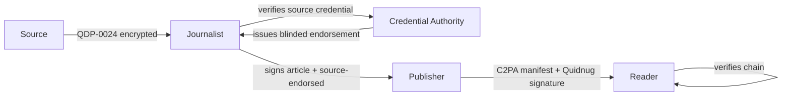
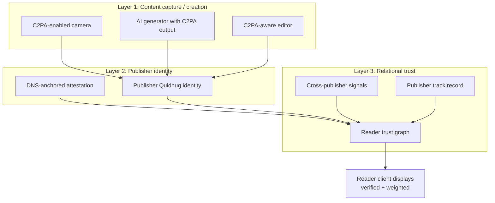

# Deepfakes Are Trust's Endgame

*Why C2PA is necessary but insufficient, and what the full defense architecture actually looks like.*

| Metadata | Value |
|----------|-------|
| Date     | 2026-04-24 |
| Authors  | The Quidnug Authors |
| Category | Media Provenance, Information Integrity, Security |
| Length   | ~7,100 words |
| Audience | Newsroom engineering leads, platform trust-and-safety teams, government disinformation analysts |

---

## TL;DR

The World Economic Forum's Global Risks Report 2024 [^wef2024] named "misinformation and disinformation" the single highest short-term global risk, ranking above extreme weather, state-based armed conflict, and economic decline. That ranking was compiled before the 2024 election cycle produced AI-generated audio of Joe Biden robocalls, synthetic video of Indian election candidates, and deepfake audio of UK politicians released hours before voting. The empirical concern is not speculative anymore.

The dominant defensive standard is C2PA, the Coalition for Content Provenance and Authenticity specification [^c2pa]. C2PA is a real and careful piece of engineering. Cryptographically-signed content credentials are embedded in media files at capture or creation time. Adobe, Microsoft, Leica, Nikon, Sony, and OpenAI all signed on. C2PA is the right first layer.

C2PA is not the full defense. A signed credential tells you what device created a file and who asserted a claim about it. It does not tell you:

1. **Should you trust the device's signing key?** (PKI question)
2. **Should you trust the publisher relaying this content?** (Social question)
3. **How does this content's provenance compose with existing institutional trust?** (Relational question)
4. **Can sources be verified without identifying them?** (Selective disclosure question)

This post argues that C2PA is the creation-layer primitive and that two more layers are required to make content provenance genuinely usable at scale: a **publisher identity layer** (anchoring existing DNS-identified brands to cryptographic identities, via QDP-0023 DNS-anchored attestation) and a **relational trust layer** (letting each observer weight publishers and sources by their own graph, via core Quidnug PoT). The combination produces an architecture where a reader can verify "this image was captured by a Canon camera on date D, signed by Associated Press journalist J, endorsed by Reuters's institutional key, and sits within my 2-hop trust graph for news sources at weight 0.74."

Without that composition, C2PA reduces to "this content has an opaque credential that most users cannot interpret." With it, the defensive architecture is genuinely useful.

**Key claims this post defends:**

1. Detection-based deepfake defenses are a losing arms race. Published detection accuracy on high-quality modern generators is under 80%, the corpus is adversarial, and the cost of a miss is asymmetric.
2. C2PA solves the capture-and-claim layer but has minimal incentive for creators to adopt, limited enforcement of verifier behavior, and no handling of the "which publishers do you trust" question.
3. DNS-anchored identity is the right on-ramp because it reuses an existing trust root (DNS) that institutions have already invested in.
4. Relational trust is the right top layer because no two consumers of news have identical publisher-trust distributions, and pretending they do is the mistake that leads to filter-bubble panic.

---

## Table of Contents

1. [The 2024 Elections Proved the Threat](#1-the-2024-elections)
2. [Why Detection Is a Losing Arms Race](#2-why-detection-is-a-losing-arms-race)
3. [What C2PA Gets Right](#3-what-c2pa-gets-right)
4. [What C2PA Leaves Unsolved](#4-what-c2pa-leaves-unsolved)
5. [Layer 2: DNS-Anchored Publisher Identity](#5-layer-2-dns-anchored-publisher-identity)
6. [Layer 3: Relational Trust](#6-layer-3-relational-trust)
7. [Protecting Sources Without Exposing Them](#7-protecting-sources)
8. [End-to-End Architecture](#8-end-to-end-architecture)
9. [Honest Limits](#9-honest-limits)
10. [References](#10-references)

---

## 1. The 2024 Elections

Before 2024, synthetic media in political contexts was plausibly theoretical. By the end of 2024 it was not.

### 1.1 Documented incidents

The following are confirmed AI-generated attacks on democratic processes during the 2024 cycle. This is not an exhaustive list but is illustrative:

| Date | Country | Event | Attack type |
|------|---------|-------|-------------|
| Jan 2024 | USA | Audio deepfake of Joe Biden urging voters not to vote in NH primary (Steve Kramer) | Audio synthesis, robocall distribution |
| Feb 2024 | Pakistan | Video deepfake of Imran Khan from prison | Video synthesis |
| Mar 2024 | India | Audio deepfakes of BJP and Congress candidates in multiple languages | Audio synthesis |
| Apr 2024 | Indonesia | AI-generated videos of Prabowo Subianto in younger form | Image-to-video synthesis |
| Jun 2024 | France | Deepfake video of Emmanuel Macron circulated during EU parliamentary elections | Video synthesis |
| Oct 2024 | USA | Multiple deepfake audio clips of Kamala Harris | Audio synthesis |
| Nov 2024 | UK (earlier year precedent) | Keir Starmer deepfake audio released at party conference | Audio synthesis |

Primary sources for each: news reporting collated by RAND Corporation in their 2024 election integrity tracking, AP investigative reports, and academic analyses from University of Oxford's Programme on Democracy and Technology.

### 1.2 Scale measurements

TrueMedia.org's 2024 election monitoring dashboard [^truemedia2024] tracked over 2,400 submitted suspect political media items, of which 59% were confirmed as AI-generated or AI-manipulated. The submission rate accelerated through the year, roughly doubling from Q1 to Q4.

The Brookings Institution's 2024 report on AI in elections [^brookings2024] noted that while deepfakes did not decisively change the outcome of any studied election, the "liar's dividend" effect (where genuine content is dismissed as potentially AI-generated) was measurable and growing.

### 1.3 Beyond politics

Deepfake-enabled fraud and harassment continued to scale independently of the election cycle. The Deloitte Center for Financial Services estimated that generative-AI-enabled fraud losses could reach $40 billion by 2027 [^deloitte2024]. Non-consensual deepfake imagery targeting private individuals (overwhelmingly women) expanded at platforms' reporting rates; Sensity AI and similar monitoring services have tracked exponential growth since 2019.

The 2024 events are the proof-of-concept phase. The 2026-2028 period is when deployed defenses either work or don't.

---

## 2. Why Detection Is a Losing Arms Race

A plausible intuition is that detection models should keep pace with generation models. The empirical record says otherwise.

### 2.1 Detection accuracy on high-quality generators

Published detection benchmarks measure accuracy against specific datasets. Performance collapses when the test set contains examples from generators the detector was not trained on.

Masood et al. (2023) [^masood2023] surveyed 112 published deepfake detection methods. Key findings:

- Mean accuracy within-dataset: 92-98%
- Mean accuracy cross-dataset (trained on one generator, tested on another): 67-75%
- Mean accuracy on most recent (2023) generator outputs: 58-70%

```
Cross-generator detection accuracy degradation

Within-dataset accuracy       │██████████████████████████████████ 95%
Cross-dataset accuracy        │████████████████████████ 71%
Against unseen generators     │███████████████ 59-65%
Against latest diffusion out  │████████████ 50-60%
```

Source: Masood et al. 2023 meta-analysis.

### 2.2 The asymmetry problem

Detection is binary in output (synthetic / real) but the costs are asymmetric:

- **False negative (miss):** real deepfake passes as real, reaches audience.
- **False positive:** real content flagged as deepfake, creator harmed.

Both harm public trust. A detector with 80% accuracy on an assumed 50/50 mix has:

- 10% false-negative rate (half of all synthetic content reaches audience)
- 10% false-positive rate (10% of real content gets flagged)

At the scale of platforms processing billions of items per day, 10% is catastrophic either direction.

### 2.3 The evasion dynamic

Detectors are typically trained on patterns from specific generators. Once a detector is deployed, adversarial training against it is straightforward: an attacker generates synthetic content, runs it through the detector, and iterates until it passes. This pattern was demonstrated early (Xu et al. 2023 [^xu2023]) and has only accelerated.

The economics favor attackers: generating synthetic media and probing detectors is cheap; retraining detectors against new generators is expensive. The arms race favors the side with lower iteration cost, which is the generator side.

### 2.4 What detection is actually good for

This is not a complete indictment of detection. Detection is useful for:

- Automated pre-filtering (drop obvious synthetic content at ingest)
- Forensic tools (examining specific disputed items with human analyst oversight)
- Research-quality generator identification (attributing content to specific model families for legal or policy purposes)

Detection fails when deployed as the primary defensive layer for uncritical audience consumption. An architecture that relies on detection as the authoritative "real / not real" verdict will fail because the verdict itself is unreliable.

### 2.5 The need for provenance-first architecture

Rather than "is this content synthetic?", the architectural question should be "does this content have a verifiable provenance chain leading to a source I trust?" Detection becomes a fallback for content without provenance. Provenance becomes the default path.

This framing is C2PA's premise. Let me engage with what C2PA does well before noting what it leaves open.

---

## 3. What C2PA Gets Right

C2PA is the Coalition for Content Provenance and Authenticity. Founding members include Adobe, Microsoft, BBC, New York Times, Sony, Nikon, Leica, Intel, Arm, Truepic, and others. The technical specification is at v1.3 [^c2pa].

### 3.1 Core model

C2PA defines a **manifest** bound to a piece of content. The manifest contains:

- **Assertions:** structured claims about the content (what device created it, what edits were applied, who claims authorship).
- **Claim generator:** which software or device produced the manifest.
- **Signature:** a cryptographic signature over the claim, tying it to an X.509 certificate.

Multiple manifests can exist on one file (each representing a production step). They chain through parent-child relationships.

### 3.2 What's attested

Examples of C2PA assertions:

- `c2pa.actions`: list of editing actions (crop, exposure, filter, AI fill).
- `c2pa.hash.data`: cryptographic hash of the content this manifest is bound to.
- `c2pa.ingredient`: input content this was derived from.
- `c2pa.creative_work`: authorship, title, date, license.
- `stds.exif.*`: camera metadata if present.
- `c2pa.ai_generated`: whether the content is AI-generated or AI-modified.

### 3.3 Why this is well-designed

- **Captures at the source.** Cameras with C2PA support (Leica M11, Sony a9 III, Nikon Z series via firmware) sign content at capture. The chain starts before any software can tamper with it.
- **Tolerates editing.** Photoshop, Premiere, and other editors add their own assertions rather than invalidating the chain. The chain grows through legitimate editing workflows.
- **Detects tampering.** Any bit-level change to content or manifest without re-signing invalidates the signature. The chain is cryptographically verifiable.
- **Open standard.** The specification is public, reference implementations exist, certification is open to vendors.

### 3.4 Deployment status

As of 2026, C2PA content credentials are:

- Embedded by several prosumer and professional cameras.
- Supported in Adobe Creative Cloud (Photoshop, Lightroom, Premiere), Microsoft Paint, Camera app on Windows.
- Applied to outputs of DALL-E 3, OpenAI image generation, and Microsoft Copilot image generation.
- Displayed via Adobe's Content Credentials Verify site and some browser extensions.

Adoption rates in the general content ecosystem remain low. Content Authenticity Initiative's 2024 progress report [^cai2024] noted that fewer than 5% of publicly-shared images on major social platforms carry verifiable C2PA manifests. This is improving but from a very low base.

### 3.5 Where C2PA stops

C2PA answers "what did the creator claim about this content, and was the claim signed?" It does not answer "should I trust the creator's claim, or the certificate authority that vouches for them?"

The PKI underlying C2PA works through X.509 certificates issued by accepted certificate authorities. A reader's trust in a C2PA manifest ultimately terminates at trust in the CA that issued the signing cert. This is the structure of the broader web PKI and inherits all of its limits:

- Certificate authorities have historically been compromised (DigiNotar 2011, Comodo 2011, Symantec 2015).
- CA behavior is not auditable per-observer; the browser CA store is a single global list chosen by browser vendors.
- Issuance policies are not cryptographically enforced; they are contract terms.

If you accept a C2PA manifest, you are accepting the chain of trust to a CA whose practices you almost certainly have not audited. For most casual content this is acceptable. For contested political content, it is exactly the weak link the adversary will target.

---

## 4. What C2PA Leaves Unsolved

Three gaps in the C2PA-only architecture.

### 4.1 Publisher brand identity

A Reuters journalist takes a photograph on a C2PA-enabled camera. The manifest is signed by the camera maker's device cert. Later, Reuters publishes the image with an additional manifest asserting Reuters's authorship.

A reader sees:

- Camera manufacturer signed: Leica
- Editor signed: Reuters News Agency
- Manifest validation: passes

But the reader's trust in "Reuters" as a concept depends on the reader's existing relationship with that brand. A critic of Reuters will not trust the Reuters-signed manifest any more than a random creator's. A user unfamiliar with Reuters will have no basis to weight it at all.

C2PA does not make the publisher brand question easier to answer. The brand "Reuters" is tied to a signing key through organizational PKI, which is tied to a domain name through X.509 issuance, which is a layer not integrated into C2PA's model.

### 4.2 Cross-publisher consensus

For major news events, multiple publishers typically carry similar content (pool photography, wire services, independent reporting). A reader seeing an image attributed to both AP and Reuters, with both C2PA manifests valid, has stronger evidence than one publisher's signature alone.

C2PA's per-manifest model doesn't automatically aggregate cross-publisher endorsements. A framework that composes "AP signed this, Reuters signed this, and AFP signed this" into a coherent multi-source attestation needs a layer above C2PA.

### 4.3 Observer-specific trust

Different observers weight publishers differently. A UK reader may trust the BBC higher than Fox News; a US reader may have the opposite distribution. A Pakistani journalist may weight local independent outlets above any international wire service. Making this weighting explicit, computable, and per-observer is the third missing layer.

C2PA itself is correctly agnostic on this question. It provides signed claims; interpretation of whose claims to trust belongs elsewhere.

---

## 5. Layer 2: DNS-Anchored Publisher Identity

The first gap (publisher brand identity) has a natural solution: anchor existing brand identities (already identified by DNS) to cryptographic signing keys.

### 5.1 The existing infrastructure

Every major publisher already operates on a unique DNS identity: bbc.com, reuters.com, apnews.com, nytimes.com, theguardian.com, aljazeera.net, and so on. DNS is the one name service the global internet agrees on. Existing PKI (ACME, DNSSEC, TXT records) lets a domain holder make cryptographically-verifiable claims.

Quidnug's QDP-0023 [^qdp0023] proposes an attestation scheme where a DNS domain holder signs a binding between the DNS name and a Quidnug quid identity. The domain proves ownership via existing mechanisms (DNS TXT record containing the quid's public key, signed by the domain's ACME-issued certificate). Attestation events are published on-chain with cryptographic binding.

### 5.2 How the binding works

```
Step 1: bbc.com publishes a TXT record:
    _quidnug.bbc.com. TXT "quid=c7e2d10000000001;valid-until=2027-01-01"

Step 2: bbc.com publishes a signed attestation event in Quidnug:
    EVENT(
      domain=dns.attestation.bbc.com,
      subject=did:quidnug:c7e2d10000000001,
      eventType=DNS_ATTESTATION,
      payload={
        dnsName="bbc.com",
        quid="c7e2d10000000001",
        validUntil=1798752000,
        challengeProof="..." // HTTP/DNS challenge response per RFC 8555 pattern
      },
      signed by: bbc's quidnug key
    )

Step 3: Any observer can verify:
    - The DNS record matches the attestation.
    - The attestation's signature chains to the ACME-issued cert for bbc.com.
    - The attestation is within its valid-until window.
```

Concretely: a reader's client fetches the DNS TXT record for bbc.com, confirms the record binds to the quid signing the content manifest, and thereby confirms that the content is attested by the real bbc.com brand.

### 5.3 Why this works

- **Reuses existing investment.** Publishers already run DNS infrastructure. Adding a TXT record and a corresponding signed attestation is cheap.
- **No new root of trust.** DNS's root of trust is already accepted by billions of users.
- **Federated.** Each domain operates independently. There is no single authority to subvert.
- **Revocable.** A publisher whose key is compromised publishes a new attestation (or removes the TXT record) and rotates.

### 5.4 How this composes with C2PA

A C2PA manifest signed by a publisher's Quidnug key includes the quid identifier. A reader's verification flow:

1. Read C2PA manifest, extract signer.
2. Query Quidnug for signer's identity attestations.
3. Find a DNS attestation (e.g., binding quid to bbc.com).
4. Verify the DNS attestation against the current DNS state.
5. Present to user: "Signed by BBC News (verified via bbc.com)."

The user sees a familiar brand backed by a verifiable chain. The chain terminates in DNS, which the user's browser trusts anyway.

### 5.5 Institutional coverage

Publishers who control their DNS and can deploy this today:

- BBC, Reuters, AP, AFP, Al Jazeera, The Guardian, The New York Times, The Washington Post, Financial Times, The Times, Xinhua, ANSA, DPA.
- Broadcast: CNN, Fox News, CNBC, BBC, NHK, France 24.
- Wire services: Reuters, AP, Bloomberg, AFP.
- Academic: Nature, Science, PNAS, The Lancet, NEJM.
- Government: CDC, NIH, NHS, Eurostat, Bank of England, SEC.

The attestation mechanism is media-agnostic. Non-news publishers (scientific institutions, government agencies, legal publishers) can use the same infrastructure.

---

## 6. Layer 3: Relational Trust

Layers 1 and 2 answer "is this content really from the signed source?" Layer 3 answers "how much do I, the reader, weight that source?"

### 6.1 The per-observer problem

No two readers have identical publisher-trust distributions. A reader in the UK may weight BBC at 0.85, Reuters at 0.8, The Guardian at 0.7, Daily Mail at 0.1. A reader elsewhere may have a completely different distribution. Forcing readers to a single distribution is the filter-bubble problem inverted: instead of secret algorithmic curation, we'd have visible-but-imposed curation.

Relational trust (the subject of the first blog in this series) solves this by making each reader's trust graph explicit and computable.

### 6.2 Operationalizing on content

A reader's client computes, for a given piece of content:

```
content_credibility(reader, content) =
    publisher_trust(reader, content.signer)
    × publisher_quality_in_domain(reader, content.signer, content.topic)
    × corroboration_factor(content)
    × recency_factor(content)
```

Where:

- `publisher_trust` walks the reader's Quidnug trust graph to the publisher's quid.
- `publisher_quality_in_domain` is the reviewer-reputation formula applied to the publisher's history in the relevant topic domain (politics, science, business, etc.).
- `corroboration_factor` rewards content that other trusted publishers have independently covered.
- `recency_factor` penalizes stale content (useful for live news).

Each factor is computable from signed events on the Quidnug chain.

### 6.3 The display model

A news reader app displays:

```
[Photograph]

Credentials:
  Camera: Leica M11 (Leica firmware 2.3, verified)
  Photographer: J. Smith, Reuters (signed)
  Publisher: Reuters News Agency (verified via reuters.com DNS)
  Corroboration: AP, AFP, Al Jazeera all carried similar pool photos
  Your trust in Reuters in politics: 0.82
  Content credibility score: 0.79 / 1.00
```

Every field is a link to the underlying signed record. The user can audit any layer they care about.

### 6.4 User opt-in calibration

New users inherit a default trust distribution from their client (typically: major wire services 0.7-0.8, major national broadcasters 0.7-0.9, tabloids 0.2-0.4, unknown sources 0.1). Users can calibrate by explicitly trusting or distrusting specific publishers. The calibration is a regular Quidnug TRUST transaction under the user's own key.

Importantly, users see a visible, editable "why do I trust this source" panel. They do not depend on an opaque platform algorithm's curation. This is filter-bubble-proof in the sense that matters: the filter is the user's own.

### 6.5 Composition with the existing news reading UX

This does not require new reading apps. Existing news aggregators can add a trust-credibility panel alongside existing content. Browsers can add extension-level verification UI. Platform feeds can annotate content with trust indicators without changing their core functionality.

The design pattern from Quidnug's reviews visualization (the aurora / constellation / trace primitives from the second blog) applies:

- **Aurora:** single-glance credibility indicator for list views.
- **Constellation:** drilldown showing the full trust chain.
- **Trace:** side-by-side credibility comparison for competing coverage of the same event.

---

## 7. Protecting Sources Without Exposing Them

Journalism has a constant source-protection problem. Deepfake defenses amplify it: the more we rely on signed content, the more pressure there is on sources to reveal themselves.

### 7.1 The tension

A whistleblower provides a document to a journalist. The journalist publishes the document, which the publisher signs as authentic. But:

- If the signature chain reveals the source's identity, source protection is destroyed.
- If the signature is from the publisher alone (not chained to the source), adversaries can argue the document is fabricated by the publisher.

C2PA does not solve this. Its trust chain requires identified signers at each link.

### 7.2 What Quidnug offers: selective disclosure

Quidnug's QDP-0021 [^qdp0021] extends the protocol with RSA-FDH-3072 blind signatures, originally designed for anonymous ballot issuance. The same primitives enable source protection:

1. A source signs a document with their Quidnug key.
2. A credentialing authority (which could be the journalist, a lawyers' guild, an NGO, etc.) issues a blinded endorsement: "we have verified this source is a current employee at company X, but we will not reveal who."
3. The content carries the source's signature plus the blinded endorsement.
4. Anyone can verify the endorsement is from the credentialing authority without learning who the source is.

This is not hypothetical cryptography. Blind signatures have been in production use since Chaumian ecash (1988 [^chaum1988]) and are deployed in modern protocols (Firefox's privacy pass, Apple's private relay, various anonymous credential systems).

### 7.3 QDP-0024: private communications

For the interaction between source and journalist before publication, QDP-0024 provides MLS-based group encryption (RFC 9420 [^rfc9420]). Messages are end-to-end encrypted with forward secrecy and post-compromise security. Only group members can decrypt; a compromised journalist's key does not expose prior messages.

### 7.4 The full stack for investigative journalism



The reader sees:

- The article is signed by the publisher.
- The source is a verified insider with a specific industry-level credential, without being identified.
- The source is distinct from prior sources (each source has a stable pseudonym even while anonymous).

The source sees their communication with the journalist was end-to-end encrypted and forward-secret.

### 7.5 The credibility without identity tradeoff

This architecture does not make anonymous sources equally credible to identified ones. An unnamed source is always weaker than a named one. What it does: it keeps the named source's credibility chain intact while providing structured credibility for anonymous sources that is stronger than "trust us, they're real."

For a reader weighing "Snowden's NSA documents" vs "a purported insider's tip," the relative weight is preserved by each having visible credential structure.

---

## 8. End-to-End Architecture

Let me put the three layers together in one coherent picture.

### 8.1 The stack



Each layer handles one question:
- Layer 1: What was captured/created and by which device or software?
- Layer 2: Is the publisher signing this content the real institution?
- Layer 3: How much does this reader weight this publisher in this topic?

### 8.2 Worked example

A photograph taken by a Reuters photographer during a breaking news event:

1. **Capture:** Leica M11 with C2PA firmware signs the raw image at capture time. Manifest includes camera model, operator EXIF data, and a hash of the raw image.
2. **Editing:** Photographer crops and adjusts exposure in Lightroom. Lightroom adds a C2PA action manifest: `{actions: [{action: "crop", parameters: {...}}, {action: "exposure", parameters: {...}}]}`.
3. **Photographer sign-off:** Photographer adds a personal signed attestation: "I, J. Smith, captured this image on 2026-04-24 in Kyiv." Signed with their Quidnug key.
4. **Publisher authorship:** Reuters adds a publisher-level manifest: "Reuters News Agency publishes this image as staff work-for-hire." Signed with Reuters's Quidnug key.
5. **DNS anchor:** Reuters's Quidnug key is anchored to `reuters.com` via DNS attestation (QDP-0023).
6. **Reader verification:** a BBC News reader fetches the image. Their client:
   - Verifies C2PA manifest signatures.
   - Looks up Reuters's DNS attestation, confirms the signing key maps to reuters.com.
   - Looks up the reader's trust graph: their trust in Reuters in `news.international.conflict` is 0.82.
   - Looks for corroborating coverage: sees AP and AFP also carried photographs from the event.
   - Composes credibility score: ~0.87.
   - Displays content with "Signed by Reuters (verified). BBC-trust-weighted credibility: 0.87."

### 8.3 What fails under this architecture

An adversary wanting to pass a deepfake as genuine Reuters coverage needs:

- A valid signing key that traces back to `reuters.com`'s DNS attestation. That requires either compromising Reuters's infrastructure or compromising the DNS zone for `reuters.com`.
- Or a plausible alternative publisher identity. But the reader's trust graph has limited reach outside the publishers they've weighted. A brand-new publisher identity has zero trust without social validation.
- Or a chain ending in a publisher the reader doesn't weight. The reader's client will display this and weight accordingly.

None of these are impossible. All are qualitatively harder than "generate a convincing video and upload it to YouTube."

### 8.4 What fails under the existing architecture (C2PA only)

The same adversary needs:

- A signing key chained to any accepted CA. (CAs exist that have issued certs with weak vetting.)
- Or a manifest generator that appears legitimate. (The manifest generator field has no enforcement beyond device certs.)

The C2PA-only architecture has weaker defenses against adversaries who can obtain signing keys under deceptive pretenses. Adding the DNS anchor requires the adversary to also subvert DNS, which is harder.

---

## 9. Honest Limits

### 9.1 Adoption is gradual

Every layer requires deployment by each participant. Cameras need C2PA firmware. Publishers need Quidnug identities with DNS attestations. Readers need clients that verify the chain. The full stack rolled out end-to-end for 5% of global news consumption would be a meaningful achievement. 50% is a 10-year target.

### 9.2 State actors can subvert DNS

A state with control over TLDs can forge DNS attestations for domains within its jurisdiction. This matters in countries with weak separations between government and infrastructure. The mitigation is partial: readers whose trust graph includes international corroborators can detect a subverted local attestation by cross-check.

### 9.3 Signing keys can be compromised

Any signing key can be stolen. QDP-0002 guardian recovery provides a mitigation (M-of-N guardian quorum can rotate a compromised key) but does not eliminate the vulnerability window.

### 9.4 Genuine misattributions are harder to fix

A publisher that accidentally signs content incorrectly (wrong date, wrong source) has a harder time fixing it when the signing is cryptographically binding. Corrections become new signed records superseding prior ones, which is slower than editing a wire story. The procedural overhead is real.

### 9.5 The "everything must be signed" fallacy

Not all content can be signed at capture. Content that predates C2PA (which is the vast majority of the historical record) will always lack manifests. Screenshots of screenshots will always lose the chain. Content from closed ecosystems (Chinese social media, end-to-end encrypted messengers) will not carry C2PA even when technically possible.

The goal is not that every piece of content has a verifiable chain. The goal is that:

- Important content (newsroom output, political speeches, legal records) can carry chains.
- The absence of a chain is itself a signal (not necessarily a bad signal; just a piece of information).
- Chains, when present, are robust enough that adversaries prefer to produce unsigned deepfakes rather than forge signed ones.

### 9.6 The liar's dividend problem

Even with a solid verification architecture, the liar's dividend remains: a politician can deny a genuine video by claiming it's a deepfake. Counterarguing requires the audience to engage with the verification chain, which most people will not do.

This is a public-literacy problem that no technical architecture solves. It is mitigated by consistent, visible, easy-to-understand verification indicators in reading clients. If readers become accustomed to seeing a credibility score alongside every news image, the absence of a score on disputed content becomes informative.

### 9.7 Privacy concerns for journalists

Signed content trails can be subpoenaed. A journalist whose byline is cryptographically bound to every article has a stronger public record but also a more comprehensive target for adversarial legal action. Some journalists will prefer the traditional "publisher shields the source chain" pattern. The architecture needs to support both.

---

## 10. References

### Policy and risk reports

[^wef2024]: World Economic Forum. (2024). *Global Risks Report 2024.* https://www.weforum.org/reports/global-risks-report-2024/

[^brookings2024]: Brookings Institution. (2024). *AI and the future of elections: A global assessment.*

[^deloitte2024]: Deloitte Center for Financial Services. (2024). *Generative AI and fraud in financial services.*

### Detection research

[^masood2023]: Masood, M., Nawaz, M., Malik, K. M., Javed, A., Irtaza, A., & Malik, H. (2023). *Deepfakes generation and detection: state-of-the-art, open challenges, countermeasures, and way forward.* Applied Intelligence, 53, 3974-4026.

[^xu2023]: Xu, Z., et al. (2023). *Adversarial attacks against deepfake detection.* IEEE Transactions on Information Forensics and Security.

### Monitoring and tracking

[^truemedia2024]: TrueMedia.org. (2024). *2024 Election Integrity Report: AI-generated political media.*

### Content provenance standards

[^c2pa]: Coalition for Content Provenance and Authenticity. (2024). *C2PA Technical Specification v1.3.* https://c2pa.org/specifications/specifications/1.3/

[^cai2024]: Content Authenticity Initiative. (2024). *2024 Adoption and deployment report.* https://contentauthenticity.org/

### Cryptographic primitives

[^chaum1988]: Chaum, D. (1988). *Blind signatures for untraceable payments.* Advances in Cryptology, CRYPTO '82.

[^rfc9420]: Barnes, R., et al. (2023). *The Messaging Layer Security (MLS) Protocol.* RFC 9420, IETF. https://datatracker.ietf.org/doc/html/rfc9420

### Quidnug design documents

- QDP-0021: Blind Signatures for Anonymous Ballot Issuance
- QDP-0023: DNS-Anchored Identity Attestation [^qdp0023]
- QDP-0024: Private Communications & Group-Keyed Encryption

[^qdp0023]: Quidnug QDP-0023 design document. `docs/design/0023-dns-anchored-attestation.md`

[^qdp0021]: Quidnug QDP-0021 design document. `docs/design/0021-blind-signatures.md`

---

*The Quidnug architecture for media provenance is deployable today against a partial participant set. The repository has reference implementations and a Discussions forum for coordination with publishers and platform operators interested in pilots.*
