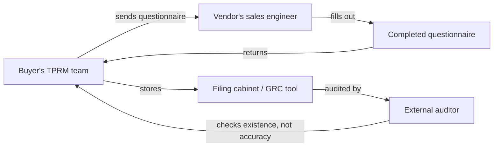
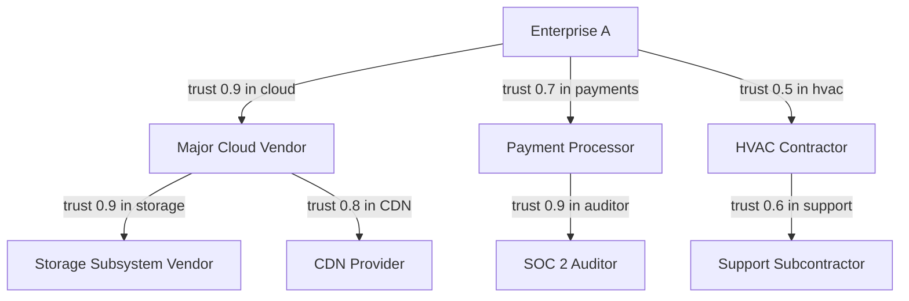

# The Third-Party Risk Management Nightmare

*Every CISO is answering vendor questionnaires. The answers are lies. Here's the architecture that fixes it.*

| Metadata | Value |
|----------|-------|
| Date     | 2026-04-25 |
| Authors  | The Quidnug Authors |
| Category | Cybersecurity, Supply Chain, Enterprise Architecture |
| Length   | ~7,000 words |
| Audience | CISOs, third-party risk teams, procurement security, SBOM implementers |

---

## TL;DR

The SolarWinds breach disclosed in December 2020 compromised roughly 18,000 organizations downstream of a single trusted vendor [^cisa-solarwinds]. The Log4Shell vulnerability (CVE-2021-44228 [^cve-log4j]) disclosed one year later affected millions of systems running a dependency most operators did not know they had. The XZ Utils backdoor (CVE-2024-3094 [^cve-xz]) disclosed in March 2024 showed a sophisticated adversary could spend two years building the social trust required to plant a backdoor in a critical upstream library.

The pattern repeats. Your attackers are your vendors' vendors' vendors. Your defenses are vendor questionnaires, most answered by the vendor's sales engineer. Your SBOM, if you have one, lists components but not trust relationships. Your compliance auditor, if you engage one, checks that you collected the questionnaires, not that the answers are true.

Third-party risk management (TPRM) as currently practiced is compliance theater. It generates paperwork. It does not produce risk information.

This post argues that the fix is structural. Cross-organization trust graphs, signed component attestations, and relational trust composition turn "I have 47 completed SIG questionnaires" into "my attack surface contains 1,243 identified components from 287 entities, of which 1,187 have transitive trust paths from my primary cloud vendor, 54 are flagged by peer organizations in my trust graph, and 2 have no corroborating trust signals." The second is a risk management posture. The first is a filing cabinet.

Quidnug provides the substrate. This post walks through why the current state fails, what structural properties a working system needs, and how to migrate from questionnaire compliance to verifiable trust.

**Key claims this post defends:**

1. Vendor security questionnaires are filled out by vendors. The structural conflict is intrinsic.
2. SBOMs are inventory without trust signals. An inventory of 47 shipped components tells you nothing about which components are actually trustworthy.
3. Cross-organization trust graphs give you Nth-party visibility that no questionnaire can.
4. The CISO-executive conversation changes from "we have the documents" to "we can show cryptographic evidence of who we trust and why."

---

## Table of Contents

1. [The Taxonomy of Supply Chain Attacks](#1-the-taxonomy)
2. [Why Vendor Questionnaires Fail](#2-why-vendor-questionnaires-fail)
3. [Why SBOMs Are Not Enough](#3-why-sboms-are-not-enough)
4. [The Nth-Party Problem](#4-the-nth-party-problem)
5. [Cross-Organization Trust Graphs](#5-cross-organization-trust-graphs)
6. [Signed Component Attestations](#6-signed-component-attestations)
7. [Migration Path from Current TPRM](#7-migration-path)
8. [Economic Analysis](#8-economic-analysis)
9. [Honest Limits](#9-honest-limits)
10. [References](#10-references)

---

## 1. The Taxonomy of Supply Chain Attacks

Before we talk about defenses, let me frame the threat precisely. Supply chain attacks are not homogeneous.

### 1.1 Attack categories

| Category | Mechanism | Canonical example |
|----------|-----------|-------------------|
| **Build system compromise** | Attacker modifies the build or CI/CD of an upstream project | SolarWinds Orion (2020) |
| **Distribution compromise** | Attacker intercepts or replaces distribution channel | CCleaner compromise (2017) |
| **Malicious maintainer** | Attacker contributes code as a trusted maintainer | event-stream (2018), XZ Utils (2024) |
| **Vulnerable dependency (accidental)** | Unintended vulnerability in widely-used code | Log4Shell (2021), Heartbleed (2014) |
| **Typosquatting** | Attacker publishes a package with a similar name to a legitimate one | Multiple npm / PyPI incidents |
| **Confused deputy / scope** | Vendor acts within its authorized scope but abuses it | Multiple subcontractor data breaches |
| **Supply chain side-channel** | Attacker exploits a trusted relationship (API keys, signed updates) | Target HVAC vendor breach (2013) |

A serious TPRM program has to have an answer for each. Most programs have an answer for the first and hand-wave the rest.

### 1.2 Scale measurement

Sonatype's annual State of the Software Supply Chain report [^sonatype2023] tracked the count of malicious packages identified in public repositories:

```
Malicious package discoveries per year (Sonatype data, approximate)

2019   │█                     216
2020   │██                    922
2021   │██████████           12,000
2022   │███████████████████   88,000
2023   │████████████████████ 245,000
```

The growth reflects both more attacks and more detection. Growth in either direction is bad news for defenders: more attacks mean more opportunities to miss one, more detection means the attack-iteration loop accelerates.

### 1.3 Cost data

IBM's Cost of a Data Breach report (2023) [^ibm2023] found:

- Breaches involving business partners cost on average $4.76 million per incident, compared to $3.76 million for internally-caused breaches.
- Supply chain breaches take on average 233 days to identify and 76 days to contain (total 309 days), vs 266 days total for non-supply-chain.
- 15% of breaches in 2023 originated in business-partner/supply-chain channels, up from 12% in 2022.

Ponemon's 2022 Cost of Third-Party Risk [^ponemon2022] surveyed 530 organizations and found:

- 54% had experienced a third-party breach in the previous 24 months.
- Average third-party breach cost: $7.5M.
- Only 34% of organizations had an inventory of all their third parties.

Two-thirds of organizations cannot even list who they are trusting with their data. The rest cannot verify the trust is warranted.

### 1.4 The geopolitical overlay

Supply chain attacks are increasingly state-attributed. CISA, NCSC-UK, and other national CERTs publicly attributed SolarWinds to APT29 (Russia), HAFNIUM Exchange exploitation to a PRC-linked group, and the Barracuda ESG campaign to a PRC-linked group. The adversaries are nation-states with persistent resources, not hobbyist threat actors.

The 2021 Executive Order 14028 on Improving the Nation's Cybersecurity [^eo14028] made supply chain security a specific federal requirement for US agencies. NIST SP 800-161r1 [^nist800161] was published in 2022 to provide implementation guidance. Both documents assume an adversary model commensurate with nation-state capability.

Treating TPRM as a compliance exercise when the adversaries are nation-state intelligence services is a category error that organizations have been slow to correct.

---

## 2. Why Vendor Questionnaires Fail

The dominant TPRM artifact is a questionnaire. SIG (Standardized Information Gathering), CAIQ (Consensus Assessments Initiative Questionnaire), VSAQ, custom enterprise questionnaires. All share the same structural weakness.

### 2.1 The questionnaire workflow



Notice who is answering: the vendor's sales engineer or security officer. The answers are aspirational. The auditor checks that the filing cabinet contains the document, not that the document reflects reality.

### 2.2 What questionnaires actually measure

From a 2019 empirical study by OWASP [^owasp2019] comparing questionnaire responses to independent assessments:

- 62% of vendors claimed "mature" status on categories where independent testing found "partial" or "ad hoc" practices.
- 29% of vendors claimed capabilities they did not deploy in the specific customer deployment under review.
- 9% of vendor answers were materially false when compared to technical evidence.

The noise floor on questionnaire answers is substantial. Any decision made primarily on questionnaire data is made on unreliable evidence.

### 2.3 The scalability problem

A mid-sized enterprise has 200-500 active vendors. Renewal of questionnaires typically runs annually. That's 200-500 complete questionnaires per year, each requiring vendor-side effort (1-3 days) and buyer-side review (4-8 hours). Total: ~0.5 to 2 FTE worth of questionnaire labor on both sides.

For 200 vendors, roughly 2 FTE × $150k/yr = $300k of buyer labor per year spent on questionnaires. Across the global enterprise market, this is a multi-billion-dollar industry of compliance labor generating paperwork.

Gartner's 2023 market report on TPRM [^gartner2023] sized the TPRM tooling market at approximately $1.7 billion annually and growing at 14%. None of that spend changes the structural reliability of questionnaire data.

### 2.4 The renewed-every-year nothing

Most questionnaires are annual. A vendor's security posture changes continuously (new employees, new integrations, new vulnerabilities). An annual snapshot is obsolete before it's filed. Continuous monitoring services (SecurityScorecard, BitSight, RiskRecon) partially address this but rely on external attack-surface signals (exposed services, open ports, DMARC records) that tell you the vendor's public infrastructure looks reasonable, not that their internal controls are sound.

### 2.5 The compliance-adjacent market

The TPRM adjacency market includes:

- Consensus assessments (CAIQ from the Cloud Security Alliance)
- Shared questionnaire libraries (SIG Core and SIG Lite)
- Continuous monitoring ratings (SecurityScorecard, BitSight)
- Attestation services (SOC 2 reports, ISO 27001 certifications)

Each is useful as a single data point. None provides a trust model. A SOC 2 Type II report tells you an auditor observed specific controls during a specific window. It does not tell you whether your specific use of the vendor's service composes with those controls, whether the vendor has changed behavior since the audit, or what trust chain connects the auditor's attestation to your risk decision.

---

## 3. Why SBOMs Are Not Enough

SBOMs (Software Bills of Materials) are the right direction but get interpreted too narrowly.

### 3.1 What an SBOM is

An SBOM is a structured list of the components in a piece of software. Formats include SPDX, CycloneDX, and SWID. A typical SBOM entry includes:

- Component name
- Version
- License
- Cryptographic hash
- Supplier
- Dependency relationships

EO 14028 required federal agencies to begin requiring SBOMs from vendors. CISA maintains the reference frameworks and has been pushing standardization.

### 3.2 What an SBOM tells you

"My application contains Apache Commons Text v1.9."

This is useful. You can check if v1.9 has known vulnerabilities. You can trace it through your dependency tree. You can check if there's a patched version.

### 3.3 What an SBOM does not tell you

- Who signed the v1.9 release, and whether their signing key has been compromised.
- Who is the maintainer of that specific release, and do they have a history of trustworthy contributions, or is this their first commit?
- What build system produced the binary in your SBOM, and was that build system auditable?
- What trust does the rest of the industry place in this library?
- Has this library been flagged by your peer organizations?

SBOMs are inventories. Inventories are useful for "when CVE-X drops, who's affected?" They are not useful for "should I deploy this library in the first place?"

### 3.4 The SLSA framework

SLSA (Supply-chain Levels for Software Artifacts) [^slsa2024] extends SBOMs with build provenance. It defines four levels:

- Level 1: build process is documented.
- Level 2: build is automated and produces authenticated provenance.
- Level 3: build platform is hardened.
- Level 4: hermetic, reproducible builds with two-party review.

SLSA is a big improvement over SBOM-alone. It gets you from "here's what's in my software" to "here's verifiable evidence of how it was built." But it does not answer "should the people who built it be trusted?"

### 3.5 What's still missing

The missing layer is trust composition. Given a component with a SLSA Level 3 build attestation from maintainer M, signed by signing authority S:

- How much do I trust S's attestations?
- How much do I trust S's attestations about M?
- How much do I trust M's competence and integrity?
- How do I compose these to produce a decision?

Quidnug's relational trust layer is exactly this composition. The component attestation is the SLSA evidence; the trust evaluation is the relational computation.

---

## 4. The Nth-Party Problem

Direct vendors are your 1st party relationships. Their vendors are 2nd party. Their vendors' vendors are 3rd. Real attacks have crossed 4 or more party boundaries.

### 4.1 Empirical depth

CyCognito's 2023 research [^cycognito2023] on enterprise attack surfaces found:

- Average enterprise has 7,500 internet-exposed assets.
- 60% of those assets are operated by 2nd-party vendors or beyond.
- Only 20% of enterprises could name their top 10 4th-party dependencies.

The depth visibility falls off dramatically beyond first-party relationships. For most enterprises, anything beyond 2nd-party is unmanaged risk.

### 4.2 Case studies

**Target 2013 [^target2013]:** HVAC contractor (Fazio Mechanical) had remote access to Target's billing systems. Attackers compromised Fazio, pivoted to Target, accessed 40M payment card records. Fazio was a 1st-party vendor; the pivot path through their access was the attack.

**Okta/Lapsus$ 2022 [^okta2022]:** Okta customer support was managed by Sitel (later Sykes), a subcontracted support provider. Lapsus$ compromised a Sitel engineer's laptop. From there, access reached Okta support tenants, which reached Okta customers. Okta was 1st-party to its customers; Sitel was 2nd-party. Most Okta customers had no awareness that Sitel was in their trust boundary.

**XZ Utils 2024 [^xz2024]:** The "Jia Tan" identity contributed to the XZ Utils project over approximately two years, building social trust before inserting a backdoor in versions 5.6.0 and 5.6.1. The backdoor was discovered by a Microsoft engineer noticing a 500ms delay in SSH connections. XZ Utils is a 3rd-4th party for most enterprises using Linux distributions.

### 4.3 Why current architecture can't see this

Vendor questionnaires ask your 1st-party vendor about their security practices. They do not ask about your 2nd-party exposure through that vendor. In principle, SIG-style questionnaires have 4th-party questions; in practice, those questions are answered vaguely if at all, because the vendor themselves often doesn't know their dependencies at depth.

SBOMs help here but only for software. Service dependencies (the SaaS your SaaS depends on) typically don't appear in SBOMs. Human-process dependencies (the subcontractor your subcontractor uses for support) definitely don't.

### 4.4 The visibility requirement

For a working Nth-party visibility system, you need:

1. Each participant publishes their own direct relationships (who they trust and in what capacity).
2. You can walk the graph transitively from your 1st-party relationships.
3. At each hop, the trust weight decays (you can reason about weak vs strong transitive trust).
4. Cross-cutting signals (CVE disclosure, breach reports) propagate as trust adjustments.

This is exactly a relational trust graph. Let me describe the Quidnug instantiation.

---

## 5. Cross-Organization Trust Graphs

The organizational-trust use case for Quidnug is the most natural fit for the relational trust model.

### 5.1 Structure

Each organization has a Quidnug identity. They publish signed trust edges to:

- Vendors they use (with scope: what domains of data or access)
- Auditors they rely on
- Industry bodies they are members of
- Peer organizations in their sector



### 5.2 Computing Nth-party exposure

When Enterprise A queries its trust graph for "what entities have indirect access through my vendors," the computation returns a path-and-weight list:

```
Nth-party exposure report

Entity                  Via path                              Composite trust
----------------------------------------------------------------------------
Major Cloud Vendor      Direct                                0.90
Payment Processor       Direct                                0.70
HVAC Contractor         Direct                                0.50
Storage Subsystem       Cloud                                 0.81
CDN Provider            Cloud                                 0.72
SOC 2 Auditor           Payment                               0.63
Support Subcontractor   HVAC                                  0.30   [WEAK]
```

The Support Subcontractor showing up with trust 0.30 is actionable intelligence that a questionnaire would not have surfaced.

### 5.3 Negative signals

Trust can also be withdrawn or qualified. If Enterprise B (a peer organization whom Enterprise A trusts at 0.6) publishes a negative signal about HVAC Contractor:

```
EVENT(
  domain=security.vendor-signals,
  subject=hvac-contractor-quid,
  eventType=INCIDENT_REPORT,
  payload={
    severity="moderate",
    categories=["access-control", "logging"],
    description="HVAC contractor had inadequate MFA on remote access...",
    resolvedAt=..., // null if ongoing
    assessor=enterpriseB
  },
  signed by: enterpriseB
)
```

Enterprise A's trust computation sees this signal, discounted by their own trust in B (0.6). The discount is: trust in HVAC Contractor decreases by some function of the signal severity × trust in B.

If multiple peers report similar signals, the discount compounds. The signal can cross trust thresholds, triggering Enterprise A to review its HVAC relationship.

### 5.4 Positive signals

Symmetrically, peers can attest to positive experiences. A peer publishing "we've audited HVAC Contractor's access logs for 18 months and they've been clean" is a positive signal that supports the trust edge.

Over time, a vendor accumulates a reputation that is visible to anyone with trust paths to the attesters. The reputation is not a single number but a distribution: strong in domain X, weak in domain Y, specific incidents disclosed and resolved.

### 5.5 Privacy considerations

Not every trust relationship is public. Some enterprises will not want competitors to know their vendor list.

**Mitigations:**
- Trust edges can be published in private domains visible only to trusted peers (domain access control).
- Signals can be aggregated and anonymized before publication (a trade association publishing "breach incidents in our sector" without naming the reporter).
- Private trust graphs can exist alongside public ones (an enterprise participates in a sector-specific private trust network and a broader public network).

Privacy does not require abandoning the substrate; it requires scoping the substrate appropriately.

---

## 6. Signed Component Attestations

At the software-component layer, the trust model needs to compose with existing build provenance infrastructure.

### 6.1 The composition

```
Component trust = f(
    build provenance (SLSA),
    signer identity (PKI),
    signer's reputation in relevant domain (Quidnug trust graph),
    peer attestations about the component,
    incident history
)
```

Each input is an existing signal. The composition is the new capability.

### 6.2 Example: evaluating Apache Commons Text v1.10

A developer wants to deploy Apache Commons Text v1.10. The evaluation flow:

1. **Build provenance check:** SLSA-level attestation exists, build reproducible, signing key verified against Apache Foundation.
2. **Signer reputation:** Apache Foundation's Quidnug identity has a long history of trusted releases, including a strong track record in the Java library domain.
3. **Peer attestations:** multiple enterprises the developer's org trusts have deployed this version without incident for 6+ months.
4. **Incident history:** Apache Commons Text had CVE-2022-42889 in v1.9 (Text4Shell). That CVE is closed in v1.10. No new CVEs.
5. **Composite trust:** ~0.85 (high but not perfect).

The developer deploys with the understanding that the composite is not 1.0 and should be monitored.

Compare to deploying `leftpad-2-alternative-pure-new` v0.0.1, published two weeks ago by a first-time maintainer:

1. **Build provenance:** package has no SLSA attestation.
2. **Signer reputation:** maintainer identity has no history.
3. **Peer attestations:** no enterprises have reported deployment.
4. **Incident history:** none (because too short a history).
5. **Composite trust:** ~0.1 or lower.

The composite correctly reflects the risk delta.

### 6.3 Integration with sigstore

sigstore [^sigstore] is the open-source signing infrastructure adopted by major OSS foundations. It uses short-lived certificates issued via OIDC and a transparency log (Rekor). The signing chain terminates at the transparency log's append-only record.

Quidnug does not replace sigstore. It composes with it:

- sigstore gives you: "This binary was signed by this identity, recorded in the transparency log at time T."
- Quidnug adds: "This signer has the following trust relationships in your trust graph, and the following peer attestations from organizations you trust."

The integration lives at the verifier. A developer evaluating a dependency sees the sigstore record plus the Quidnug trust overlay.

### 6.4 Peer-to-peer attestations

The most important new primitive: organizations publishing attestations about components they have deployed.

```
EVENT(
  domain=software.attestations,
  subject=apache-commons-text-v1.10-sha256-hash,
  eventType=DEPLOYMENT_ATTESTATION,
  payload={
    deployedSince=1710000000,
    deploymentScale="200 production services",
    incidentCount=0,
    notableObservations=[],
    reviewedForLicensing=true,
    licenseVerified="Apache-2.0"
  },
  signed by: enterpriseB.ciso-quid
)
```

Every time this event type is published, the component's trust signal accumulates. A component deployed by hundreds of enterprises for years without incident carries a very different signal than one newly published.

This is not the same as "download count" on npm or PyPI. Download count is easily gamed. Signed deployment attestations require a real organizational identity behind each one, and the attestations accumulate in a tamper-evident log.

---

## 7. Migration Path from Current TPRM

The structural argument is made. How does an enterprise actually get from current state to target state?

### 7.1 Phase 1: identity establishment (months 1-2)

- Create a Quidnug identity for the enterprise.
- Establish DNS-anchored attestation (QDP-0023) binding the identity to the enterprise's primary DNS domain.
- Publish the identity's public key through standard channels (public website, vendor communications, industry body).

### 7.2 Phase 2: trust edge publication (months 2-6)

- Inventory current direct vendors (use existing TPRM data).
- Ask each vendor if they have a Quidnug identity. For those that do, publish a trust edge.
- For vendors that don't, include a request-for-identity in the next contract renewal.
- Prioritize identity establishment for vendors in high-impact categories (cloud, data, security tools).

### 7.3 Phase 3: peer network membership (months 4-8)

- Join a sector-specific trust network (ISAC memberships are the existing precedent; Quidnug-enabled trust networks are a natural extension).
- Begin publishing anonymized incident signals.
- Begin consuming signals from peer organizations.

### 7.4 Phase 4: component-layer integration (months 6-12)

- Deploy sigstore verification for OSS dependencies.
- Extend the verifier to consume Quidnug trust signals.
- Begin publishing your own deployment attestations for widely-used components.

### 7.5 Phase 5: decision automation (months 9-18)

- Replace questionnaire-based vendor evaluation with trust-graph-based scoring for categories where the graph has enough data.
- Questionnaires continue for categories where trust-graph coverage is thin.
- Over time, the coverage expands and questionnaire dependence contracts.

### 7.6 What this looks like in 24 months

After 24 months of a motivated enterprise running this migration:

- All direct vendors have Quidnug identities and published trust relationships.
- All peer organizations in the enterprise's sector have published trust edges.
- Software component trust is composed automatically in the CI/CD pipeline.
- Vendor evaluation runs 60-80% on trust graph data with questionnaires reserved for gap coverage.

### 7.7 Compatibility with existing frameworks

- **NIST SP 800-161r1:** Quidnug trust graphs map directly to the C-SCRM cyber supply chain risk management model. Evidence of due diligence is stronger, not weaker.
- **ISO 27036 (Information Security for Supplier Relationships):** the trust graph is evidence of systematic supplier management beyond what questionnaires provide.
- **SOC 2 / CC7 (Operations):** vendor management controls are stronger with verifiable trust graph data.
- **CMMC (DoD):** Nth-party visibility is an implicit requirement that trust graphs make explicit.

No existing framework has to be abandoned. The trust graph supplies better evidence for the same required controls.

---

## 8. Economic Analysis

The compelling case for action is financial. Let me quantify.

### 8.1 Current state cost

For a mid-sized enterprise (200 vendors, 500 people in IT):

- Questionnaire labor: 2 FTE × $150k = $300k/yr
- Continuous monitoring service: $50k-500k/yr depending on scope
- Breach response from third-party incident (annualized, expected value): per Ponemon 2022, ~54% probability × $7.5M = $4M expected/yr

Total: roughly $4.5M per year expected cost.

### 8.2 Post-migration cost

At 24-month steady state:

- Questionnaire labor: 0.5 FTE × $150k = $75k/yr (residual for vendors without Quidnug identities)
- Quidnug infrastructure: reference node + staff time, ~$100k/yr
- Continuous monitoring service: reduced scope, $25k-200k/yr
- Expected breach cost: per-vendor risk visibility reduces the "unknown unknowns" category. Assume 30% reduction in breach frequency × $7.5M × 0.54 = $1.2M reduction. Adjusted expected: $2.8M/yr.

Total: roughly $3.1M per year expected cost. Savings: ~$1.4M/year per enterprise.

These numbers are rough estimates; actual savings depend on industry, threat profile, and current TPRM maturity. The direction is clear: structural trust substrates are net-cheaper than questionnaire compliance plus fraud.

### 8.3 The industry-wide effect

If 25% of Fortune 500 enterprises deploy trust graphs within 5 years, the collective visibility into Nth-party risk becomes qualitatively different. Peer-attestation data from several hundred enterprises materially changes the risk calculation for every participant.

This is a classic network effect: value grows superlinearly with participants. Early adopters capture more value than later ones because their trust relationships become part of the backbone.

### 8.4 The CISO executive briefing

Under the current state, a CISO's report to the board on TPRM includes:

- "We have SOC 2 Type II reports from 80% of our vendors."
- "We completed 192 vendor assessments this year."
- "SecurityScorecard rates our average vendor as B+."

Under the proposed state:

- "Our trust graph includes 287 organizations, representing 98% of our vendor footprint."
- "We have cryptographic evidence of deployment attestations from 412 of our peer organizations on the components we use."
- "We receive an average of 12 peer incident signals per month from our sector trust network, actioned in average 4 days."
- "Our Nth-party visibility extends to depth 4 for 80% of vendors, depth 6 for our top 20 vendors."

The second report tells the board what risk actually looks like. The first tells them what paperwork exists.

---

## 9. Honest Limits

### 9.1 Not all vendors will adopt

Some vendors will refuse or be slow to adopt Quidnug identities. Legacy vendors without modern engineering teams, vendors in regions with weak PKI support, vendors whose contracts do not reward investment in customer-facing trust tooling.

For these, questionnaires and SOC 2 reports remain the mainstay. The trust graph handles the vendors who do adopt; the old mechanisms handle the ones who don't. Mixed-state operation is tolerable.

### 9.2 Peer attestations can themselves be gamed

A vendor could incentivize peer organizations to publish favorable attestations. Without some social infrastructure around attestation quality (auditor review, trusted intermediary attestation), these signals are subject to manipulation.

**Mitigation:** trust-weight peer attestations by the attester's reputation. A peer that has published 100 attestations of varying positive and negative valence has more credible attestations than one that only publishes positive ones on specific vendors.

### 9.3 Private trust graphs create new concentration

If the sector trust network becomes the authoritative signal, membership in the network becomes gatekept by its existing members. A new entrant might have difficulty being visible.

**Mitigation:** multiple overlapping trust networks with different membership criteria. Federated Quidnug instances allow cross-network signals with controlled trust. This is QDP-0013 territory.

### 9.4 Attestation burden on deployers

Every enterprise publishing deployment attestations is new labor. Not huge, but not free.

**Mitigation:** most of this can be automated. CI/CD pipelines can emit attestations for every production deployment. Scaled enterprises can have this running as a sidecar without per-deployment manual work.

### 9.5 Regulatory and procurement compatibility

Some procurement processes require specific questionnaire formats. Replacing the questionnaire is a multi-year procurement-policy change.

**Mitigation:** Quidnug trust graphs supply evidence; the existing questionnaire format is a presentation layer. The two can coexist: auto-populate the questionnaire from trust graph data, leave the questionnaire format unchanged, upgrade the authoritative source behind the scenes.

### 9.6 Summary

The limits above are real and require ongoing effort to manage. None is structural. The underlying substrate works; the operational deployment is the hard part.

---

## 10. References

### Major supply chain incidents

[^cisa-solarwinds]: Cybersecurity and Infrastructure Security Agency (CISA). (2020-2021). *SolarWinds Compromise Advisory.* https://www.cisa.gov/news-events/cybersecurity-advisories

[^cve-log4j]: MITRE CVE-2021-44228 (Log4Shell). National Vulnerability Database. https://nvd.nist.gov/vuln/detail/CVE-2021-44228

[^cve-xz]: MITRE CVE-2024-3094 (XZ Utils backdoor). National Vulnerability Database. https://nvd.nist.gov/vuln/detail/CVE-2024-3094

[^target2013]: Krebs, B. (2014). *Target Hackers Broke In Via HVAC Company.* KrebsOnSecurity. https://krebsonsecurity.com/2014/02/target-hackers-broke-in-via-hvac-company/

[^okta2022]: Okta. (2022). *Detailing Our Response to the Lapsus$ Compromise.* Okta Security Team Blog.

[^xz2024]: Freund, A. (2024). *Backdoor in upstream xz/liblzma leading to SSH server compromise.* oss-security mailing list disclosure.

### Frameworks and regulations

[^eo14028]: The White House. (2021). *Executive Order 14028: Improving the Nation's Cybersecurity.* https://www.whitehouse.gov/briefing-room/presidential-actions/2021/05/12/executive-order-on-improving-the-nations-cybersecurity/

[^nist800161]: Boyens, J., et al. (2022). *NIST SP 800-161r1: Cybersecurity Supply Chain Risk Management Practices for Systems and Organizations.* NIST. https://csrc.nist.gov/pubs/sp/800/161/r1/final

[^slsa2024]: Supply-chain Levels for Software Artifacts. (2024). *SLSA Specification v1.0.* https://slsa.dev/

[^sigstore]: Sigstore Project. https://www.sigstore.dev/

### Industry research

[^sonatype2023]: Sonatype. (2023). *9th Annual State of the Software Supply Chain Report.* https://www.sonatype.com/state-of-the-software-supply-chain/

[^ibm2023]: IBM Security. (2023). *Cost of a Data Breach Report 2023.* https://www.ibm.com/reports/data-breach

[^ponemon2022]: Ponemon Institute. (2022). *The State of Third-Party Risk Management.*

[^gartner2023]: Gartner. (2023). *Market Guide for Third-Party Risk Management Solutions.*

[^cycognito2023]: CyCognito. (2023). *2023 State of External Attack Surface Risk Report.*

[^owasp2019]: OWASP. (2019). *Comparison of Vendor Questionnaires to Independent Assessment.* OWASP Project Documentation.

### Quidnug design documents

- QDP-0013: Network Federation Model
- QDP-0018: Observability and Tamper-Evident Operator Log
- QDP-0023: DNS-Anchored Identity Attestation

---

*For CISOs and TPRM teams interested in pilot deployments, the Quidnug repository has reference implementations and a Slack channel for cross-org coordination.*
