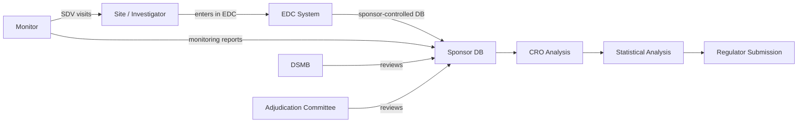

# Clinical Trial Data Integrity

*How signed event streams replace ALCOA+ paper-trail compliance, and why FDA inspectors will prefer them.*

| Metadata | Value |
|----------|-------|
| Date     | 2026-04-26 |
| Authors  | The Quidnug Authors |
| Category | Pharma, Regulatory Compliance, Healthcare |
| Length   | ~6,900 words |
| Audience | Pharmaceutical quality heads, clinical operations leads, regulatory inspectors, CRO platform engineers |

---

## TL;DR

The Ranbaxy consent decree [^ranbaxy-doj], finalized in 2013, required the company to pay $500 million in civil and criminal fines after years of manufacturing data fabrication. Theranos's trial data proved to be systematically unreliable; Elizabeth Holmes was convicted in 2022 on multiple counts of fraud. FDA's Warning Letters database [^fda-warning-letters] shows data integrity findings as one of the most consistently recurring violation categories in pharmaceutical manufacturing inspections, year after year.

Clinical trial data integrity matters because the data feeds regulatory decisions about whether drugs are safe and effective for human patients. Getting this wrong is not a compliance abstraction; it causes patient harm.

The regulatory framework that governs this is ALCOA+, a set of data quality principles articulated by FDA (originally Attributable, Legible, Contemporaneous, Original, Accurate, later extended with Complete, Consistent, Enduring, Available). FDA's 2018 Guidance for Industry on Data Integrity and Compliance [^fda-dg2018] codified expectations. EMA published a comparable reflection paper in 2016 [^ema-2016]. 21 CFR Part 11 [^cfr-part-11] governs electronic records and signatures.

The framework is sound. The implementation is a disaster.

ALCOA+ principles were designed to prevent paper lab notebooks from being modified after the fact. They have been mechanically translated to electronic systems in ways that preserve the compliance vocabulary but miss the structural opportunity. A 2024 analysis of FDA Form 483 observations [^fda483-2024] noted that 28% of inspections surfacing data integrity issues involved electronic systems, not just paper. Computerized systems can be (and are) manipulated in ways paper never permitted.

This post argues that clinical trial data integrity requires moving from trust-the-sponsor compliance to cryptographic tamper-evidence. Quidnug's signed event streams (QDP-0018 audit log) plus append-only block history give inspectors a class of evidence they currently cannot get: verifiable proof that data was recorded when claimed, has not been altered since, and is attributable to specific parties with specific roles.

The trial sponsor, the clinical site, the contract research organization (CRO), the independent monitor, and the regulator all have distinct roles. Under Quidnug, each signs what they attest to. When the regulator reviews a trial years later, the attestation chain tells them exactly who did what and when.

**Key claims this post defends:**

1. ALCOA+ compliance today depends on trusting the sponsor's internal processes. That trust is necessary under paper-era tooling and unnecessary under cryptographic tooling.
2. 21 CFR Part 11 audit trails are typically log files the sponsor could modify. True tamper-evidence requires append-only hash-chained records the sponsor cannot rewrite.
3. Multi-party signed attestation eliminates the "who wrote this data?" question that has been the root cause of multiple major fraud incidents.
4. The regulatory inspection experience improves materially for both inspectors and sponsors when the substrate provides verifiable evidence directly.

---

## Table of Contents

1. [ALCOA+ Explained, and Where It Came From](#1-alcoa-explained)
2. [21 CFR Part 11 and Its Failure Modes](#2-21-cfr-part-11)
3. [Major Fraud Cases and What the Substrate Would Have Caught](#3-major-fraud-cases)
4. [The Multi-Party Structure of a Clinical Trial](#4-multi-party-structure)
5. [Tamper-Evident Event Streams Applied to Trial Data](#5-tamper-evident-event-streams)
6. [Worked Example: Phase III Endpoint Adjudication](#6-worked-example)
7. [The Inspector Experience](#7-the-inspector-experience)
8. [Integration with Existing Systems (EDC, CTMS, eTMF)](#8-integration)
9. [Honest Limits and Regulatory Timeline](#9-honest-limits)
10. [References](#10-references)

---

## 1. ALCOA+ Explained

The framework's origin is worth understanding because it explains why it is both correct and constraining.

### 1.1 ALCOA acronym expansion

| Letter | Principle | Paper-era interpretation |
|--------|-----------|--------------------------|
| A | Attributable | Handwritten initials on every entry |
| L | Legible | Readable handwriting |
| C | Contemporaneous | Recorded at time of observation, not later |
| O | Original | First-capture record, not a transcribed copy |
| A | Accurate | Reflects what happened |

Added as ALCOA+ (post 2010):

| Letter | Principle |
|--------|-----------|
| C | Complete (nothing omitted) |
| C | Consistent (uniform across the record) |
| E | Enduring (retained for the retention period) |
| A | Available (retrievable on inspection) |

### 1.2 Origin story

FDA's modern data integrity focus traces to multiple inspections in the late 1990s and 2000s where manufacturers were found to have falsified or selectively reported data. The ALCOA framework crystallized in guidance documents (MHRA UK, WHO, FDA) around 2010-2018.

FDA's 2018 guidance [^fda-dg2018] remains the authoritative US document. EMA's 2016 reflection paper is the European counterpart. PIC/S (Pharmaceutical Inspection Convention) published comparable guidance in 2021 covering data integrity expectations across member inspectorates.

### 1.3 Transposition to electronic records

When manufacturers transitioned from paper to electronic records (broadly 1995-2015), ALCOA+ principles were applied mechanically:

- Attributable → electronic signatures required
- Legible → electronic records are legible by design
- Contemporaneous → system timestamps
- Original → "first capture" concept, sometimes with "dynamic data" considerations
- Accurate → validation of electronic systems (GAMP 5 framework)
- Complete → audit trails
- Consistent → cross-reference checks
- Enduring → backup and retention policies
- Available → searchable electronic archives

Each translation is correct as far as it goes. But each introduces the question: who guarantees that the electronic system behaved as specified?

### 1.4 The trust gap

Every electronic record in a modern clinical trial has the following structure:

1. Data entered by a site user into an electronic data capture (EDC) system.
2. EDC system writes to a database managed by the sponsor or CRO.
3. Audit trail log written alongside, recording the entry event.
4. Backup periodically taken.
5. Archive on trial completion.

The integrity of (1) depends on the user not lying. The integrity of (2) depends on the sponsor's database not being tampered with. The integrity of (3) depends on the audit trail not being modified. The integrity of (4) and (5) depends on no one modifying backups or archives.

Every step is an opportunity for compromise. The regulatory framework requires sponsors to validate their systems, document their processes, and maintain segregation of duties. These are controls. They are not proofs.

A motivated sponsor who wishes to modify data has: access to the database (DBA role exists by necessity), access to the audit trail (often in the same database), access to backups (they manage them), and access to the archive (they retain it for 15+ years).

What the current framework does well: catches casual, careless, or unsophisticated attempts. What it does not do: prevent a sophisticated, motivated internal party from modifying records.

---

## 2. 21 CFR Part 11 and Its Failure Modes

The US regulation governing electronic records and signatures in regulated industries. Published 1997, updated via guidance documents since.

### 2.1 Key requirements

- **Electronic records must be retained as accurately as paper records would have been.**
- **Electronic signatures must be unique to one individual, not transferable, bound to the record.**
- **Audit trails must be secure, computer-generated, time-stamped, and tracking any creation, modification, or deletion.**

### 2.2 Typical compliance implementation

A commercial EDC system (Medidata Rave, Veeva CDMS, Oracle InForm, etc.) implements Part 11 roughly as:

- User authentication via username/password (or SSO).
- Electronic signature captured as user-id + password + reason code.
- Audit trail as a database table: user-id, timestamp, record-id, old-value, new-value, reason.
- Database access segregated: users can edit their records, admins can see all, DBAs can maintain the database.

### 2.3 Where this fails

**The audit trail is in the same database it audits.** A sufficiently-privileged user can modify the audit trail itself. System controls (database triggers, separate audit databases, etc.) reduce this but do not eliminate it.

**Electronic signatures bind to data via foreign key, not cryptographically.** An "electronic signature" in most Part 11 systems is a database record referencing the data record. There is no cryptographic signature over the content. If the signature row is modified or the data row is modified, the relationship can be falsified.

**System validation vs system trust.** Validation (per GAMP 5) demonstrates the system works as specified. It does not demonstrate the system has not been tampered with since the last validation.

**Clock trust.** Timestamps depend on the system clock. The system administrator can change the clock. NTP synchronization is common but not mandated. An administrator who changes the clock before entering a record changes the "Contemporaneous" attribute on that record.

### 2.4 Warning letter examples

FDA Warning Letters from the past five years include cases where:

- Audit trails were disabled for specific users or during specific time windows.
- Records were created with backdated timestamps by administrators.
- Electronic signatures were shared or applied by users other than the named signer.
- Databases were "cleaned up" by removing records deemed inconvenient.
- Multiple data sources existed with different values for the same parameter.

Each of these would be preventable under a cryptographically tamper-evident substrate. They occurred under Part 11-compliant systems.

### 2.5 GAMP 5 as it actually operates

GAMP 5 (Good Automated Manufacturing Practice, version 5) [^gamp5] is ISPE's framework for computerized systems validation. It categorizes systems by risk and prescribes validation rigor accordingly.

GAMP 5 is genuinely useful for ensuring software behaves as specified. It is not designed to address the threat model where an insider with administrative access tampers with records after capture. That threat model belongs to a different domain (cybersecurity / data integrity for insider threat), which GAMP 5 acknowledges but does not address at depth.

The gap between "the system operates correctly" (GAMP 5) and "the records have not been altered by insiders" (data integrity under adversarial conditions) is what a cryptographic substrate closes.

---

## 3. Major Fraud Cases

Concrete examples illustrate what the substrate would have caught.

### 3.1 Ranbaxy (2008-2013)

Ranbaxy was a major Indian pharmaceutical manufacturer. FDA and DOJ investigations uncovered systematic fraud including:

- Submitting fabricated data to FDA in support of drug applications.
- Substituting one vendor's API for another without disclosure.
- Backdating records to match submitted timelines.
- Maintaining duplicate "clean" and "real" records, submitting only the clean ones.

The scheme persisted for years across multiple drugs. It was uncovered via a whistleblower (Dinesh Thakur) who provided evidence directly to FDA. Ranbaxy ultimately paid $500M in civil and criminal penalties [^ranbaxy-doj] and was acquired by Sun Pharmaceutical.

**What the substrate would have caught:** every record submitted to FDA as original source would have been signed at capture time. "Duplicate clean" records would have had distinct signatures and timestamps, making their dual existence immediately visible. Backdating would have required backdating the cryptographic chain, which requires forging signatures with keys that have monotonically-increasing nonces. The attack pattern does not extend to cryptographic records.

Would it have prevented the fraud entirely? No. Motivated actors can still fabricate records at capture (signed fabrications look signed). But the scale and longevity of Ranbaxy's scheme depended on record modifications after the fact. That specific vector is closed by tamper-evidence.

### 3.2 Theranos (2015-2022)

Theranos claimed to perform comprehensive blood tests from a finger-prick sample. Regulatory, investor, and patient deception spanned years. Holmes was convicted in 2022 on four counts of fraud [^holmes-conviction].

Specific patterns:

- Validation studies were performed and then modified or selectively reported.
- Test results produced by unconventional methods were reported alongside results from commercial equipment, blurring which was which.
- Internal QC failures were hidden from external validators.

**What the substrate would have caught:** if Theranos had been operating under a cryptographic-substrate regulatory framework (which does not exist in the current US system), internal QC records would have been signed at capture. The pattern of "some tests were performed this way, others that way, but all were reported identically" would have been visible because each record would have had provenance back to the specific method used.

### 3.3 Olympus Corporation (2011)

Not a clinical data case, but a corporate fraud case that illustrates the same pattern: accounting fraud at Olympus was concealed for over a decade through coordinated record modifications across multiple subsidiaries. The scheme ended because a new CEO (Michael Woodford) asked questions that internal records could not answer.

The parallel to clinical trials: any long-running modification scheme fails when records are tamper-evident. The scheme's persistence depends on the ability to retrofit records to tell a coherent false story.

### 3.4 Valeant Pharmaceuticals / Philidor (2015-2016)

Valeant's relationship with specialty pharmacy Philidor involved alleged manipulations of prescription records to inflate reported sales. Investigation (SEC, DOJ) continued for years.

The issue here was less about cryptographic tampering and more about the structural opacity of the reporting chain. Each party (Valeant, Philidor, third-party payers) had records that could not be independently reconciled.

**What the substrate would have caught:** cross-party reconciliation is exactly what signed cross-party attestations enable. A prescription record signed by the prescribing physician, countersigned by the pharmacy, recorded by the payer, with all signatures in a common verifiable chain, would have made the inconsistencies visible in real time rather than years later.

### 3.5 The common pattern

Every fraud case above involved either record modification after capture or record fabrication combined with inconsistent cross-party records. Cryptographic substrates close the first vector entirely and make the second vector detectable through cross-party signatures.

Motivated actors can still commit fraud. The scheme becomes harder to sustain, harder to conceal, and far easier to detect in retrospect.

---

## 4. The Multi-Party Structure of a Clinical Trial

Clinical trials are multi-party by nature. Understanding the parties and their roles is prerequisite to designing the substrate.

### 4.1 The parties

| Party | Role | What they attest to |
|-------|------|---------------------|
| Investigator (site) | Performs the protocol on patients | Patient data, adverse events, protocol deviations |
| Site staff (coordinators, nurses) | Data entry, patient interactions | Specific visits, measurements, subject responses |
| Sponsor | Owns the trial, owns the data | Protocol, statistical analysis plan, final submissions |
| Contract Research Organization (CRO) | Operates the trial on sponsor's behalf | Site monitoring, data cleaning, analysis |
| Independent monitor | Reviews site compliance | Monitoring reports, source data verification |
| Endpoint adjudication committee | Reviews clinical events for classification | Adjudicated events |
| Data safety monitoring board (DSMB) | Reviews safety data during trial | Interim safety reports, recommendations |
| Statistician | Analyzes data | Final statistical reports |
| Institutional Review Board (IRB) / Ethics Committee | Approves protocol, monitors conduct | Approvals, continuing reviews |
| Regulatory authority (FDA, EMA, PMDA) | Approves the submission | Decision, inspection records |

### 4.2 Current data flow



Every arrow is a place where the record passes through the sponsor's or CRO's control. The sponsor sees all data. The regulator sees what the sponsor submits.

### 4.3 Why this structure has integrity risks

- **Single point of data control.** Sponsor/CRO has the data. Any modification at this point is hidden from other parties.
- **Delayed monitoring.** Monitors visit sites weeks or months after data capture. By that point, patterns of modification may be established.
- **Lack of cross-party cryptographic binding.** Site data entry, monitor review, and sponsor verification are logically separate events but not cryptographically bound to each other.

### 4.4 What multi-party signed attestation changes

Each party signs what they attest to. The signatures compose into a verifiable record.

- Site enters data: signed at entry.
- Site supervisor countersigns: independent verification.
- Monitor reviews source: signs a review record.
- CRO processes: signed processing logs.
- Sponsor finalizes dataset: signed.
- Regulator reviews: signed review record.

Every party's record includes cryptographic links to the prior records. Modification of any prior record breaks the chain.

### 4.5 The structural property this enables

Under current architecture, if the sponsor modifies data after monitor review, detection requires comparing the sponsor's database to the monitor's separate records (maintained in a separate system). This comparison is rare and effortful.

Under the substrate, comparison is automatic: the monitor's signature binds to the exact content at review time. If the sponsor later modifies, the chain is broken at the monitor's signature. Any subsequent inspector can detect the break in seconds.

---

## 5. Tamper-Evident Event Streams Applied to Trial Data

Quidnug's event stream architecture (QDP-0014 plus audit log QDP-0018) maps naturally to clinical trial data.

### 5.1 Per-subject event stream

Each trial subject has a stream of events: visits, measurements, adverse events, protocol deviations. Each event is signed by the party who entered it and committed to an append-only log.

```
Subject ID: SUB-0001
Trial: COVID-19-VAX-Phase-III
Domain: trial.pfizer.c4591001.subjects

EVENT 001 (Timestamp: 2025-06-15 14:32)
  Signed by: investigator-site-042-coordinator-primary
  Type: VISIT_START
  Payload: visit 1, screening, CIDR-hash

EVENT 002 (Timestamp: 2025-06-15 14:38)
  Signed by: investigator-site-042-coordinator-primary
  Type: DEMOGRAPHIC_DATA
  Payload: {age: 54, sex: female, race: ..., weight: ...}

EVENT 003 (Timestamp: 2025-06-15 14:47)
  Signed by: investigator-site-042-physician
  Type: INFORMED_CONSENT_OBTAINED
  Payload: consent form version 2.3, signed at 14:45

EVENT 004 (Timestamp: 2025-06-15 14:52)
  Signed by: investigator-site-042-nurse-a
  Type: VITAL_SIGNS
  Payload: BP 124/78, HR 72, T 36.7C, weight 72.5kg

... etc ...

EVENT 087 (Timestamp: 2025-09-12 10:15)
  Signed by: site-042-pharmacist
  Type: DRUG_ADMINISTRATION
  Payload: kit PFz-887, dose 1, lot 240915-A

EVENT 103 (Timestamp: 2025-09-15 16:22)
  Signed by: subject-voluntary-ae-report
  Type: ADVERSE_EVENT_REPORT
  Payload: {symptom: headache, onset: 2025-09-14 22:00, severity: mild}
```

Each event is signed. Each event's hash chains to the prior. The sequence is append-only.

### 5.2 Cross-party signatures

Some events require multiple signers. Informed consent, for example, is jointly signed by the subject (or their legal representative) and the physician who obtained consent. Adverse event assessments are signed by the reporter, the investigator, and potentially the sponsor's safety officer.

Each signature attests to a specific role in the event. The record shows not just "this happened" but "this happened, and these specific parties acknowledge their roles."

### 5.3 Source data verification (SDV)

When a monitor visits a site and verifies data against source documents, they sign a verification event:

```
EVENT (Timestamp: 2025-10-02 09:30)
  Signed by: monitor-CRO-042
  Type: SDV_REVIEW
  Parent hashes: [event-002, event-004, event-087, event-103]
  Payload: {
    scope: "100% key variables for subject SUB-0001",
    findings: [],
    reconciliation_status: "no discrepancies"
  }
```

The monitor's signature commits to the exact state of events 002, 004, 087, and 103 at review time. If any of those is later modified, the monitor's signature no longer matches.

### 5.4 What becomes automatically detectable

- **Record modification:** any change to prior events breaks the chain. Immediately visible.
- **Record backdating:** nonce ledgers (QDP-0001) ensure each signer's events are monotonically ordered. Cannot insert an event with a timestamp earlier than the most recent one.
- **Cross-site inconsistency:** parallel site event streams can be cross-compared. A site with zero protocol deviations while all others report some is a suspicious pattern.
- **Clock manipulation:** in a consortium model, multiple nodes observe events. A site whose clock drifts significantly from the consortium is visible.

### 5.5 Privacy and PHI

Patient health information is highly regulated. Raw events cannot be on a public chain.

**Architecture:** the Quidnug chain carries event metadata (timestamp, signer, event type, content hash). The actual PHI content is stored separately (encrypted, subject-keyed, at the trial sponsor or CRO) and referenced by hash. The hash on chain commits to the content; the content itself stays in the PHI-appropriate storage.

An inspector with authorization to see the content can verify: the content they're shown matches the hash on chain. Unauthorized parties see the hash but not the content.

This composes cleanly with QDP-0017 (Data Subject Rights) and QDP-0015 (Moderation) for handling subject erasure requests: the content can be cryptographically shredded while the event metadata remains for audit.

---

## 6. Worked Example: Phase III Endpoint Adjudication

Let me walk through a specific high-stakes scenario to show the substrate in action.

### 6.1 The scenario

A Phase III cardiovascular outcomes trial. Primary endpoint: composite of cardiovascular death, myocardial infarction (MI), and stroke. The trial will enroll 15,000 subjects over 3 years. Endpoint events are adjudicated by an independent Clinical Events Committee (CEC) because the distinction between "MI" and "other chest pain" can significantly affect the statistical outcome.

### 6.2 The endpoint event flow

A subject experiences chest pain. The site clinician identifies a possible MI and initiates:

**Step 1: Event report at site**

```
EVENT (Timestamp: 2026-03-14 04:30 UTC)
  Domain: trial.x.endpoints.cardiovascular
  Signed by: site-227-physician-primary
  Type: POSSIBLE_ENDPOINT_EVENT
  Subject: SUB-7843
  Payload: {
    clinical_presentation: "typical chest pain, 6/10 severity, radiating",
    initial_troponin: 0.042 ng/mL at 04:15,
    ECG_findings: "2mm ST depression in lateral leads",
    preliminary_classification: "suspected NSTEMI",
    source_documents_cids: [ecg-image, lab-report-hash, history-hash]
  }
```

**Step 2: Site completion of endpoint form**

```
EVENT (Timestamp: 2026-03-18 14:00 UTC)
  Signed by: site-227-physician-primary, site-227-coordinator
  Type: ENDPOINT_FORM_COMPLETE
  Parent: previous event
  Payload: {
    final_site_assessment: "NSTEMI confirmed by 12h troponin of 1.2",
    all_supporting_documents: [ecg-final, lab-series, discharge-summary, angio-report]
  }
```

**Step 3: CRO review and CEC package preparation**

```
EVENT (Timestamp: 2026-03-22 10:30 UTC)
  Signed by: CRO-endpoint-manager
  Type: CEC_PACKAGE_PREPARED
  Parent: previous event
  Payload: {
    package_cid: "bafy...",
    redactions_applied: ["patient identifiers masked per blind protocol"],
    ready_for_adjudication: true
  }
```

**Step 4: CEC adjudication**

Three-member blinded adjudication committee reviews the package:

```
EVENT (Timestamp: 2026-03-25 16:00 UTC)
  Signed by: cec-member-001-pseudonym
  Type: ADJUDICATION_VOTE
  Parent: CEC package
  Payload: {
    classification: "NSTEMI",
    confidence: "high",
    rationale_cid: "bafy...",
    concurrence_pending: 2
  }
```

Two more members sign similar votes. After unanimity (or majority per committee charter):

```
EVENT (Timestamp: 2026-03-25 18:45 UTC)
  Signed by: cec-chair
  Type: ADJUDICATION_COMPLETE
  Parent: [vote-001, vote-002, vote-003]
  Payload: {
    final_classification: "NSTEMI",
    concurring_members: 3,
    dissenting_members: 0,
    classification_counts_toward_primary_endpoint: true
  }
```

**Step 5: Statistical inclusion**

At trial completion, the statistician produces the final analysis dataset. The event's adjudicated classification flows into the primary endpoint analysis:

```
EVENT (Timestamp: 2027-03-15 22:00 UTC)
  Signed by: independent-statistician
  Type: ENDPOINT_INCLUDED_IN_ANALYSIS
  Parent: adjudication-complete
  Payload: {
    subject: SUB-7843,
    event_classification: "NSTEMI",
    included_in: ["primary-composite", "MI-secondary", "cv-death-excluded"],
    final_analysis_dataset_hash: "bafy..."
  }
```

### 6.3 What inspections can verify

At any point, an inspector or auditor can trace the endpoint from initial presentation through final analysis:

- Initial signed by the site physician at the time of event.
- Supporting documents with their hashes on chain.
- CRO packaging visible.
- Each CEC vote independently signed.
- Final classification with majority rationale.
- Inclusion in statistical analysis.

Every step is independently signed, cryptographically linked, and cannot be altered after the fact without detection.

Compare to current practice: the inspector reads the endpoint form, reviews the CEC's adjudication output, and trusts the trail between them. The substrate makes trust explicit.

### 6.4 If something goes wrong

Suppose a year after trial completion, an investigator alleges that the site reclassified the event between initial presentation and final submission in a way that affected the primary endpoint.

Under current architecture: the investigator must piece together a story from source documents, emails, and database snapshots. The reviewing authority may or may not be able to reconstruct what actually happened.

Under the substrate: the investigator traces the chain. Each event is signed at a specific time by a specific party. If the classification changed between step 2 and step 4 (site assessment vs CEC adjudication), that's visible and expected (CEC can override site). If records were modified after capture, that's visible and indicates fraud.

The substrate does not prevent bad behavior. It makes bad behavior attributable.

---

## 7. The Inspector Experience

Field inspectors (FDA 483-writing investigators, EMA GCP inspectors, MHRA inspectors) evaluate trial conduct post-hoc. Their experience under the substrate improves materially.

### 7.1 Current inspection workflow

Inspector arrives at site. They work through:

- Regulatory file (protocol, amendments, approvals)
- Informed consent documents
- Source documents (paper records, lab printouts, ECGs)
- EDC system snapshots
- Sponsor-produced monitoring reports
- Site staff interviews

Typical on-site duration: 3-10 days per site, with follow-up reviews. They produce Form 483 observations (US) or equivalent.

The work is detective work: triangulating source documents against electronic records against sponsor-reported data. Time-consuming, prone to missing inconsistencies that a systematic review would catch.

### 7.2 Substrate-enabled inspection workflow

Inspector connects to the trial's Quidnug chain with their inspector identity. Their client presents:

- All events in the trial, signed by responsible parties.
- Events filtered by site, subject, event type.
- Anomaly detection: parties whose signing pattern deviates from norm, events with late signatures, events with broken chains.
- Cross-party reconciliation: site-monitor-CRO-sponsor events compared automatically.

Typical on-site duration: unchanged or shorter, but with orders of magnitude more ground truth to work from.

### 7.3 What inspectors can now do that they couldn't before

- **Verify timestamps cryptographically.** Not "this record claims to be from March 14" but "the signing key's nonce ordering proves this record was signed before these other records."
- **Verify independence.** CEC members' signatures prove they signed independently (different keys, different times, different rationales).
- **Trace the chain from capture to submission.** Not through interviews but through cryptographic links.
- **Detect anomalies programmatically.** Tools can scan the chain for patterns (excessive late signatures, signatures from unusual accounts, data flows that don't match protocol).
- **Compare across trials and sites.** A sponsor with multiple trials has a cross-trial pattern visible. Patterns that look irregular trigger deeper review.

### 7.4 What inspectors can still do that they always could

- Interview site staff.
- Inspect physical facilities.
- Review paper records.
- Request clarifications.
- Issue observations.

The substrate augments traditional inspection; it doesn't replace it.

### 7.5 The regulator's position

FDA has publicly expressed interest in more structured, more portable data formats (CDISC standards, SDTM/ADaM). The progression from paper to EDC to structured standards is long-running. Quidnug-style tamper-evident substrates are the natural continuation: structured data plus cryptographic integrity plus verifiable provenance.

Regulatory acceptance of Quidnug-style substrates will lag technical readiness by a few years. During that period, sponsors who deploy the substrate internally gain inspection-resilience benefits (they can prove their data is tamper-evident) without regulatory mandate. Regulatory mandate follows demonstrated maturity.

---

## 8. Integration with Existing Systems

Clinical trial technology has a large installed base. The substrate must coexist.

### 8.1 EDC systems (Medidata, Veeva, Oracle, Castor)

EDC vendors manage the site-facing data capture interface. They would not be replaced; they would adopt signing primitives.

Integration pattern: every data entry in the EDC produces a signed event emitted to the Quidnug chain. The EDC UI does not change for the site user (signing happens in the background via the user's stored key). The EDC database continues to store data as before; the Quidnug chain is an additional tamper-evident audit layer.

Vendors have a business reason to adopt: their customers (sponsors) will increasingly demand tamper-evident audit trails, and Quidnug support is a differentiator.

### 8.2 CTMS (Clinical Trial Management Systems)

CTMS manages trial-level metadata (sites, contracts, visits schedules). Integration is similar: trial-level events (site activation, protocol amendment deployment, monitoring visit scheduling) are signed and chained.

### 8.3 eTMF (electronic Trial Master File)

eTMF holds trial documents (protocols, amendments, approvals, correspondence). Every document addition is a signed event. Document modification is a new event superseding the prior (with full history retained).

### 8.4 Statistical systems (SAS, R-based validated environments)

Statistical analysis produces derived datasets and analysis outputs. The statistician signs these outputs. Reproducibility: the signed event includes the code hash, input dataset hash, and output hash. Re-running should produce the same output hash.

### 8.5 Adverse event reporting (ARISg, Argus, safety databases)

Safety databases handle AE/SAE reporting. Signatures at reporter, investigator, sponsor safety officer, and regulator-submission levels provide verified chain of safety reporting.

### 8.6 IRB/Ethics committees

IRB approvals and continuing reviews are signed by IRB members (or by the IRB's institutional key). Sites cannot initiate enrollment without a signed approval event.

### 8.7 The migration path

Sponsors do not need to convert all systems simultaneously. A phased approach:

- **Phase 1:** audit log for operator actions (QDP-0018) alongside existing systems. Provides basic tamper-evidence for internal operations.
- **Phase 2:** key events (informed consent, endpoint adjudication, monitoring) signed and chained.
- **Phase 3:** full integration with EDC. All data capture signed.
- **Phase 4:** cross-party (site, CRO, sponsor, regulator) signing.
- **Phase 5:** integration with inspection tooling.

Each phase delivers incremental benefit. A sponsor can stop at any phase if the marginal benefit no longer justifies the effort.

---

## 9. Honest Limits and Regulatory Timeline

### 9.1 Regulatory acceptance takes time

FDA, EMA, PMDA, and other authorities require evidence of substrate maturity before writing it into guidance. Expect 3-5 years between "substrate is technically mature" and "substrate is referenced in guidance" and another 3-5 years before "substrate is required."

This is the standard pace of regulatory change in pharmaceuticals.

### 9.2 Key management is a real burden

Every site staff member needs a signing key. Key management at scale (5,000 site staff across a trial) is nontrivial. HSM integration (QDP feature) helps but adds infrastructure. Compromised keys need rotation (QDP-0002 guardian recovery) and audit.

Mitigation: centralized key issuance by the sponsor with per-site key operators. The burden is comparable to existing Part 11 authentication infrastructure, not a new order of magnitude.

### 9.3 Legacy trial data cannot be retrofitted

Data from trials completed before substrate deployment cannot be retroactively signed. The substrate benefits new trials more than old. Safety submissions covering previously-collected data still rely on legacy mechanisms.

Mitigation: bridge retrospective data with forward-looking signed attestations. "Sponsor X attests (signed 2027) that the data in trial Y (completed 2020) is consistent with our internal records and has not been modified since 2020." Not cryptographically tamper-evident from 2020 but adds forward tamper-evidence from 2027.

### 9.4 PHI handling complexity

Clinical trial data is PHI. Substrate architecture must keep PHI off-chain. This is feasible (hash-on-chain, content off-chain) but adds operational complexity and requires careful GDPR/HIPAA compliance review.

### 9.5 Vendor ecosystem coordination

Widespread adoption requires EDC vendors, CROs, sponsors, and regulators to move in coordination. Any one party's refusal slows the others.

Mitigation: sponsor-driven adoption. Top pharmaceutical companies have the market power to require vendor support. Once top-5 sponsors require it, the rest of the ecosystem follows.

### 9.6 Summary

Clinical trial data integrity is a domain where the current framework's weaknesses are acute but improvement is slow for good reasons (regulatory change is deliberate, patient safety demands caution). Quidnug-style substrates are appropriate for internal deployment now, will see pilot inspection acceptance in 3-5 years, and could become standard practice in 10-15 years. That is slower than the need demands, but it is faster than paper-to-Part 11 was.

---

## 10. References

### Regulatory guidance

[^fda-dg2018]: U.S. Food and Drug Administration. (2018). *Data Integrity and Compliance With Drug CGMP: Questions and Answers.* FDA Guidance for Industry. https://www.fda.gov/regulatory-information/search-fda-guidance-documents/data-integrity-and-compliance-drug-cgmp-questions-and-answers

[^ema-2016]: European Medicines Agency. (2016). *Reflection paper on expectations for electronic source data and data transcribed to electronic data collection tools in clinical trials.*

[^cfr-part-11]: U.S. Code of Federal Regulations. *Title 21, Part 11: Electronic Records; Electronic Signatures.* https://www.ecfr.gov/current/title-21/chapter-I/subchapter-A/part-11

[^fda-warning-letters]: U.S. FDA. *Warning Letters database.* https://www.fda.gov/inspections-compliance-enforcement-and-criminal-investigations/compliance-actions-and-activities/warning-letters

[^fda483-2024]: FDA inspection observations data aggregated in various industry analyses (Vector Infotech, Redica Systems, DIA publications).

### Frameworks

[^gamp5]: ISPE. (2022). *GAMP 5 Guide: A Risk-Based Approach to Compliant GxP Computerized Systems, 2nd Edition.*

### Legal cases

[^ranbaxy-doj]: U.S. Department of Justice. (2013). *Generic Drug Manufacturer Ranbaxy Pleads Guilty and Agrees to Pay $500 Million to Resolve False Claims Allegations, cGMP Violations and False Statements to the FDA.*

[^holmes-conviction]: U.S. v. Elizabeth Holmes (2022). Verdict on multiple fraud counts. Northern District of California, Case No. 18-cr-00258.

### Quidnug design documents

- QDP-0001: Global Nonce Ledger
- QDP-0002: Guardian-Based Recovery
- QDP-0014: Node Discovery + Domain Sharding
- QDP-0015: Content Moderation & Takedowns
- QDP-0017: Data Subject Rights & Privacy
- QDP-0018: Observability and Tamper-Evident Operator Log

---

*Clinical research organizations and sponsors interested in pilot deployments can engage via the Quidnug repository. The pharmaceutical integration pattern is an active area of development with domain-specific configuration templates under preparation.*
