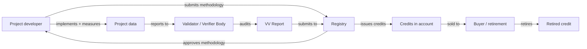

# Carbon Credits Are Being Gamed

*Trust-anchored provenance fixes the voluntary carbon market's phantom-credit problem.*

| Metadata | Value |
|----------|-------|
| Date     | 2026-04-27 |
| Authors  | The Quidnug Authors |
| Category | Climate, ESG, Market Integrity |
| Length   | ~7,000 words |
| Audience | ESG officers, carbon market regulators, climate policy researchers, corporate sustainability leads |

---

## TL;DR

In January 2023, The Guardian, Die Zeit, and SourceMaterial published an investigation into rainforest carbon credits issued under Verra's REDD+ methodology. Their analysis, based on peer-reviewed science including West et al. (2023) in Science [^west2023], concluded that more than 90% of the credits from Verra's most-used methodology (VM0015 "Methodology for Avoided Unplanned Deforestation") represented reductions that likely would have occurred anyway. Phantom credits in a market sized near $2 billion annually at the time of the investigation.

Verra disputed the methodology of the critique. Follow-up analyses from Cambridge, Columbia, and multiple independent research groups have sustained the core finding: a large portion of voluntary carbon credits (VCCs) trade on attestations that cannot be verified in the ways buyers assume they can.

The voluntary carbon market is projected to grow from approximately $2 billion in 2023 to $50 billion by 2030 per McKinsey estimates [^mckinsey2022], and to $250 billion by 2050 per Trove Research. This growth runs on a substrate (registries, verifiers, methodologies) that has already demonstrated it does not produce the confidence the market assumes.

This post argues that carbon market integrity is a trust architecture problem. The existing registries (Verra, Gold Standard, American Carbon Registry, Climate Action Reserve, Puro.earth) operate in isolation, each with their own verification processes, each trusted or not trusted on essentially reputational grounds. Buyers have almost no mechanism to compose attestations across registries or to apply their own weighting to specific verifiers. Regulators have no way to audit the chain from project claim to issued credit without opening each registry's internal records case by case.

Quidnug's relational trust model solves the composition problem. Signed attestations from projects, auditors, verifiers, registries, and corroborating scientists produce a chain a buyer can evaluate against their own trust graph. Phantom credits become detectable because the trust graph of honest auditors produces weak or absent corroboration. Registries competing for credibility gain a cryptographic way to demonstrate their rigor.

**Key claims this post defends:**

1. The phantom credit problem is not hypothetical. Peer-reviewed research and investigative journalism have documented it across multiple methodologies and registries.
2. Supervised detection of bad credits is insufficient because each methodology's specifics are unique. Structural defenses win.
3. Relational trust over auditor/verifier/registry identities converts a brand-trust market into an evidence-trust market.
4. Early movers in credit integrity (buyers and issuers) will see cost of capital advantages as capital reallocates toward verifiable credits.

---

## Table of Contents

1. [How the Voluntary Carbon Market Works](#1-how-the-vcm-works)
2. [The Phantom Credit Problem](#2-the-phantom-credit-problem)
3. [Why Current Verification Fails](#3-why-current-verification-fails)
4. [The Four Integrity Dimensions](#4-the-four-integrity-dimensions)
5. [Trust-Anchored Attestation Architecture](#5-trust-anchored-attestation-architecture)
6. [Auditor Reputation Weighting](#6-auditor-reputation-weighting)
7. [Integration with ICVCM and VCMI](#7-integration-with-icvcm-and-vcmi)
8. [Worked Example: Evaluating a REDD+ Credit Batch](#8-worked-example)
9. [Honest Limits](#9-honest-limits)
10. [References](#10-references)

---

## 1. How the VCM Works

Understanding the market's structure is prerequisite to understanding where it fails.

### 1.1 The lifecycle of a carbon credit



Steps:

1. Project developer identifies a reduction or removal opportunity (avoided deforestation, renewable energy, direct air capture, etc.).
2. Registry (the accountant) approves a methodology specifying how reductions are measured.
3. Project implements, collects data.
4. Validation/Verification Body (VVB) audits the project against the methodology.
5. Registry issues credits based on VVB's verification.
6. Credits are sold on secondary markets or directly retired by buyers.

### 1.2 Market sizing

| Year | Market size (USD) | Source |
|------|-------------------|--------|
| 2020 | $0.3 billion | Ecosystem Marketplace |
| 2021 | $1.0 billion | Ecosystem Marketplace |
| 2022 | $2.0 billion | Ecosystem Marketplace |
| 2023 | $1.6 billion (declined after integrity concerns) | Ecosystem Marketplace |
| 2024 | ~$1.4-1.8 billion (estimated) | Multiple sources |
| 2030 forecast | $50+ billion | McKinsey 2022 |
| 2050 forecast | $250 billion | Trove Research |

The decline from 2022 to 2023 is significant. It coincides with the Guardian investigation and subsequent academic analyses. Buyers became more cautious; prices and volumes dropped.

### 1.3 The registries

Major registries:

| Registry | Credits issued cumulatively (approx, 2024) | Primary methodologies |
|----------|------------------------------|----------------------|
| Verra (VCS) | 1+ billion tonnes CO2e | REDD+, improved forest management, renewable energy |
| Gold Standard | 230+ million tonnes CO2e | Community projects, cookstoves, renewable energy |
| American Carbon Registry (ACR) | 180+ million tonnes CO2e | Forestry, methane, industrial |
| Climate Action Reserve (CAR) | 180+ million tonnes CO2e | North American forestry, methane |
| Puro.earth | 500k+ tonnes CO2e | Durable carbon removal (biochar, enhanced weathering) |

Verra dominates. Its scale makes its methodology choices have outsized market effect.

### 1.4 Methodology types

- **Avoidance:** credits for reductions that would have otherwise happened (example: avoided deforestation). Requires counterfactual analysis: would the deforestation have happened without this project?
- **Removal:** credits for removing CO2 from the atmosphere (example: direct air capture, afforestation). More physically straightforward but capacity-constrained.
- **Reduction:** credits for reducing emissions relative to a baseline (example: replacing coal power with solar).

The phantom credit problem is most severe in the avoidance category because counterfactual analysis is unfalsifiable in individual cases. A project claims "without me, 100 hectares of forest would have been cut down." Proving that claim requires simulating a world in which the project did not exist, which is impossible.

### 1.5 The buyer profile

Buyers include:

- Corporations claiming net-zero (tech, airlines, oil majors, retailers)
- Individuals making personal offsets
- Governments purchasing for compliance markets
- Speculators

Most corporate buyers have limited internal capacity to evaluate credit quality. They rely on registry brand and sometimes on external ratings (Sylvera, BeZero Carbon Ratings, Calyx Global). The rating services are a recent phenomenon (2020s); they supply some information the market was missing but are themselves untransparent.

---

## 2. The Phantom Credit Problem

Now the specific empirical findings.

### 2.1 West et al. 2023 Science paper

The key academic source [^west2023] analyzed REDD+ projects across three continents. Key findings:

- Only one of 18 studied REDD+ projects had statistically credible evidence of averted deforestation.
- Most projects claimed emission reductions that, when compared to similar counterfactual regions using matching methods, showed no detectable actual reduction.
- The authors estimated that approximately 1 tonne of actual reduction existed for every 8-32 tonnes claimed, depending on the project.

The methodology used was synthetic control: finding regions with similar characteristics that did not host REDD+ projects, then comparing deforestation rates between the project area and the synthetic control. This is a standard causal inference technique for evaluating interventions.

### 2.2 Other academic work

Guizar-Coutiño et al. 2022 [^guizar2022] performed synthetic control analysis of Cambodian REDD+ projects. Found similar limitations of baseline-based methodologies.

Coffield et al. 2022 [^coffield2022] analyzed forest carbon offset projects in the US. Found that some 29% of credits likely represented emission reductions that would have happened anyway.

### 2.3 What Verra disputed

Verra's response to the Guardian investigation [^verra-response] contested the synthetic control methodology. The methodological dispute is technical. The broader point: the market was trading volumes of credits at billions of dollars of nominal value while the academic scientific consensus about whether those credits represent real reductions was unresolved.

Verra has subsequently revised methodologies (VM0048 replacing VM0015) and is implementing jurisdictional baselines. These are improvements but arrive after substantial credits have already been issued under previous methodologies and retired by buyers.

### 2.4 Other documented integrity failures

Beyond REDD+:

- **Renewable energy credits from grids that were going renewable anyway.** If a wind farm would have been built without carbon finance, its credits represent no additional reduction.
- **Efficiency projects where the baseline was overstated.** If the baseline "business as usual" efficiency was already going to improve, crediting an actual improvement against an inflated baseline inflates credits.
- **Double-counting across registries.** Projects listed on multiple registries have been documented, though most registries have cross-check mechanisms now.

### 2.5 The systematic issue

These specific findings illustrate a general problem: the counterfactual (what would have happened without the project) is the necessary reference for avoidance credits, and the counterfactual cannot be directly observed. Methodologies estimate it, verifiers check the estimation, but the estimation has inherent uncertainty that the market prices at zero.

Removal credits (direct air capture, enhanced weathering, biochar) are less subject to this problem because the physical mass of CO2 removed is measurable. But removal credits are a fraction of the market.

---

## 3. Why Current Verification Fails

Knowing the problem, why does verification not catch it?

### 3.1 The verifier selection problem

Project developers select their own verifiers. The verifier is paid by the project. Reputation effects exist but are weak.

This is the same incentive problem that exists in financial auditing (where Arthur Andersen's role in the Enron collapse is the canonical case study) and bond rating (where Moody's, S&P, and Fitch rated mortgage-backed securities AAA in 2007).

The verifier has an incentive to find the project compliant and get paid; the project has an incentive to select a verifier who will find them compliant. The equilibrium is permissive verification.

### 3.2 Registry competition

Registries compete for project listings. A registry that is too strict drives projects to competitors. A registry that is too loose loses credibility with buyers.

This creates a middle ground that doesn't clearly serve either direction well: registries are strict enough to maintain baseline credibility but lenient enough to retain projects. The position shifts over time with market conditions.

### 3.3 Methodology complexity

Each methodology is a detailed document (often 50-200 pages) specifying how to measure reductions for a specific type of project. Methodologies are typically developed by proponents (project developers or consultants) and approved by registries.

Methodology complexity makes outside scrutiny difficult. Only a handful of academic groups globally have the specialized expertise to critique a given methodology rigorously. When critique happens, it's typically post-hoc (after credits have been issued) rather than in-cycle.

### 3.4 Information asymmetry

The project developer has complete information about the project. The verifier has substantial information gathered during audit. The registry has the verifier's report. The buyer has whatever the registry chooses to publish.

A buyer evaluating credits has access to:
- Project description document
- Registry-listed monitoring reports
- Aggregate issuance data
- External ratings (if they subscribe)

What the buyer does not have: raw monitoring data, counterfactual analyses, verifier working papers, details of methodology application. The substrate of trust is the registry's brand.

### 3.5 The rating agency band-aid

Sylvera, BeZero, Calyx, and similar services have emerged to rate credits. They apply their own methodologies to assess quality, then publish letter grades (AAA, BB, etc.). This adds information but:

- Rating methodologies are proprietary and not directly auditable.
- Ratings change over time, sometimes inconsistently.
- Ratings don't include underlying data for buyers to review independently.
- Ratings agencies compete for paid data feeds from registries and projects, creating some of the same incentive problems.

Rating agencies help. They do not solve the structural problem.

---

## 4. The Four Integrity Dimensions

A credit's integrity rests on four independently-verifiable dimensions. Let me formalize.

### 4.1 Additionality

Would the reduction have occurred without this project? This is the counterfactual question.

**Current verification:** methodology-specified baseline, financial additionality test (would the project be financially viable without credit revenue?).

**Structural weakness:** impossible to verify directly. Verification is heuristic-driven.

### 4.2 Permanence

For removal credits (like forest carbon), will the removal persist? A forest that is planted and then burns in a wildfire five years later has not produced a permanent removal.

**Current verification:** buffer pools (a fraction of credits set aside to cover reversals), monitoring period commitments.

**Structural weakness:** monitoring periods are typically 20-40 years; long-term persistence is multi-century; the accounting is speculative.

### 4.3 Leakage

Did the reduction just shift activity elsewhere? Protecting one forest while deforestation moves to another is not a net reduction.

**Current verification:** methodology-specified leakage assessments.

**Structural weakness:** leakage measurement at broad spatial scales is difficult; methodologies discount for leakage but the discount fractions are not empirically validated.

### 4.4 Measurement accuracy

Is the claimed volume of reduction actually measured correctly?

**Current verification:** remote sensing, ground plots, emissions factor calculations.

**Structural weakness:** measurement is strong for removal credits (direct measurement of mass) and weaker for avoidance credits (measurement of a counterfactual).

### 4.5 The four together

A credit with demonstrated additionality, demonstrated permanence, low leakage risk, and accurate measurement is a "high-integrity" credit. A credit weak in any dimension is correspondingly weaker.

Currently, the market does not clearly price integrity. Prices vary but the signal is dominated by methodology category and project geography more than by actual integrity assessment.

---

## 5. Trust-Anchored Attestation Architecture

Here is how Quidnug primitives map to carbon credit integrity.

### 5.1 Signed attestations at each step

Every event in the credit's lifecycle becomes a signed attestation:

```
Project developer → Registry:
  EVENT: project_submitted
  signed by: project-developer-quid
  payload: { methodology, project_description_cid, baseline_analysis_cid }

Registry → Project:
  EVENT: methodology_approved
  signed by: registry-quid
  payload: { methodology_version, conditions }

Project implementation (monthly monitoring):
  EVENT: monitoring_report
  signed by: project-developer-quid
  payload: { period, raw_data_cid, calculated_reduction }
  signed by: auditor-ground-truth-team (co-signature for ground observations)

Verifier audit:
  EVENT: verification_performed
  signed by: verifier-quid
  payload: { findings, confidence, verified_tonnes }

Registry issuance:
  EVENT: credits_issued
  signed by: registry-quid
  payload: { project_id, vintage, tonnes, credit_ids }

Secondary market:
  EVENT: credits_transferred
  signed by: seller-quid, buyer-quid
  payload: { credit_ids, price_per_tonne }

Retirement:
  EVENT: credit_retired
  signed by: retirer-quid
  payload: { credit_ids, retirement_reason }
```

Every event is append-only, cryptographically linked to parents, and signed by the specific party making the attestation.

### 5.2 Adding independent attestations

Critical addition: third parties can attest to the project independent of the verifier chosen by the developer.

- **Independent scientific review:** a university research group can publish signed attestations: "We reviewed project X's methodology application and find it credible / deficient."
- **Community/NGO review:** local community representatives or conservation NGOs can attest: "We observe the project's activity on the ground and confirm it."
- **Satellite verification:** providers like Planet, Maxar, or Carbon Mapper can publish signed satellite-derived attestations of forest cover changes or deforestation patterns.
- **Corroborating scientific publications:** peer-reviewed research that supports or contests the project's claimed reductions can be linked to the project's attestation chain.

These independent attestations compose with the registry's attestation. A buyer's trust calculation over the chain includes all of them.

### 5.3 The buyer's trust computation

A buyer evaluating credits from project X:

```
credit_integrity(buyer, project_X) = f(
    trust(buyer, registry) × registry.attests_credit,
    trust(buyer, verifier) × verifier.attests_verification,
    trust(buyer, scientific_reviewers) × corroborating_research,
    trust(buyer, community) × local_attestations,
    satellite_corroboration_signal,
    incident_signals × negative_attestations
)
```

Each input is a signed, auditable event. The function is computable. The output is a trust-weighted integrity score that buyer can use to decide purchase.

### 5.4 What this changes for buyers

Under current architecture, a buyer's evaluation is: "I trust Verra, Verra issued this credit, I accept it." The trust anchor is the registry brand.

Under substrate architecture: "I trust Verra at 0.7, the verifier at 0.6, I have independent satellite signals at 0.8, academic review at 0.6, community attestation at 0.9, composite integrity 0.72." The trust anchor is the composition, not any single party.

If the registry loses credibility (as Verra did in 2023 for some methodologies), the buyer's trust weight in the registry drops, but their confidence in specific credits with strong independent corroboration remains.

### 5.5 What this changes for projects

Projects have a new incentive: accumulate independent attestations. A project that secures academic review, community endorsement, and satellite corroboration is demonstrably higher-integrity than one that relies purely on the registry's verification.

Over time, the market prices integrity signals. Projects that invest in third-party attestation capture premium pricing. Projects that cut corners on verification see their credits trade at a discount.

---

## 6. Auditor Reputation Weighting

Verifiers (VVBs) are the quality gatekeepers. Their reputation matters.

### 6.1 The current reputation signal

Verifiers are accredited by ISO (ISO 14065) and regulated by schemes like ANSI-ANAB or UKAS. Accreditation is binary (accredited or not) and slow-moving.

Published verification reports give some information about a verifier's methodology. But there is no systematic cross-project comparison. A verifier who approves every project with minimal critique looks similar to one who rigorously scrutinizes.

### 6.2 Substrate-based verifier reputation

Under Quidnug, a verifier's signed verification reports are visible on-chain. Over time, patterns emerge:

- Projects the verifier approved, and how those projects performed on later review.
- Projects the verifier approved that were subsequently challenged by independent research.
- Cross-verifier consistency (do multiple verifiers of the same project type produce consistent assessments?).
- Findings rate (verifiers who consistently identify issues are structurally different from those who consistently find compliance).

All of this data already exists in principle; it just isn't in a computable form. The substrate makes it computable.

### 6.3 The computation

A buyer's trust in a verifier:

```
verifier_trust(buyer, verifier_V) = 
    base_trust_from_accreditation
    × (1 + Σ corroborated_findings / total_projects_verified)
    × (1 - Σ disputed_findings / total_projects_verified)
    × recency_factor
```

This is a crude formulation. More sophisticated versions incorporate Bayesian updating, domain specialization (forestry vs industrial vs DAC), and peer attestations from other registries.

The point: verifier reputation becomes empirically computable from visible data rather than informally known within the industry.

### 6.4 What this changes

Good verifiers (rigorous, consistent, corroborated) build visible reputation. Bad verifiers (permissive, inconsistent, disputed) see their reputation decay. Project developers selecting verifiers face a tradeoff: cheap verifier with low reputation vs expensive verifier with high reputation. The market price of integrity gets visible.

Over time, the verifier market evolves toward higher quality because buyers discount credits from weak verifiers.

### 6.5 The ecosystem effect

Verifier reputation becomes portable across registries. A verifier accredited with Gold Standard with high substrate reputation gains standing with Verra, ACR, and others. Cross-registry credibility becomes a thing.

This is analogous to credit rating agencies, but with transparent methodology visible to any market participant.

---

## 7. Integration with ICVCM and VCMI

The industry is not sitting still. Two multi-stakeholder initiatives are attempting to address integrity concerns.

### 7.1 ICVCM Core Carbon Principles

The Integrity Council for the Voluntary Carbon Market [^icvcm] published Core Carbon Principles (CCPs) in 2023. The CCPs are a set of requirements for what "high-integrity" credits should demonstrate:

- Governance by an accredited body
- Tracking in a registry
- Transparency
- Validation and verification
- No double counting
- Additionality
- Permanence
- Real and measurable emission reductions
- Contribution to UN Sustainable Development Goals
- Avoidance of social and environmental harms

ICVCM assesses methodologies and registries against the CCPs. Methodology categories receiving the CCP label are positioned as higher-integrity.

### 7.2 VCMI Claims Code

The Voluntary Carbon Markets Integrity Initiative [^vcmi] focuses on the buyer side: what claims can a company legitimately make about its carbon offset purchases. VCMI's Claims Code (2023, updated) specifies:

- Silver: buyer purchases high-integrity credits to offset 20-60% of residual emissions.
- Gold: purchases 60-100%.
- Platinum: purchases 100% plus additional scope 3 action.

Buyers who meet the code can make specific substantiated claims.

### 7.3 How the substrate composes with these

ICVCM and VCMI provide labels. Labels are signals. Under the substrate, ICVCM labels become signed attestations from ICVCM's identity. A credit labeled "CCP-approved" has a signature from ICVCM in its attestation chain.

This composes with the trust computation: a buyer who weights ICVCM highly (as most institutional buyers do) sees credits with ICVCM labels at higher composite trust than those without.

VCMI claims become signed claims from the buyer, auditable by anyone viewing the buyer's carbon disclosures. A buyer claiming "VCMI Gold" has this claim on the chain, with the underlying credit attestations linked. Anyone checking can verify the credits the buyer has retired support the claim.

### 7.4 The broader market effect

ICVCM and VCMI labels currently rely on buyer/registry reputation for enforcement. Under the substrate, enforcement is cryptographic. A buyer claiming CCP-approved credits can prove they retired CCP-approved credits. A buyer claiming VCMI Gold can prove the underlying math.

This is consistent with the direction both initiatives are pushing. The substrate accelerates their adoption by making their labels verifiable.

---

## 8. Worked Example: Evaluating a REDD+ Credit Batch

Let me walk through a specific buyer evaluation to show the substrate in use.

### 8.1 The scenario

A corporation evaluating the purchase of 100,000 tonnes of REDD+ credits from "Kariba REDD+" (a real project in Zimbabwe, used here illustratively because it has been publicly analyzed). The project is registered with Verra, methodology VM0009.

### 8.2 The substrate-based evaluation

The buyer's procurement team queries the Quidnug chain for all attestations about the credit vintage in question:

```
Project: Kariba REDD+ (VCS-... identifier)
Credit vintage: 2021
Credits available: 100,000 tonnes CO2e

Attestations on chain:
  [Verra] issued 2023-06-15: Credit batch approved under VM0009
  [South Pole Group, project developer] attests: project operated normally in 2021
  [TUV SUD, verifier] attests 2023-03-15: verified 100,000 tonnes reduction
  [Carbon Mapper, satellite provider] attests 2022-02: deforestation rate in project
    area tracked vs surrounding regions; in-project rate matched surrounding
  [Academic review, Cambridge team] attests 2023-01: synthetic control analysis
    suggests baseline may be overstated
  [Sylvera] rates the project C grade, noting methodology concerns

Buyer's trust graph:
  Trust in Verra: 0.55 (reduced after 2023 REDD+ concerns)
  Trust in South Pole: 0.6
  Trust in TUV SUD: 0.7
  Trust in Carbon Mapper: 0.8
  Trust in Cambridge academic team: 0.85
  Trust in Sylvera: 0.65

Composite integrity score:
  Positive signals:
    Verra issuance: 0.55 * 1.0 = 0.55
    South Pole developer: 0.6 * 1.0 = 0.6
    TUV SUD verification: 0.7 * 1.0 = 0.7
  Negative signals:
    Carbon Mapper lack of differential: -0.8 * 0.4 = -0.32
    Cambridge baseline critique: -0.85 * 0.5 = -0.425
    Sylvera C grade: -0.65 * 0.3 = -0.195

  Normalized composite: ~0.35

Buyer's threshold for purchase: 0.6
Decision: do not purchase this batch at current composite integrity.
```

### 8.3 What this changes

Under current architecture, the buyer sees: "Verra-issued, VM0009, 100,000 tonnes, $800,000 purchase price." They decide based on brand and price.

Under the substrate, the buyer sees the composite integrity signal with provenance for each input. They make a substantively different decision.

### 8.4 Alternative scenario: high-integrity credit

Suppose the buyer evaluates a different project: an afforestation project in Nigeria with:

- Registry: Gold Standard (buyer trusts at 0.75)
- Verifier: DNV (buyer trusts at 0.8)
- Satellite: Planet data signed by multiple providers (aggregate 0.85)
- Academic: University of Ibadan forestry department attests to measurements (buyer trusts at 0.7)
- Community: local community representatives sign attestation (0.9)
- Ratings: Sylvera AA (0.9)

Composite integrity: ~0.83. Buyer purchases.

The substrate made the difference visible. Good projects capture their premium; weak projects are priced correctly as weak.

### 8.5 The aggregate market effect

If 20% of corporate buyers adopt substrate-based evaluation, the market prices bifurcate. High-integrity credits trade at a premium; low-integrity credits trade at a discount or don't clear. Projects facing discounted prices either improve their integrity (more attestations, better methodologies) or exit the market.

Within 5 years of adoption at scale, the integrity distribution of issued credits shifts materially toward the high end.

---

## 9. Honest Limits

### 9.1 The adoption coordination problem

Registries, verifiers, projects, and buyers all need to adopt the substrate. Without critical mass, the market signal is noisy.

**Mitigation:** early adopters (buyers demanding substrate evidence, projects providing it) pull the ecosystem. Companies with sustainability credibility concerns are plausibly-motivated early buyers.

### 9.2 Some attestations cannot be cryptographically signed in practice

Community attestations in rural settings, academic reviews, satellite data: each requires the party to have a key and infrastructure to sign. Not all parties do.

**Mitigation:** intermediaries (NGOs, universities, service providers) can run signing infrastructure on behalf of parties without their own. This introduces a trust step (the intermediary must be trustworthy) but the intermediary itself is identifiable and can build reputation.

### 9.3 The counterfactual problem remains fundamental

Additionality cannot be directly observed. The substrate does not solve the counterfactual problem; it makes the counterfactual analysis more auditable. Better evidence, not different physics.

### 9.4 Political resistance from beneficiaries of opacity

Registries and verifiers that benefit from current opacity will resist transparency. Entities with weak historical quality records will resist substrates that make their records visible.

**Mitigation:** regulator-driven adoption. The EU's Carbon Border Adjustment Mechanism (CBAM), the UK's Carbon Markets Framework, and similar regulatory initiatives have leverage to require specific verification standards. Substrate-style transparency aligns with regulatory direction.

### 9.5 Attestation gaming

Projects could solicit favorable attestations from paid reviewers. This is the same problem that emerged in product reviews (discussed in the reviews blog earlier in this series).

**Mitigation:** the same defense: attestations are trust-weighted by the reviewer's reputation. A reviewer who accepts payment for positive attestations has a weaker trust signal after that pattern is visible. The structural defense is the same as relational reviews.

### 9.6 Summary

Carbon credit integrity is a hard, cross-disciplinary problem. The substrate does not solve it completely. It reframes the market from "trust the registry brand" to "trust-weighted composite of verifiable attestations," which is a material improvement over current practice and is compatible with regulatory directions and industry-led initiatives.

The market's ambition (scaling from $2B to $50B+) depends on resolving the trust problem. If trust doesn't improve, the scaling doesn't happen. The substrate is one of a small number of approaches that plausibly can improve trust at scale.

---

## 10. References

### Scientific papers on phantom credits

[^west2023]: West, T. A. P., Wunder, S., Sills, E. O., Börner, J., Rifai, S. W., Neidermeier, A. N., Frey, G. P., & Kontoleon, A. (2023). *Action needed to make carbon offsets from forest conservation work for climate change mitigation.* Science, 381(6660), 873-877. https://www.science.org/doi/10.1126/science.ade3535

[^guizar2022]: Guizar-Coutiño, A., Jones, J. P. G., Balmford, A., Carmenta, R., & Coomes, D. A. (2022). *A global evaluation of the effectiveness of voluntary REDD+ projects at reducing deforestation and degradation in the moist tropics.* Conservation Biology, 36(6), e13970.

[^coffield2022]: Coffield, S. R., et al. (2022). *Forest carbon offsets risk overstating climate benefits.* Ecosphere, 13(12).

### Market data

[^mckinsey2022]: McKinsey & Company. (2022). *A blueprint for scaling voluntary carbon markets to meet the climate challenge.* https://www.mckinsey.com/capabilities/sustainability/our-insights/a-blueprint-for-scaling-voluntary-carbon-markets-to-meet-the-climate-challenge

[^verra-response]: Verra. (2023). *Response to The Guardian article.* https://verra.org/guardian-article-response/

### Industry initiatives

[^icvcm]: Integrity Council for the Voluntary Carbon Market. *Core Carbon Principles.* https://icvcm.org/

[^vcmi]: Voluntary Carbon Markets Integrity Initiative. *VCMI Claims Code of Practice.* https://vcmintegrity.org/

### Quidnug design documents

- QDP-0014: Node Discovery + Domain Sharding
- QDP-0015: Content Moderation & Takedowns
- QDP-0018: Observability and Tamper-Evident Operator Log
- QDP-0023: DNS-Anchored Identity Attestation

---

*The Quidnug substrate for carbon credit attestation is deployable today. ESG officers, carbon market operators, and research organizations interested in pilots are welcome via the repository's Discussions.*
