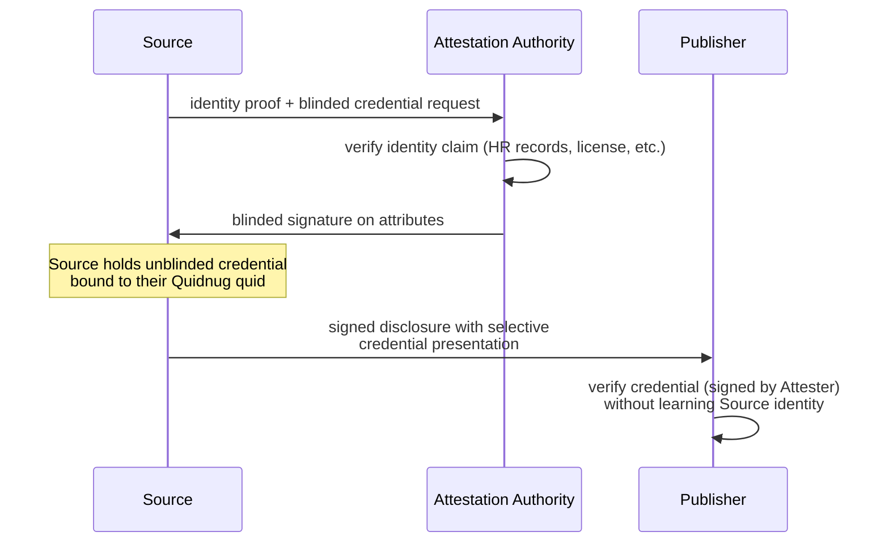
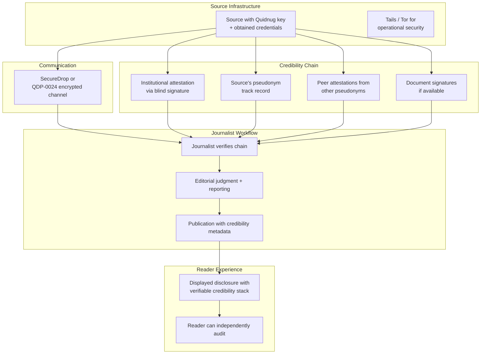

# The Whistleblower Channel

*Selective disclosure plus cryptographic credibility plus trust-graph vouching is the architecture modern whistleblower platforms actually need.*

| Metadata | Value |
|----------|-------|
| Date     | 2026-04-28 |
| Authors  | The Quidnug Authors |
| Category | Journalism, Civil Society, Privacy, Applied Cryptography |
| Length   | ~6,800 words |
| Audience | Investigative journalists, platform engineers at whistleblower services, legal counsel for journalists, civil society technology teams |

---

## TL;DR

Edward Snowden's disclosures in 2013 worked because Glenn Greenwald and Laura Poitras spent months verifying Snowden's credibility before publishing. Frances Haugen's 2021 disclosures from Meta worked because she provided thousands of signed documents and testified under oath to Congress, which established credibility independently of the content. The pattern generalizes: whistleblower disclosures succeed when credibility can be established. They fail, or their impact is diluted, when audiences cannot distinguish a real insider's account from a fabrication or an adversarial operation.

Current whistleblower infrastructure solves parts of this problem. SecureDrop [^securedrop], developed after Aaron Swartz's contributions, gives sources a secure-submission channel. GlobaLeaks [^globaleaks] offers a similar architecture to NGOs and tip lines. Signal provides encrypted communication that has become the industry standard for source-to-journalist contact. Freedom of the Press Foundation provides training and operational security support.

What current infrastructure does not provide: a way for a source to demonstrate "I am who I claim to be" without revealing who they are. The credibility question is currently solved either by trusting the journalist's assurance ("my source is a senior engineer at Company X") or by the source eventually revealing their identity. Neither option preserves the source's anonymity while giving the audience reason to trust the claim.

This post argues that modern cryptographic primitives (blind signatures, selective disclosure credentials, stable pseudonyms with accumulating reputation) can give anonymous sources structured credibility without compromising their identity. Combined with Quidnug's private communications (QDP-0024 MLS-based group encryption) for the source-journalist channel and trust-graph vouching for peer endorsement, this produces an architecture where an anonymous disclosure can carry verifiable institutional context.

"A current employee at Company X, with at least four years tenure, attested to by the Society of Professional Engineers, not previously sanctioned for professional misconduct, and in good standing with their union local" is a substantively different claim than "an anonymous source." The former is verifiable. The latter requires faith.

**Key claims this post defends:**

1. Credibility-without-identity is a solved cryptographic problem. Blind signatures have been in production use since 1988. Privacy Pass, Apple Private Relay, and various anonymous credential systems deploy similar primitives today at massive scale.
2. Current whistleblower platforms are excellent at the "get the documents from the source to the journalist" layer and silent on the "verify the source's credibility to the public" layer.
3. Adding institutional attestation (via DNS-anchored identity for attesting organizations) gives sources a credibility floor without exposing them.
4. The pattern extends beyond journalism to regulated-industry whistleblowers (SEC tips, OSHA complaints, EU Whistleblower Directive), where statutory protections benefit from verifiable but anonymous credible tipsters.

---

## Table of Contents

1. [Why Credibility Is the Hard Part](#1-why-credibility-is-the-hard-part)
2. [Current Whistleblower Infrastructure](#2-current-infrastructure)
3. [The Selective Disclosure Primitive](#3-selective-disclosure)
4. [Stable Pseudonyms With Reputation](#4-stable-pseudonyms)
5. [Trust-Graph Vouching by Peers and Institutions](#5-trust-graph-vouching)
6. [End-to-End Architecture](#6-end-to-end-architecture)
7. [Legal Framework Alignment](#7-legal-framework)
8. [Worked Example: A Financial Fraud Disclosure](#8-worked-example)
9. [Honest Limits and Ethical Tensions](#9-honest-limits)
10. [References](#10-references)

---

## 1. Why Credibility Is the Hard Part

The journalism-ethics scholarly literature has long recognized that sourcing and credibility are the hard parts of investigative reporting.

### 1.1 The journalistic function of sources

Singer (2007) [^singer2007] and Robinson (2011) [^robinson2011] analyzed newsroom sourcing practices. Key findings:

- Investigative stories with multiple corroborating sources are rated higher in credibility assessments.
- Sources with verifiable institutional affiliation (named or anonymous) carry higher credibility than unverified sources.
- The "off-the-record" / "on background" / "on the record" gradient is functional but lossy.
- Journalists' credibility chain to the source is opaque to readers.

The structural role of sources: they provide evidence that the journalist has privileged information about an institution. The credibility of the reporting depends on the source being real and positioned to know.

### 1.2 The verification problem

Journalists verify sources through private processes: checking employment records, cross-referencing claims with public records, cultivating multiple sources on the same story, assessing internal consistency of the source's account.

Readers do not have access to any of this. They rely on the journalist's reputation and the publication's track record.

This works for established outlets with long credibility history. It fails for:

- New outlets without accumulated credibility.
- Adversarial contexts where an outlet's reputation is itself contested.
- Cross-jurisdictional reporting (a UK reader evaluating a US-published story).
- Stories attacked as "fake news" by subjects of the reporting (the liar's dividend).

### 1.3 The chilling effect of identity exposure

Donaldson (2020) [^donaldson2020] and Radsch (2019) [^radsch2019] documented the increasing risks facing whistleblowers. Specific concerns:

- Legal retaliation (firing, civil litigation, criminal prosecution under statutes like the US Espionage Act).
- Professional destruction (industry blacklisting, loss of professional licenses).
- Social and family consequences.
- Physical safety (documented in authoritarian contexts).

The ACLU's analysis of US whistleblower prosecutions under Obama and Trump administrations [^aclu2023] noted that Espionage Act prosecutions of leakers increased substantially across both administrations, making the legal risk calculus for potential sources materially worse than in prior decades.

Under this risk environment, the pressure on journalists to protect source anonymity is extreme. But anonymity erodes source credibility. The tension is structural.

### 1.4 What would help

A source who is cryptographically verifiable as "current senior engineer at Company X, with institutional attestation, not previously discredited" has substantially more credibility than "an unnamed source" while maintaining identity protection. The source's specific identity remains private; their category (with specific attested claims) is public.

This is what modern cryptography enables. Let me walk through the specific primitives.

---

## 2. Current Whistleblower Infrastructure

Before describing what's new, let me map what exists.

### 2.1 SecureDrop

Developed initially by Aaron Swartz and Kevin Poulsen, then maintained by Freedom of the Press Foundation [^securedrop]. Architecture:

- Source connects over Tor to a news organization's SecureDrop instance.
- Source is given a code-name and uploads documents.
- Journalist retrieves documents via an air-gapped system.
- Communications between source and journalist use the code-name, not any durable identity.

SecureDrop is the operational standard for major news organizations (AP, Washington Post, Guardian, NY Times, ProPublica, The Intercept, and many others). Its threat model is thoughtful and its track record is strong.

**What SecureDrop does well:**
- Source identity protection.
- Document submission.
- Journalist-side operational security.

**What SecureDrop does not do:**
- Cryptographic attestation of source's institutional claims.
- Persistent pseudonymous identity that accumulates credibility over multiple stories.
- Cross-publication credibility portability.

### 2.2 GlobaLeaks

GlobaLeaks [^globaleaks] provides the SecureDrop pattern for NGOs and government anti-corruption tip lines. Used by Transparency International chapters, anti-corruption agencies in multiple countries, and investigative journalism initiatives.

Same strengths and same gaps as SecureDrop.

### 2.3 Signal

End-to-end encrypted messaging. Used widely for source-journalist contact. Developed by the non-profit Signal Foundation; protocol (Double Ratchet, X3DH) is well-studied and implemented in reference quality.

**What Signal does well:**
- End-to-end encryption for messaging.
- Forward secrecy.
- Open-source and audited.

**What Signal does not do:**
- Source credibility verification.
- Persistent pseudonym beyond a phone number.
- Anonymity against the phone number association.

### 2.4 Tor and Tails

Tor provides network-layer anonymity. Tails is a Linux live-USB operating system designed for hostile-environment journalism and whistleblowing.

Both are operational security tools. Both assume the user's identity is protected by layered anonymity measures. Neither provides credibility machinery.

### 2.5 The gap

Every current tool handles one layer (submission channel, encryption, network anonymity, operational security). None handles the credibility attestation layer.

A whistleblower who uses SecureDrop to submit documents, Signal to communicate, and Tails to operate has done everything right. The journalist still has to verify the source's credibility through private, non-cryptographic means. The reader still has to trust the journalist's verification.

Modern cryptography offers a missing primitive for closing that gap.

---

## 3. The Selective Disclosure Primitive

"Selective disclosure" in the cryptographic sense: a scheme that lets the holder of a credential prove specific attributes about themselves without revealing others.

### 3.1 Origins

Chaum's 1985 paper "Security without identification: transaction systems to make big brother obsolete" [^chaum1985] introduced the foundational ideas. Chaum's 1988 blind signature paper [^chaum1988] gave a specific cryptographic primitive for unlinkable token issuance.

The research line since then has included:

- **Brands credentials** (Brands 1993): signatures on attribute sets with selective disclosure.
- **CL signatures** (Camenisch-Lysyanskaya 2001, 2003): anonymous credentials with zero-knowledge attribute proofs.
- **BBS+ signatures** (Boneh-Boyen-Shacham, extensions): compact signatures that support selective disclosure efficiently.
- **Privacy Pass** (2017+): deployed system using blind signatures for anonymous abuse-resistance tokens, standardized as RFC 9576 [^privacy-pass].

### 3.2 What deployed systems look like

**Privacy Pass** (used in Cloudflare, Apple Private Relay, Firefox): a user proves they are human (e.g., via CAPTCHA) and receives a batch of blinded tokens. Later, when the user wants to access a service, they redeem a token to prove they are a verified human without revealing which specific CAPTCHA they solved. The issuer (CAPTCHA provider) cannot link tokens to the solving session.

**Apple's Private Click Measurement and Private Relay:** use blind signatures to decouple click attribution from user identity.

**Various anonymous credential systems in enterprise access control:** the W3C Verifiable Credentials standard with BBS+ signature suite supports selective disclosure of credential attributes.

The pattern is proven at massive deployment scale. The cryptography works.

### 3.3 Quidnug QDP-0021 implementation

Quidnug's QDP-0021 [^qdp0021] specifies RSA-FDH-3072 blind signatures for the election ballot anonymity use case. The same machinery applies to whistleblower credentials.

The flow:



The Attestation Authority (could be an HR-style service, a professional body, a certification entity) verifies the source's identity claims and issues a blinded credential. The source holds a credential that proves specific attributes (industry, tenure, job level, certifications) without revealing which specific individual they are.

When the source publishes a disclosure, they include a zero-knowledge proof of the credential with selected attributes disclosed. The publisher verifies the proof and can assert to readers: "this disclosure is from a credentialed source whose credentials include X, Y, Z."

### 3.4 Concrete example

A disclosure might carry:

```
Attested attributes:
  Industry: Financial services
  Employer category: Major US bank (top 5 by assets)
  Role category: Senior engineer in risk systems
  Tenure range: 5+ years
  Active employment: Yes
  Certifications: CFA (held), CISSP (held)
  Regulatory history: No sanctions or enforcement actions

Not disclosed:
  Specific name of bank
  Specific name of employee
  Specific team or manager
  Specific geographic location
```

A reader can verify: the attester (say, the Institute of Banking and Finance, a specific industry body with a DNS-anchored Quidnug identity) signed the credential. The signature is valid. The attributes disclosed are therefore attested to by that specific body. The reader trusts the body to the extent that their trust graph includes it.

The source remains anonymous. Their claims have institutional weight.

### 3.5 Why this is stronger than "trusted journalist says"

Under current practice, the credibility chain is: reader trusts journalist, journalist trusts source, reader does not verify source independently.

Under selective disclosure, the credibility chain is: reader trusts attester, attester verified source attributes, reader independently verifies attestation. The journalist's role changes from "vouch for source credibility" to "handle content and judgment."

Both are useful. The second adds cryptographic verifiability where current practice has only transferred trust.

---

## 4. Stable Pseudonyms With Reputation

A single disclosure is one event. A reliable source makes many disclosures over time. Current practice does not handle this well; the source either re-establishes credibility each time (expensive) or progressively reveals themselves.

### 4.1 The stable pseudonym primitive

A source generates a Quidnug keypair. They use this keypair consistently across disclosures. The public key is their stable pseudonym. Specific attested attributes (from §3) may vary across disclosures (maybe they disclose more about themselves over time as trust accumulates), but the keypair is constant.

Over multiple disclosures, the pseudonym accumulates a track record:

```
Pseudonym: did:quidnug:pseudo-banker-a2c7

Disclosure history:
  Story 1 (2024-03): Disclosure about mortgage pricing model errors.
    Verified by subsequent SEC action. Accuracy confirmed.
  Story 2 (2024-09): Disclosure about quarterly earnings restatement.
    Verified by company's own 8-K filing. Accuracy confirmed.
  Story 3 (2025-06): Disclosure about internal compliance gaps.
    Verified by third-party audit report. Accuracy confirmed.
  
Track record: 3 of 3 disclosures subsequently independently verified.
```

A fourth disclosure from the same pseudonym carries the weight of three prior verified disclosures. The pseudonym is credible even though the source is not identified.

### 4.2 Verification without identification

The key property: the pseudonym does not require identity revelation for verification. Each disclosure's accuracy is assessed against independent evidence (SEC filings, court records, later institutional admissions). The pseudonym's reputation accumulates from these independent verifications, not from the journalist's assertion.

This is structurally the same as Judith Donath's analysis of identity in virtual communities (1999) [^donath1999]: stable pseudonyms enable reputation accumulation; identity revelation is orthogonal to credibility.

### 4.3 What prevents impersonation

The keypair is the authority. Only the holder of the private key can sign disclosures under that pseudonym. If the key is compromised, the compromise is discoverable (inconsistent disclosure patterns, violation of prior disclosures' implicit commitments) and the pseudonym can be retired.

QDP-0002 guardian recovery could in principle support key rotation, but for adversarial whistleblower contexts, the simpler model is: if the key is compromised, retire that pseudonym and start a new one. Accumulated credibility is lost, but the attacker cannot continue to impersonate.

### 4.4 Cross-publication portability

A pseudonym is not tied to a specific publication. The same pseudonym can disclose to The Guardian, The New York Times, Der Spiegel, ProPublica, or a non-traditional outlet. Each publication verifies the pseudonym's signature and (optionally) its accumulated reputation. The source's leverage is not dependent on any single publication's willingness to accept them.

### 4.5 Anonymous-but-accountable

The pseudonym model gives a form of accountability that purely anonymous sources do not have. If the pseudonym is caught in a falsehood, their credibility drops. A falsehood is detectable (the claim is falsified by later evidence). The pseudonym bears a cost for being wrong.

Under fully-anonymous models, a source can lie once with full impact (audiences often believe anonymous claims on first hearing) and have no cost. Pseudonyms create a repeated-game dynamic where reputation pressure constrains behavior.

Axelrod's work on the evolution of cooperation [^axelrod1984] applies: repeated-game dynamics can produce cooperation even among strangers when reputation is persistent. Pseudonyms enable the dynamic without requiring identity.

---

## 5. Trust-Graph Vouching by Peers and Institutions

The third primitive: peer and institutional attestation.

### 5.1 Two types of attestation

**Peer attestation:** other employees or professionals vouching for the source. "I, a colleague at the same institution, can confirm this person has the access they claim."

**Institutional attestation:** organizations vouching for the source's category. "This person is a credentialed member of our professional body."

Both types compose. A source with peer attestation from 3 colleagues plus institutional attestation from a professional body has stronger evidence than either alone.

### 5.2 Peer attestation without identity exposure

A source's peers attesting to their credibility raise the question: do the peers have to reveal themselves?

Answer: not necessarily. Using the same selective disclosure machinery, peers can make attestations from their own pseudonyms. A peer attestation says: "I am a current employee at Company X, pseudonymously known as [pseudo-B], and I attest that [source] has the access they claim."

A journalist or reader evaluating the disclosure sees: multiple pseudonymous attestations from people who claim specific institutional roles, each with their own accumulating reputation. The set of attesters is itself verifiable to the extent their pseudonyms have track records.

### 5.3 Institutional attestation via DNS anchor

Institutions that wish to vouch for category members can do so via DNS-anchored identities (QDP-0023).

Example: the Society of Professional Engineers maintains a Quidnug identity anchored to its DNS domain. Members can obtain attestations from the Society that they are in good standing, certified in specific specialties, without sanctions.

A source who obtains such an attestation includes it in their disclosure. The reader verifies the attestation chains to the Society's DNS identity. The Society's credibility (which exists independently through its pre-existing reputation) transfers to the source.

### 5.4 The layered credibility stack

A disclosure's credibility stack:

```
Layer 1: Source pseudonym signature (identifies who is making the claim)
Layer 2: Institutional attestation (source's credentials as vouched by attester)
Layer 3: Peer attestations (corroboration by pseudonymous peers)
Layer 4: Document signatures (if source can prove document provenance)
Layer 5: Journalist vetting (traditional editorial judgment)
```

Each layer adds independent evidence. A reader evaluates the stack as a whole.

### 5.5 Adversarial signal: absence of attestation

A source that lacks any institutional attestation or peer attestation is signaling either:

- They cannot obtain attestation (unusual for genuine insiders; most professionals can be attested by some body).
- They are not in the position they claim.
- They are a first-time source with no accumulated credibility.

The absence is informative. The stack is never empty in a principled way; either there are attestations (adds weight) or there aren't (draws weight down). Readers factor accordingly.

### 5.6 Defense against fake attestations

What prevents a bad actor from creating fake institutional identities that vouch for fake sources?

The same defenses that apply to the broader trust graph:

- DNS-anchored attestation requires a real DNS domain with verifiable control. Creating "Institute of Banking and Finance" as a fake identity requires registering a domain and building a presence that readers would actually trust.
- Readers weight institutions by their own trust graph. A new unfamiliar institution has low weight even if technically authentic.
- Cross-institution corroboration: a source attested by one real institution is weaker than one attested by multiple.

These are the same defenses that prevent review spam in the relational ratings context. The structure carries over.

---

## 6. End-to-End Architecture

Let me put the pieces together.

### 6.1 The stack



The source uses operational security (Tails, Tor) to protect their physical identity. They use an encrypted channel (SecureDrop or QDP-0024 MLS group) for communication with journalists. Their disclosure carries a credibility stack: pseudonym with history, institutional credential, peer attestations, document signatures.

The journalist verifies the stack and applies editorial judgment. The publication carries the credibility metadata so readers can independently verify.

### 6.2 What readers see

A reader viewing a disclosed story sees:

```
Story: [Title]
Byline: [Journalist name] at [Publication]

Source verification:
  Source pseudonym: pseudo-banker-a2c7 (established 2023-11, 4 prior verified disclosures)
  Institutional attestation: Institute of Banking and Finance (verified via DNS anchor)
    Attested attributes: Current senior employee, 8+ years tenure, 
    certifications valid, no sanctions
  Peer attestations: 3 colleagues (pseudonymous), each with their own track record
  Document signatures: corporate authentication on 12 of 17 documents

Reader trust calculation:
  Trust in publication: 0.85
  Trust in journalist: 0.8
  Trust in Institute of Banking and Finance: 0.7
  Trust in source pseudonym's track record: 0.75
  Composite credibility: ~0.78

Click for detailed verification.
```

Every piece is verifiable by the reader. The publication is not asking for blind trust; they are showing their work.

### 6.3 The source's protection

The source's protection comes from:

- Network-layer anonymity (Tor).
- Operational security (Tails, air gap).
- Pseudonym decoupling from legal identity.
- Selective disclosure (credentials prove category without revealing identity).
- Encrypted communication channels.

The substrate adds layers; it does not remove existing protections.

### 6.4 The credibility floor

Without any of this, an anonymous source has credibility floor near zero; the journalist's assurance is the only signal. With this substrate, an anonymous source has a credibility floor set by their institutional attestation and peer attestations, which are independently verifiable.

The floor makes credible anonymous disclosures possible at scale, for sources who currently cannot reach credibility because they cannot expose themselves.

---

## 7. Legal Framework Alignment

Whistleblower law varies by jurisdiction. The architecture composes differently with each.

### 7.1 United States

**Dodd-Frank Whistleblower Program (2010):** SEC and CFTC programs offering monetary awards (10-30% of recoveries over $1M) for information leading to successful enforcement. Strong anti-retaliation protections.

- The substrate supports: pseudonymous tips can be submitted with cryptographic attestation of source attributes. The SEC could accept tips from attested pseudonyms, awarding through the pseudonym (which the source controls) without requiring identity revelation until award processing.

**Espionage Act (1917):** prosecutes unauthorized disclosure of classified information. Current interpretation applies broadly to leaks to journalists.

- The substrate does not protect against statutory criminal liability. The Espionage Act applies regardless of how the disclosure is made. The source still faces legal risk; the substrate does not change that risk profile.

**Federal whistleblower statutes (SOX, FCA, EPA, OSHA):** various statutes protecting whistleblowers in specific domains.

- The substrate can help establish the "reported in good faith" element by producing verifiable documentation of the disclosure flow.

### 7.2 European Union

**EU Whistleblower Directive (2019/1937):** requires member states to establish internal and external reporting channels with protections for whistleblowers.

- The substrate aligns: internal reporting channels can accept attested pseudonymous reports. The directive explicitly allows anonymous reporting in some contexts.

**GDPR:** the substrate's data minimization (selective disclosure) aligns well with GDPR principles. Blind signatures and pseudonymous credentials are mentioned as privacy-enhancing techniques in GDPR guidance.

### 7.3 United Kingdom

**Public Interest Disclosure Act (1998):** protects workers making disclosures in the public interest.

- Anonymous disclosures are not directly protected under PIDA (the worker must be identified to claim protections). However, a pseudonymous track record can be helpful for establishing the public-interest nature of disclosures.

### 7.4 Non-democratic jurisdictions

In contexts where whistleblower statutes are weak or absent, the substrate provides the same credibility infrastructure but the legal risk to sources is much higher. The technology can make credible disclosure possible where current infrastructure cannot; it does not remove the risk of retaliation.

### 7.5 Statutory alignment directions

The substrate could inform policy design. Specifically:

- Anti-retaliation statutes could be strengthened to protect disclosures made via attested pseudonymous channels (same protection as identified disclosures).
- Regulatory bodies accepting tips (SEC, FTC, EPA, OSHA) could formalize acceptance of attested pseudonymous tips.
- Courts accepting whistleblower testimony could consider pseudonymous cryptographic identity as equivalent to sealed testimony.

These are policy directions, not technical requirements. The technology enables the policy; it does not require the policy to work.

---

## 8. Worked Example: A Financial Fraud Disclosure

Let me walk through a detailed scenario.

### 8.1 The context

A senior risk analyst at a major bank discovers systematic misreporting of loan-loss reserves that inflates reported profits. She wants to disclose this to regulators and journalists while protecting her career and her family.

### 8.2 Setup

- Alice (the source) generates a Quidnug keypair on an air-gapped laptop.
- She obtains a credential from the Institute of Banking and Finance (a professional body she is a member of) via a blind-signature flow. The credential attests to her professional standing, tenure, and certifications.
- She identifies two colleagues she trusts, each of whom provides pseudonymous peer attestations via their own keypairs.
- She identifies and prepares documents with any identifying metadata scrubbed.

This preparation takes roughly 4-6 weeks of part-time effort, performed without any internet connection to her work account and using Tails on her personal hardware.

### 8.3 Disclosure to journalist

Alice connects to a major financial newspaper's SecureDrop instance via Tor. She submits:

- Her credential-backed disclosure package.
- 17 supporting documents, 12 of which are corporate-signed originals with intact signatures.
- Her contact channel (QDP-0024 MLS group, with her pseudonym as member).

The journalist verifies:
- The credential signature chains to the Institute of Banking and Finance's DNS-anchored Quidnug identity.
- The peer attestations chain to pseudonyms with some track record of verified attestations (or are new; this is disclosed).
- Document signatures verify against the bank's public PKI where applicable.

The journalist cross-references the disclosed attributes with publicly-knowable context (what category of employee makes sense for the claims). The package is consistent.

### 8.4 Reporting and publication

Over several weeks, the journalist corroborates through additional sources, public records, and analysis of the documents. They reach publication confidence.

The published story carries:

- Source description: "A senior risk analyst at a top-five US bank, with certifications in banking and finance, attested to by the Institute of Banking and Finance. The source's credentials and documents have been independently verified."
- Links to verification pages (technically-inclined readers can examine the attestation chains).
- Not revealed: Alice's name, specific bank, specific team.

### 8.5 Regulatory response

The Securities and Exchange Commission accepts the tip through their whistleblower program. Alice's pseudonym files the tip (with attestation). SEC verifies attestation and initiates investigation.

Enforcement action eventually vindicates Alice's claims. SEC recovers substantial penalties from the bank.

### 8.6 Award processing

Alice's pseudonym files a claim under the Dodd-Frank whistleblower program. When the award is ready for processing, Alice must identify herself to SEC (so they can pay her). This is the one point where her identity is revealed, and it is revealed to SEC under strict confidentiality obligations.

The public-facing disclosure, throughout the journalism and public discussion, preserved Alice's anonymity entirely.

### 8.7 What would have happened without the substrate

Under current practice, the journalist would have required Alice to eventually identify herself (at least to the journalist) to establish credibility. The identification itself creates legal exposure. Many potential whistleblowers do not come forward under current infrastructure; the substrate lowers the barrier.

---

## 9. Honest Limits and Ethical Tensions

### 9.1 Bad-faith whistleblowers

Not all whistleblowers are good-faith. Some are bad-faith actors with grudges, disinformation campaigns, or adversarial operations. The substrate does not distinguish these.

**Mitigation:** the credibility stack can be defeated by sophisticated adversaries (especially state-level actors creating fake credentials, fake peer attestations, fake document signatures). No technology fully defeats sophisticated adversaries; it raises the cost. Journalist vetting and cross-corroboration remain necessary.

### 9.2 Attestation authority gatekeeping

Who decides which institutions can issue credentials? There is no central authority in a relational trust model, but that means different readers may weight the same credential differently.

**Mitigation:** this is a feature. Readers should weight credentials by their own trust graph. A reader who trusts a particular professional body sees credentials from that body as strong. A reader who distrusts it sees those credentials as weak. The readers' varied perspectives are preserved rather than overridden.

### 9.3 The professional-body exclusion problem

Some potential whistleblowers are not members of professional bodies. Gig workers, undocumented workers, low-paid service workers can be insiders to important stories but lack institutional attestation.

**Mitigation:** peer attestation from colleagues does not require a professional body. A service worker can have coworkers attest to their employment. The peer attestations carry less weight than institutional attestations but are not zero-weight.

**Honest acknowledgment:** the substrate privileges credentialed professionals over non-credentialed workers. This is a real equity concern. The mitigation above helps but does not fully address it.

### 9.4 Court compulsion

A court can compel the disclosure of a source's identity under certain circumstances. In the US, shield laws vary by state. Federally, courts have ordered journalists to disclose sources under various legal theories.

**The substrate limits:** if the journalist has taken the cryptographic precautions, they may genuinely not know the source's identity. The source's operational security plus the substrate's pseudonymity means the journalist has no information to disclose. Court compulsion then targets the attestation authority (the professional body), which may be outside the court's jurisdiction or may have its own privilege protections.

**What this means:** source protection gets somewhat stronger but not absolute. Sophisticated adversarial legal action can still reach the source through other means (surveillance of operational security practices, compromise of the attester, or investigation of document provenance).

### 9.5 Disinformation concerns

Does this make it easier for disinformation to be presented as whistleblowing? Potentially yes, if the substrate's credibility stack is misinterpreted as certainty.

**Mitigation:** the substrate explicitly presents trust-weighted rather than binary credibility. A reader's credibility calculation can return 0.3, which is clearly weak, rather than "verified." The honest framing that credibility is a spectrum, not a binary, is itself a defense against disinformation.

Readers' trust graphs themselves can be manipulated (adversaries publishing fake institutional attestations on domains they control). Defense: the same trust-graph anti-manipulation properties discussed in the relational trust blog apply here.

### 9.6 The anonymity responsibility gap

Anonymous disclosure shifts responsibility from the source to the journalist and publication. If the disclosure turns out to be wrong or bad-faith, the anonymous source faces no social consequences; the publication faces all of them.

**Mitigation:** pseudonymous track records create consequences: a pseudonym that makes a bad-faith disclosure loses credibility, potentially permanently. The consequence is real even without legal identity. This partially restores the accountability lost by anonymity.

### 9.7 Summary

The substrate is a material improvement over current infrastructure but is not a solution to all whistleblower problems. Legal risk remains. Sophisticated adversarial attacks remain possible. Equity concerns for non-credentialed sources remain. The technology is a part of a larger solution that includes statutory reform, operational security training, and journalistic practice.

Relative to the status quo (where credibility is privately established and anonymity implies uncertainty), the improvement is substantial. For journalists who currently face the dilemma of "protect my source completely but accept reduced credibility" vs "get verifiable credibility but expose my source more," the substrate gives a third option.

---

## 10. References

### Foundational cryptography

[^chaum1985]: Chaum, D. (1985). *Security without identification: transaction systems to make big brother obsolete.* Communications of the ACM, 28(10), 1030-1044.

[^chaum1988]: Chaum, D. (1988). *Blind signatures for untraceable payments.* Advances in Cryptology, CRYPTO '82.

[^privacy-pass]: Davidson, A., Faz-Hernandez, A., Sullivan, N., & Wood, C. (2024). *Privacy Pass Issuance Protocol.* RFC 9576, IETF. https://datatracker.ietf.org/doc/html/rfc9576

### Journalism and source protection

[^singer2007]: Singer, J. B. (2007). *Contested autonomy: Professional and popular claims on journalistic norms.* Journalism Studies, 8(1), 79-95.

[^robinson2011]: Robinson, S. (2011). *Journalism as process: The organizational implications of participatory online news.* Journalism & Communication Monographs, 13(3), 137-210.

[^donaldson2020]: Donaldson, M. (2020). *Whistleblowers in the post-Snowden era: Patterns, risks, and outcomes.* International Journal of Press/Politics.

[^radsch2019]: Radsch, C. C. (2019). *Securing Safe Spaces for Journalists.* Committee to Protect Journalists research.

[^aclu2023]: American Civil Liberties Union. (2023). *National Security and Free Speech reports on Espionage Act prosecutions.* https://www.aclu.org/

[^donath1999]: Donath, J. S. (1999). *Identity and deception in the virtual community.* In Smith, M. A., & Kollock, P. (Eds.), Communities in Cyberspace (pp. 29-59). Routledge.

### Game theory of cooperation

[^axelrod1984]: Axelrod, R. (1984). *The Evolution of Cooperation.* Basic Books.

### Whistleblower platforms

[^securedrop]: Freedom of the Press Foundation. *SecureDrop.* https://securedrop.org/

[^globaleaks]: Hermes Center for Transparency and Digital Human Rights. *GlobaLeaks.* https://www.globaleaks.org/

### Quidnug design documents

- QDP-0021: Blind Signatures for Anonymous Ballot Issuance (machinery reused for credentials)
- QDP-0023: DNS-Anchored Identity Attestation (for institutional attesters)
- QDP-0024: Private Communications & Group-Keyed Encryption (for source-journalist channel)

[^qdp0021]: Quidnug QDP-0021. docs/design/0021-blind-signatures.md

---

*Journalists, NGOs, and platform operators interested in pilot deployments can engage via the Quidnug repository. Legal counsel is recommended for any deployment in sensitive jurisdictions.*
