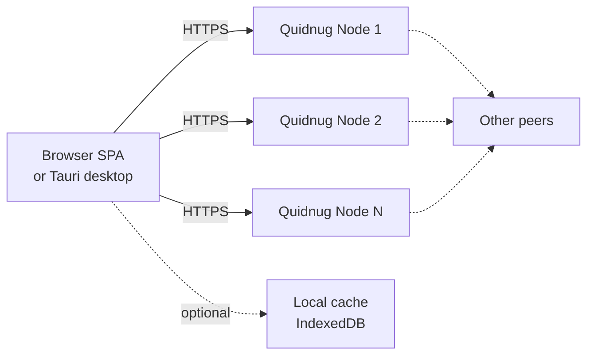
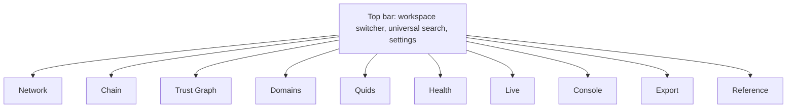

# QDP-0025: Quidnug Explorer

| Field         | Value                                                                |
|---------------|----------------------------------------------------------------------|
| Status        | Draft                                                                |
| Track         | Ecosystem                                                            |
| Author        | The Quidnug Authors                                                  |
| Created       | 2026-05-01                                                           |
| Discussion    | -                                                                    |
| Requires      | QDP-0011 (client libraries roadmap), QDP-0014 (discovery & sharding), QDP-0018 (observability & audit) |
| Supersedes    | -                                                                    |
| Superseded-by | -                                                                    |
| Enables       | Operator self-service health, data-engineer ETL, graph-analyst research, app-developer prototyping |
| Activation    | N/A (tooling, not protocol)                                          |

## 1. Summary

A single-page application, served either from the node itself at
`/explorer` or as a desktop wrapper, that lets a human or an AI
agent connect to one or more Quidnug nodes and explore the
network at three layers simultaneously: the **transport layer**
(peers, addresses, scoreboards, reachability), the **ledger
layer** (blocks, transactions, registries), and the **trust
graph layer** (quids, edges, paths, domains). The explorer is
the primary technical surface for inspection, debugging, and
research; it is read-mostly, with carefully gated write actions
for privileged operations.

## 2. Motivation

Today a Quidnug operator inspecting their node has the
following options:

1. `curl` against the node's HTTP API and `jq` the responses.
2. Read raw JSON files in `data_dir/` (`blockchain.json`,
   `trust_domains.json`, `peer_scores.json`).
3. Tail logs and grep.
4. Write throwaway scripts.

A data engineer who wants to ETL the chain has to write a
custom paginator over `/api/v1/blocks` and assemble the
registry view themselves. A graph-data analyst who wants to
compute centrality on the trust graph has to walk
`/api/v1/registry/trust` and convert it to a format Gephi or
networkx can ingest. An application developer who wants to
debug a transaction submission has no way to see why their
transaction was rejected without reading Go source.

The protocol is observable in principle (every state-bearing
fact is on the chain or in a public registry). It is not
observable in practice: there is no GUI, no path navigator, no
visual graph, no schema browser, no "why was this rejected?"
explainer. ENG-79 through ENG-82 (recently shipped peer-mesh
convergence fixes) were each hard to diagnose precisely
because debugging required reading goroutine stacks and
correlating multi-node logs by hand. An explorer would have
shown the silent block-rejection symptom on the first cycle.

## 3. Goals and non-goals

**Goals:**

- Connect to a running Quidnug node by URL, with optional API
  token, and probe its identity, health, and capabilities.
- Browse the chain page-by-page with rich per-block detail,
  including re-verification (hash recompute, signature check)
  client-side.
- Browse trust domains: validators, governors, governance
  quorum, supported transaction types, blockchain head.
- Browse the trust graph as a force-directed network,
  filterable and queryable, with path-finding from any quid
  to any other quid.
- Browse identity, title, event, advertisement, and consent
  registries with deep linking from blocks and transactions.
- Show peer-to-peer mesh state: who this node knows about,
  scoreboard, quarantine status, sync lag per peer.
- Run a "compare" view across two or more connected nodes so
  divergence is visible at a glance.
- Live-tail new blocks and gossip events.
- Export anything visible as JSON, JSONL, CSV, GraphML,
  or Parquet.
- Provide an integrated API console with the request shapes
  the explorer itself uses.
- Explain every domain term inline with tooltips and "Why?"
  panels, linked to the canonical docs at quidnug.com.
- Be useful to AI agents (every view emits machine-readable
  representations alongside the human view, every URL is
  a stable shareable address).

**Non-goals:**

- The explorer is not a wallet. It does not generate or store
  private keys. Signing happens elsewhere (CLI, SDK, HSM
  integration).
- The explorer does not implement gossip, peer admission, or
  block production. It is a client of the node's HTTP API.
- The explorer does not introduce new protocol surface. It
  consumes only endpoints already specified by other QDPs.
  If a feature requires a new endpoint, that endpoint is
  proposed in a separate QDP and the explorer adopts it
  later.
- The explorer is not a CMS for off-chain content (review
  bodies, attached files). Out-of-band media browsing is
  out of scope.

## 4. Background

The reference node ships an HTTP server with these endpoint
families (citing `internal/core/handlers.go` and adjacent):

- `/api/v1/info` (node identity, version, supported domains).
- `/api/v1/blocks` (chain pagination, returns canonical
  Block envelope).
- `/api/v1/blocks/tentative/{domain}` (per-domain tentative
  blocks not yet promoted to trusted).
- `/api/v1/nodes` (known-peers list with scoreboard data).
- `/api/v1/domains` (trust-domain registry; POST registers a
  new domain).
- `/api/v1/domains/{domain}/query` (per-domain query path
  for identities, titles, events).
- `/api/v1/registry/trust` (verified trust edges).
- `/api/v2/discovery/operator/{op}` (operator-quid based
  node lookup, QDP-0014).
- `/api/v1/gossip/domains` (domain fingerprint exchange,
  POST-only normally; informational read paths exist).
- `/api/transactions/{txType}` (POST submission for each
  transaction type).
- `/metrics` (Prometheus, when the metrics endpoint is
  enabled).

Per-process data the explorer wants to expose visually:

- `node.Blockchain` (flat slice; per-domain sub-chains
  identifiable by `block.TrustProof.TrustDomain` after
  ENG-80).
- `node.TrustDomains[]` (validator set, governance, head,
  thresholds, public keys).
- `node.TrustRegistry[truster][trustee] = level` (verified
  edges); plus the unverified-edge buffer that ENG-77 and
  Phase 4 produce.
- `node.IdentityRegistry[quid]` (identity transactions).
- `node.NodeAdvertisementRegistry` (operator-to-node mapping
  for QDP-0014 discovery).
- `node.QuidDomainIndex` (per-domain quid activity index).
- `node.PeerScoreboard` (Phase 4 peer scoring + quarantine).

These are all already serialized through HTTP responses; the
explorer never reaches into the process directly.

## 5. Personas and primary journeys

The explorer is built for four primary personas. Each module
called out in §7 lists which persona drives it.

### 5.1 Operator (Olivia)

Runs one or more nodes. Cares about: is my node healthy, are
my peers reachable, is the chain converging, what is the
quarantine state, why is a specific peer flagging? Wants
glanceable dashboards and one-click drill-downs.

**Primary journey:** open the explorer pointed at her own
node, sees the **Health** dashboard. Spots that one peer is
quarantined. Clicks the peer, lands on the Peer-detail panel,
reads the quarantine reason, sees the recent events that
drove the score below threshold. Confirms the peer is
genuinely misbehaving and adds it to a static blocklist, or
realizes it is a false positive and uses the API console to
issue an unquarantine command.

### 5.2 Data engineer (Diego)

Wants to land Quidnug data into a warehouse for
joins with off-chain data. Cares about: schema stability,
bulk export, incremental sync, throughput.

**Primary journey:** opens the explorer, browses to **Export**,
configures a JSONL dump of all blocks since timestamp T,
filtered by domain, downloads a streaming response. Inspects
the inferred schema. Wires the same parameters into a
scheduled `quidnug-cli export` command for production runs.
The explorer is his discovery and verification surface; the
CLI is the production surface.

### 5.3 Graph data analyst (Greta)

Researches the trust graph: who trusts whom, what subgraphs
form, where are the bridges and authorities, how does trust
decay over time. Cares about: visualization, path queries,
algorithm overlays, export to Gephi or networkx.

**Primary journey:** opens the explorer, navigates to **Trust
Graph**, searches for a known quid, expands two hops out.
Filters edges by trust threshold and by domain. Toggles a
PageRank overlay to size nodes by influence. Switches to
"path query" mode, picks two quids, and reads the per-edge
trust contribution that drives the relational-trust score
between them. Exports the visible subgraph as GraphML and
opens it in Gephi for deeper analysis.

### 5.4 Application developer (Avi)

Building an application that submits transactions and reads
results. Cares about: schema, request shapes, what a
successful response looks like, why his transaction was
rejected.

**Primary journey:** opens the explorer, finds the **API
Console** tab, picks the `IDENTITY` transaction template,
fills in fields, submits via the integrated form. Sees the
node's response, then watches the transaction land in a
block via the live-activity stream. Clicks through to the
block, expands the transaction, sees the registry effect.
Copies the resulting cURL or fetch snippet into his code.

## 6. Architecture

### 6.1 Topology



The explorer is a pure client. It speaks HTTP to one or more
Quidnug nodes and renders the responses. There is no
explorer-side backend, no aggregation server, no proxy
service, no shared state store. Everything the explorer
shows comes either from a node it is currently connected to
or from local browser storage that the user controls.

### 6.2 Why pure client

- **Trust boundary clarity.** The user is already trusting
  the node they connect to; introducing an aggregation tier
  doubles the trust surface and gives that tier a tempting
  position to forge views.
- **Operator simplicity.** A node with the explorer bundle
  served at `/explorer/*` is self-contained. No second
  process, no second port, no Docker compose.
- **Air-gapped deployment.** A desktop wrapper can talk to
  nodes on a private LAN where no extra service can run.
- **Forensic snapshots.** A user can save the in-memory
  view to disk and reopen it later (file-mode, §7.13)
  without needing the source node.

### 6.3 Trust model

The explorer trusts the connected node to truthfully serve
its own view. It does not assume the node is correct about
the rest of the network. When two nodes' views disagree,
the explorer surfaces the disagreement (compare-mode in
several modules) rather than picking a winner.

For privileged operations (POST endpoints, anything that
mutates), the explorer requires an API token entered by the
user and stored in `localStorage` scoped to the workspace.
Tokens are never transmitted to anywhere except the
configured node's origin.

### 6.4 Data freshness

Server state is managed by TanStack Query. Per-resource
TTLs:

| Resource                | TTL    | Refetch trigger                        |
|-------------------------|--------|----------------------------------------|
| `/api/v1/info`          | 60s    | workspace open, manual refresh         |
| `/api/v1/blocks` (head) | 5s     | live-activity tick, manual refresh     |
| `/api/v1/nodes`         | 15s    | health-tab focus, manual refresh       |
| `/api/v1/domains`       | 30s    | domain-tab focus                       |
| `/api/v1/registry/trust`| 30s    | trust-graph open, manual refresh       |
| Per-block detail        | infinite (immutable) | hash mismatch invalidation |
| Per-tx detail           | infinite (immutable) | hash mismatch invalidation |

Stale-while-revalidate is enabled everywhere. The user sees
the cached view immediately and a fresh fetch hydrates in
the background.

## 7. Information architecture



Each top-level module has its own URL slug
(`/network`, `/chain`, etc.) and supports deep links into
sub-views (`/chain/block/{hash}`,
`/trust-graph/quid/{quidId}?depth=3`). Every linkable view
has a stable URL the user can paste into a bug report, a
slack message, or feed back to an AI agent for context.

## 7.1 Module: Workspace and Connection

**Persona:** all four.
**Endpoints:** `/api/v1/info`.
**State:** persisted to `localStorage` per workspace label.

A "workspace" is a saved connection: label, base URL,
optional API token. The user can have multiple workspaces
open simultaneously; the top bar shows them as tabs and the
active workspace tints the chrome (so the user always
knows which node they are looking at).

**Connection flow:**

1. User clicks "Connect to node" or visits the explorer at
   `/explorer` on a node's own URL.
2. Explorer pings `/api/v1/info`. If the response is a
   well-formed Quidnug `info` envelope, the connection
   succeeds. Otherwise the explorer shows a diagnostic
   panel: "this URL responded but did not look like a
   Quidnug node; here is what we got."
3. Workspace gets a label (auto-suggested from the
   `info.NodeQuid`'s short prefix, editable).
4. Workspace gets a tint color (auto-assigned from the
   nodeQuid hash, editable).
5. User can pin the workspace to remember it across browser
   sessions.

**"Hop" affordance:** anywhere in the UI where another
peer's address is visible (peer list, validator-set view,
known-nodes table), a small "hop" icon opens that peer in
a new workspace tab with one click. Useful for graph
analysts following the federation, useful for operators
verifying that a peer's view of a domain matches the local
view.

**Empty state:** first launch. Show a one-page tutorial
explaining what a Quidnug node is, where to find one, and
how to point the explorer at it. Include a "demo node"
button that connects to a public read-only example node
operated by the Quidnug authors.

**Error states:**

- Network error: "could not reach this URL." Show curl
  equivalent the user can paste into a terminal.
- 401/403: "this node returned 'unauthorized'. If you have
  an API token, paste it in the workspace settings."
- Schema mismatch: "this node speaks Quidnug protocol
  version X; the explorer was built for version Y." Show
  what works regardless and what is gated.

## 7.2 Module: Network

**Persona:** operator, graph analyst.
**Endpoints:** `/api/v1/nodes`,
`/api/v2/discovery/operator/{op}`, `/api/v1/info`.

Two sub-views: **Peer list** (default, table) and
**Topology** (graph).

### 7.2.1 Peer list

Tabular columns: short ID, operator quid (linked to operator
view), address (with reachability indicator), connection
status, peer-score composite, quarantine flag, last-seen
timestamp, supported domains (badge list), is-validator
flag.

Filter chips: status (admitted, gossip, quarantined),
operator quid, supported domain, score threshold.

Per-row expander shows: full peer-score breakdown
(per-event-class subscores, recent events, last
quarantine reason if any), full advertisement record
(endpoints, capabilities, expiresAt), the chain of admit
verdicts that produced this peer.

### 7.2.2 Topology

Force-directed graph. One node per peer plus the local
node. An edge between A and B when both A and B appear in
each other's `KnownNodes` (requires having both workspaces
connected, otherwise the edge is "asserted by A only" and
rendered dashed).

Node size: peer score. Node color: quarantine status. Edge
opacity: how recently mutual visibility was confirmed.

Hover any node: identity card popover. Click any node: hop
into its workspace tab. Click any edge: shows the
advertised endpoint and the round-trip-time of a probe if
the user runs one.

**Reachability test:** a button that probes each peer's
HTTP `info` endpoint from the explorer's origin and shows
which ones answer, how fast. Useful for diagnosing local
firewall issues.

## 7.3 Module: Chain

**Persona:** all four.
**Endpoints:** `/api/v1/blocks`,
`/api/v1/blocks/tentative/{domain}`.

### 7.3.1 Block list

Default view: paginated descending by index (latest first).
Server-side pagination via offset and limit; client-side
sort and filter on the visible page.

Columns: index, hash short, timestamp (relative and
absolute toggle), validator (linked to quid view), trust
domain (linked to domain detail), tx count, tier badge
(trusted, tentative, untrusted, invalid).

Filters: by domain, by validator, by tx-type presence
(blocks containing at least one TRUST tx, etc.), by time
range. Filters compose; the URL captures every filter as
query params for shareability.

Two layout modes:

- **Flat:** every block, ordered by global slice index. The
  default.
- **Per-domain:** group by `TrustProof.TrustDomain` and
  show each domain's sub-chain as its own column. After
  ENG-80 the per-domain view is the natural unit; the flat
  view is for forensic ordering.

### 7.3.2 Block detail

Navigation arrows (previous, next within the active filter).
Top section: hash, prev hash, index, timestamp, validator,
trust domain. Click any of these to navigate to its detail
view (peer, domain, etc.).

**Trust proof panel:** validator id, validator pubkey,
validator signatures, validation time, validator trust in
creator. A "Re-verify locally" button: the explorer
recomputes the block hash from the canonical signable data
and verifies the signature against the embedded pubkey. The
result is a green check or a red X with a precise reason.
The user can do this without trusting the server's tier
badge.

**Transactions panel:** list of every transaction in the
block. Each row shows tx type, signer, summary fields. Click
to open the **Transaction Inspector** (§7.4).

**Per-domain context panel:** for the block's trust domain,
show what changed in the registries because of this block.
A "before / after" diff: trust edges added or modified,
identities added, titles transferred, advertisements
rotated, events emitted. This is computed client-side by
running the same `update*Registry` logic in JavaScript;
the explorer ships with a faithful port of those helpers
in TypeScript so the diff is identical to what the live
node does.

**Pre-fork artifacts:** if the block carries
`NonceCheckpoints`, render them. If it carries
`TransactionsRoot`, render the Merkle root and provide a
"verify this root against the transactions" button.

### 7.3.3 Tentative blocks

Per-domain tab listing tentative blocks for the active
domain: same shape as trusted blocks but with the
acceptance reason (which tier the block fell into and why
the tier evaluation chose it). Useful for understanding
why a peer's block did not get fully promoted on this
node, which is one of the most common operator questions.

## 7.4 Module: Transaction Inspector

**Persona:** developer, operator.
**Endpoints:** mostly nested in block responses; some
cross-references via `/api/v1/registry/*`.

A typed view per transaction class. The explorer ships
schemas for each class (TRUST, IDENTITY, TITLE, EVENT,
NODE_ADVERTISEMENT, MODERATION_ACTION, DSR_REQUEST,
CONSENT_GRANT, CONSENT_WITHDRAW, PROCESSING_RESTRICTION,
DSR_COMPLIANCE, plus future classes).

For each tx the inspector shows:

- **Header:** id, type, signer (pubkey), domain, timestamp,
  signature.
- **Typed body:** rendered with field labels and tooltips
  ("what is `Truster`?", "what does `TrustLevel: 0.85`
  mean in the relational-trust model?").
- **Validation trace:** the explorer ports
  `Validate*Transaction` to TypeScript and re-runs it
  client-side. If validation fails, the failing rule is
  highlighted with the reason. This is the "why was my tx
  rejected" surface developers ask for.
- **Registry effect:** before-and-after for the registry
  this tx writes into. Hyperlinked to the Quid view (§7.5)
  for the affected entities.
- **Backlinks:** which block contains this tx, which other
  txs reference it (e.g., a CONSENT_WITHDRAW points at the
  CONSENT_GRANT it withdraws).

## 7.5 Module: Quids

**Persona:** all four.
**Endpoints:** `/api/v1/registry/trust`,
`/api/v2/discovery/operator/{op}`, plus block-derived
identity records.

The Quid view is the noun-page for any quid id (16 hex
chars, derived from a public key). It pulls together every
fact the connected node holds about that quid:

- **Identity card:** display name (from the most recent
  IdentityTransaction), home domain, pubkey, key history
  (epochs from the `NonceLedger`).
- **Trust edges:** every edge where this quid is truster or
  trustee, grouped by domain. Shows weight, last refresh,
  TTL, decay-adjusted current weight (QDP-0019).
- **Path-from-me:** if the user is signed into a workspace
  with operator credentials, a one-click "what is the
  relational trust from my operator quid to this quid?"
  query that runs ComputeRelationalTrust client-side using
  the locally-fetched edges. Shows the path that produced
  the result.
- **Owned titles:** every TitleTransaction where this quid
  is an owner.
- **Authored events:** event-stream entries this quid
  signed, paginated.
- **Operator role:** if this quid is an operator quid, the
  list of node quids it operates (from the
  NodeAdvertisementRegistry).
- **Moderation history:** any MODERATION_ACTION
  transactions that targeted this quid, with verdict and
  governing domain.
- **Privacy state:** any DSR_REQUEST or CONSENT_WITHDRAW
  transactions affecting this quid's data.

The Quid view is the most-linked page in the application;
nearly every other module deep-links into it.

## 7.6 Module: Domains

**Persona:** operator, governance reviewer, developer.
**Endpoints:** `/api/v1/domains`,
`/api/v1/domains/{domain}/query`, `/api/v1/blocks` filtered
by domain.

### 7.6.1 Domain list

Searchable table. Columns: name, validators count,
governors count, trust threshold, governance quorum,
parent-delegation mode, blockchain head (short hash, links
to the block), block count, last activity timestamp.

### 7.6.2 Domain detail

- **Validators panel:** for each validator, id, pubkey,
  participation weight, last block produced, status
  (active, stale, quarantined-by-this-node).
- **Governors panel (QDP-0012):** for each governor, id,
  pubkey, vote weight. Quorum threshold visualization.
- **Subdomain hierarchy:** if the domain has a parent
  (e.g., `subteam.org.example.com`), show the parent
  chain with delegation modes annotated.
- **Activity feed:** recent blocks, recent identity adds,
  recent trust edges within this domain.
- **Top quids:** by the QuidDomainIndex's activity score.
- **Cross-node compare:** if the user has multiple
  workspaces open, a side-by-side diff of how each peer's
  view of this domain looks. Disagreements (different
  validator sets, different heads) are flagged red.

### 7.6.3 Register a domain

Behind a feature flag and an API-token gate. Renders a form
backed by the JSON Schema for TrustDomain registration
payloads (validators, governors, quorum, threshold). On
submit, the explorer POSTs to `/api/v1/domains` and shows
the response. Used by operators bringing up a new domain
without leaving the GUI.

## 7.7 Module: Trust Graph

**Persona:** graph analyst, security reviewer, operator
debugging trust scoring.
**Endpoints:** `/api/v1/registry/trust`, plus per-domain
indices when filtering scope.

This is the marquee visualization.

### 7.7.1 Canvas

WebGL-rendered force-directed graph (sigma.js, pixi-based)
to handle five-figure node counts smoothly. Each node is a
quid; each edge is a verified trust relationship.

### 7.7.2 Controls

- **Center quid:** the graph's focal point. Defaults to
  the local node's operator quid (if available) or the
  highest-degree quid in the registry.
- **Depth:** 1 to 5 hops out from the center.
- **Edge filters:** trust threshold (slider), TTL state
  (active vs expired vs not-set), include unverified
  (toggle).
- **Domain filter:** show edges in selected domains only.
  Multi-select.
- **Time filter:** show edges last refreshed within the
  selected window. Slider keyed to the QDP-0019
  half-life so users see decay in motion.

### 7.7.3 Overlays

Each overlay recolors or resizes nodes without changing
topology:

- **Centrality** (degree, closeness, betweenness, eigenvector,
  PageRank). Computed client-side via `graphology`. Useful
  for finding hubs.
- **Decay age:** edges colored by recency. Pale edges have
  not been refreshed in a long time.
- **Tier:** verified vs unverified edges in different
  shades. Default mixes both.
- **Path from A:** picks a quid A and shades every node by
  its relational trust from A.

### 7.7.4 Path query

Switches the canvas to "two endpoints" mode. The user picks
A and B; the explorer enumerates all paths up to depth N
that satisfy the threshold filter, ranks them by computed
relational trust, and renders the top K with each edge
labeled by its contribution. This is the visual mirror of
ComputeRelationalTrust; an analyst can see which edges
matter for the result.

### 7.7.5 Selection and detail

Click a node: opens the Quid view (§7.5) in a side panel.
Click an edge: shows the underlying TrustTransaction
(domain, signer, level, nonce, timestamp), with a link to
the block that committed it.

### 7.7.6 Export

- **GraphML / GEXF:** for Gephi.
- **JSON-LD:** semantically rich, AI-friendly.
- **NetworkX-flavored JSON:** for Python notebooks.
- **Subgraph clipping:** export only what is currently
  visible (after filters and depth limits).

## 7.8 Module: Health

**Persona:** operator.
**Endpoints:** `/api/v1/info`, `/api/v1/nodes`,
`/metrics` (Prometheus, when enabled), the persistence
metadata endpoints proposed in QDP-0018.

Glanceable dashboard with these tiles:

- **Sync status:** for each domain the node tracks, the
  highest local block index, the highest peer-reported
  block index, and the lag. Anything more than a few
  blocks behind highlights yellow; more than a hundred
  highlights red.
- **Peer scoreboard summary:** count of peers in each
  state (admitted, gossip-only, quarantined). Trend
  sparkline over the last hour.
- **Persistence health:** last-save timestamp for each
  data file, file size, error count from the last save
  cycle. ENG-74/75/76 made these surfaces meaningful;
  this tile is the user-facing payoff.
- **Rate limits:** current request rate against
  configured caps. Red when nearing the cap.
- **Pending transaction queue:** size, oldest entry age.
  Click to see what is in the queue and why each item
  has not been included in a block yet.
- **Recent errors:** tail of any logger entries at WARN
  or ERROR level (pulled from a `/logs/recent` endpoint
  to be specified by QDP-0018; if the endpoint is not
  available, the tile shows a dim placeholder).
- **Network reach:** count of peers the explorer can
  reach directly from its origin. Yellow when below
  threshold, red on full isolation.

Each tile expands into its own detail panel with charts
and per-row drill-down.

## 7.9 Module: Live activity

**Persona:** operator (during incidents), developer
(during integration), curious viewer.
**Mechanism:** polling first, server-sent events when the
node implements them (proposed in QDP-0018).

A vertically-scrolling list of recent events as they
happen: new blocks, gossip ticks, peer admits, peer
quarantines, transaction submissions, registry updates.
Each entry expands inline. Pause and resume controls. A
filter bar to narrow by domain, by event type, by
validator. A "freeze" button captures the current view as
a forensic snapshot the user can export.

The default cadence (poll-mode) is 1Hz against
`/api/v1/blocks?limit=5&offset=0` plus `/api/v1/nodes`.
Diff against the previous tick produces the event stream.
This is bandwidth-light enough to leave open in a
background tab.

## 7.10 Module: API console

**Persona:** developer, operator running ops commands.
**Endpoints:** every endpoint the connected node exposes.

The API console is a Postman-lite for Quidnug nodes,
seeded with the request shapes the explorer itself
uses. Every endpoint has a template; the user fills in
variables and the console shows:

- The exact `fetch` and `curl` shapes (copyable).
- The response, syntax-highlighted, with response-shape
  schema rendered side-by-side.
- A "save as workspace preset" button for repeat use.
- A "diff against previous response" toggle for endpoints
  the user calls more than once.

For POST endpoints (transaction submission, domain
registration), the console offers a form view backed by the
endpoint's JSON Schema, validates client-side, and shows
the canonical signing payload with an "I have a signature
from elsewhere, paste here" field. The console never holds
a private key.

A built-in **Recipe library** captures common multi-step
flows: "submit a TRUST transaction and watch it land",
"register a domain and verify governors", "rotate an
identity key", "submit a CONSENT_WITHDRAW and observe the
moderation action chain".

## 7.11 Module: Reference

**Persona:** developer, AI agent reading the explorer.
**Source:** static, bundled with the explorer build.

A docs panel embedded inside the explorer:

- Glossary of every Quidnug term (quid, domain, validator,
  governor, anchor, fork block, tentative tier).
- Endpoint reference for every endpoint the explorer
  uses, with request/response schemas.
- Transaction-class reference: every tx type, every field,
  every validation rule, every registry effect.
- Cross-link to the canonical docs at quidnug.com when
  the topic exceeds the inline summary.

The panel is a slide-out so the user can read it next to
whatever they are working on.

## 7.12 Module: Export

**Persona:** data engineer.
**Endpoints:** every read endpoint the explorer
otherwise consumes, but here marshalled into bulk
formats.

A single page that drives bulk exports. Source selectors
(blocks, registries, peer scoreboard, etc.), filter
controls, format selector (JSONL, CSV, Parquet via
arrow-js, GraphML, JSON-LD), date range, target
(streaming download, file in browser, IndexedDB cache for
later). For Parquet, the column types come from the
TypeScript schema definitions the explorer ships, so the
output is faithful to the protocol's typed model.

A "scheduled export" stub captures the configuration as a
shell command line for `quidnug-cli export`, since
production exports should run there rather than in a
browser tab.

## 7.13 Module: Snapshot and offline mode

**Persona:** all four during postmortems and tutorials.

Two related features:

- **Save snapshot:** dump every API response the explorer
  has cached during the current session into a single
  `.qsnap` file (gzipped JSONL of `{endpoint, params,
  response, fetchedAt}`).
- **Open snapshot:** drag-drop a `.qsnap` file. Explorer
  enters file-mode: every API call resolves from the
  snapshot, no network. Workspace tint switches to
  archive-grey so the user knows nothing they see is live.

Useful for sharing reproducible bugs, for offline
analysis, for tutorial content that should not depend on
any specific live node.

## 7.14 Module: Settings

Per-workspace: base URL, API token, label, tint, default
filters.

Global: theme (dark, light, auto), table density (compact,
comfortable), refresh cadences (overrides for the table in
§6.4), graph engine quality (auto, low for large graphs,
high for screenshots), telemetry opt-in (off by default;
when on, sends only client-side error reports to
quidnug.com error sink).

## 8. Cross-cutting concerns

### 8.1 Universal search

A single bar in the top chrome. Heuristics on the input:

- 64 hex chars: block hash. Resolves to block detail.
- 16 hex chars: quid id. Resolves to Quid view.
- Looks like `host:port`: peer address. Resolves to peer
  detail (or "no peer at this address" if not in
  KnownNodes).
- Contains a dot: candidate trust domain. Resolves to
  domain detail or "no domain by this name".
- Otherwise: full-text against identity-display-name,
  domain-name, label fields.

Recent searches are pinned in a dropdown.

### 8.2 Empty and error states

Every module specifies the empty state (zero blocks, zero
peers, zero edges, etc.). The convention: a one-sentence
diagnosis ("this node has not finished bootstrap"), a
one-sentence remedy ("wait 30s and refresh, or check the
gossip log"), and a deep link into the relevant section
of the canonical docs.

Errors follow a similar pattern: the response code, the
node's error body, the curl equivalent, a guess at the
likely cause, and a "report to maintainer" button that
generates a pre-filled GitHub issue.

### 8.3 Education layer

Every domain term is rendered as a `<dfn>` with a hover
tooltip and a click-through to the Reference panel. First
appearance of a term in a session opens the tooltip
automatically (dismissable; remembered per-term).

A "tutorial mode" overlays each module on first visit
with arrow-and-callout descriptions of the major UI
elements. The user can replay the tutorial from Settings.

### 8.4 AI friendliness

Per the user's preference for AI-agent friendly content
on quidnug.com, the explorer extends the same posture:

- Every page emits a `<script type="application/ld+json">`
  block describing what is on screen using a Quidnug
  vocabulary defined in `docs/vocab/explorer.jsonld`.
- Every list and detail view supports a `?format=json`
  query param that returns the same data as JSON instead
  of HTML, for easy scraping by an agent that does not
  want to drive a browser.
- The Reference panel is openable directly via
  `/explorer/reference/{topic}`, so an agent can fetch
  documentation about a term in one HTTP call.
- URLs are stable, parameterizable, and lossless. An
  agent can construct a URL from natural-language intent
  and trust the result.

### 8.5 Accessibility

WCAG 2.2 AA target. Every interactive element keyboard-
reachable. Tables expose rows as `<tr>` with proper
headers. Graph canvas has a parallel list-mode
representation that screen readers can navigate.

## 9. Tech stack

| Layer                  | Choice                                              | Rationale                                                                  |
|------------------------|-----------------------------------------------------|----------------------------------------------------------------------------|
| Language               | TypeScript (strict)                                 | Type-safe consumption of node responses; Zod runtime validation            |
| Build                  | Vite                                                | Fast dev, small prod bundle, good tree shaking                             |
| Framework              | React 18                                            | Largest hire pool, deep ecosystem, fits TanStack Query / Table             |
| Routing                | TanStack Router                                     | Type-safe URL params, fits the file-based view structure                   |
| Server state           | TanStack Query                                      | Stale-while-revalidate, dedupe, devtools                                   |
| Tables                 | TanStack Table                                      | Virtualized rows, column resizing, sort/filter integration                 |
| Graph                  | Sigma.js + Graphology                               | WebGL renderer scales past 10k nodes; Graphology has the algorithms        |
| Charts                 | Recharts                                            | Declarative, sufficient for sparklines and stacked bars                    |
| UI primitives          | shadcn/ui on Radix                                  | Accessible by default, headless components, easy to theme                  |
| Styling                | Tailwind CSS                                        | Consistent with shadcn/ui, fast iteration                                  |
| Schema validation      | Zod                                                 | Runtime validation of node responses; same schemas drive the API console   |
| Date / time            | Temporal polyfill                                   | Sane time arithmetic; falls back to native Temporal when available         |
| Testing                | Vitest, Playwright                                  | Vitest for component tests, Playwright for end-to-end against a test node  |
| Bundle target          | ES2022, modern browsers only                        | The user already runs a modern browser; node-served builds can dual-target |

The bundle ships a `quidnug-protocol.ts` package that mirrors
the on-the-wire types and the `update*Registry`,
`Validate*Transaction`, and `ComputeRelationalTrust` algorithms
from the Go reference. This is what powers client-side
re-verification, client-side validation traces, and
client-side relational-trust path queries. A round-trip
test harness against the Go reference's published test
vectors keeps the two implementations in lockstep; any
divergence fails CI on the explorer side.

## 10. Distribution and deployment

### 10.1 Three artifacts

1. **Static SPA bundle.** The default. The build
   produces a folder of static assets that any HTTP server
   can serve. The reference node ships this folder embedded
   in its binary and serves it at `/explorer/*` when
   `--explorer=enabled` is set in node config. Operator
   experience: zero install, just open
   `https://my-node.example.com/explorer`.
2. **Tauri desktop wrapper.** A native window around the
   SPA bundle, with native file dialogs (snapshot
   open/save), no CORS constraints, and the ability to
   talk to nodes on a private LAN that the user's browser
   cannot reach due to CSP. Single-binary distribution
   for macOS, Linux, Windows. About 10MB per platform.
3. **npm package.** `@quidnug/explorer` for embedding the
   SPA into a larger product (a vendor tooling portal, a
   compliance dashboard, etc.). Exports React components
   per module so a consumer can drop in just the trust
   graph without the rest of the chrome.

### 10.2 CORS

The reference node already handles CORS for `/explorer`
when serving the bundle from the same origin. For
cross-origin browser usage (the SPA on
`explorer.quidnug.com` connecting to a node on
`node.example.com`), the operator must enable
`--explorer-cors-origins=https://explorer.quidnug.com` in
node config. This is opt-in.

The Tauri wrapper sidesteps CORS entirely because the
requests originate from a privileged process, not a
browser tab. This is the recommended path for any user
running multi-node compare-mode.

### 10.3 Versioning

The explorer's `package.json` major version tracks the
Quidnug protocol's major version. A v1.x explorer talks to
v1.x nodes. A v2 explorer ships when the protocol
introduces breaking changes. The `info` probe in §7.1
reports the version mismatch case.

### 10.4 Build output

```
dist/
  index.html
  assets/
    explorer-{hash}.js
    explorer-{hash}.css
    sigma-worker-{hash}.js
    fonts/
  reference/
    {topic}.html
```

About 1.5MB gzipped at MVP scope. Code-split per top-level
module so the initial paint loads only the workspace
chrome plus whatever module the URL targets.

## 11. Phasing

The phases are scoped so each one is independently
useful. Phase 1 is the smallest set that gives all four
personas something they cannot do today.

### 11.1 Phase 1 (MVP)

- Workspace + connection (§7.1).
- Network peer list (§7.2.1).
- Chain block list and detail (§7.3.1, §7.3.2).
- Domain list and detail (§7.6.1, §7.6.2).
- Quid view (§7.5) read-only.
- Universal search (§8.1).
- Reference panel (§7.11) seeded with the existing docs.
- Snapshot save / open (§7.13).
- Static SPA bundle distribution (§10.1.1).

Ships: a usable explorer for all four personas. No
visualization, no live tail, no API console, no export
beyond raw JSON download per page.

Estimated effort: 6 to 8 weeks for a single full-time
developer with the chosen stack.

### 11.2 Phase 2

- Trust graph viz (§7.7).
- Live activity stream (§7.9).
- Health dashboard (§7.8) basic tiles.
- Topology sub-view in Network (§7.2.2).
- Tauri desktop wrapper (§10.1.2).

Ships: graph analyst persona moves from "blocked" to
"primary user". Operator persona gains glanceable health.
Adds 4 to 6 weeks.

### 11.3 Phase 3

- API console (§7.10).
- Export module (§7.12) with bulk formats.
- Cross-node compare in Domain detail (§7.6.2) and Health.
- Education tutorial overlays (§8.3).
- Validation traces in Transaction Inspector (§7.4).

Ships: developer persona moves from "secondary" to
"primary" for prototyping. Adds 4 weeks.

### 11.4 Phase 4

- npm package distribution (§10.1.3).
- Algorithm overlays in Trust Graph (§7.7.3).
- Path query (§7.7.4).
- Schema-driven domain registration form (§7.6.3).
- Full AI friendliness (§8.4) end-to-end.

Ships: graph analyst gains research depth, embedding
becomes possible. Adds 4 weeks.

Total to full spec: roughly 5 to 6 calendar months for
one developer, or 3 calendar months for two working
in parallel along the module boundaries (modules are
deliberately decoupled).

## 12. Out of scope

- **Wallet functionality.** Key generation, key storage,
  signing. Belongs in the SDKs and the CLI.
- **Off-chain content browsing.** Review bodies, attached
  media, IPFS-hosted artifacts. The explorer renders the
  content-addressed pointers and lets the user open them
  in a separate viewer; it does not host the viewer.
- **Multi-user collaboration on the explorer itself.**
  Comments, annotations, shared cursors. The explorer is
  single-user; collaboration happens by sharing URLs and
  snapshots.
- **Aggregation across all known Quidnug networks
  globally.** The explorer is scoped to nodes the user
  knows about. A "network registry" service that
  discovers public Quidnug instances would be a separate
  product.
- **Mobile-first design.** The explorer targets desktop.
  It will work on a tablet but is not optimized for
  phones.

## 13. Open questions

1. **Where does the explorer source live?** Same
   repository as the reference node (so binary embedding
   stays one build), or a separate repository (so the JS
   ecosystem is not pulled into Go contributors' tree)?
   Leaning separate, with the reference node depending on
   the explorer's published static assets at build time.
2. **Should the npm package own the protocol-port
   TypeScript code or should it depend on a separate
   `@quidnug/protocol-ts`?** Separate is cleaner if other
   consumers (the JS SDK) eventually share the same
   ports.
3. **Color palette.** No decision yet. Constraint: tints
   for workspace tabs must remain visually distinct
   when several are open, and the trust-edge color scale
   must work for protan, deutan, and tritan color vision
   variants.
4. **Live activity transport.** Polling at 1Hz for
   Phase 2; SSE proposed for Phase 3 in QDP-0018. Should
   the explorer accept a WebSocket pathway as a fallback,
   or stick with SSE?
5. **API token storage.** `localStorage` has the wrong
   trust posture for sensitive tokens but is the only
   option for a pure SPA. The Tauri wrapper can use the
   OS keychain. Do we restrict privileged actions to
   Tauri-only, or do we accept the `localStorage` risk
   with prominent warning?
6. **Telemetry.** Off by default. When on, what is
   acceptable to send? Crash stack traces only, or
   anonymous usage analytics, or nothing? Affects the
   privacy posture quidnug.com communicates to operators.
7. **Time math.** Use `Temporal` everywhere, or keep
   `Date` for compatibility with older runtimes that the
   ESM bundle does not exclude?
8. **Embedded reference docs scope.** Inline the entire
   protocol spec, or link out to quidnug.com? Inline is
   offline-friendly but doubles the bundle size; link-out
   is small but breaks for users on a private LAN with no
   internet.

## 14. Reference implementation

Empty during Draft. Once Phase 1 lands, this section
links to the explorer repository and the binary-embedding
PR against the reference node.

## 15. Changelog

- 2026-05-01 Draft published.
