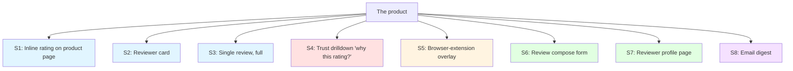
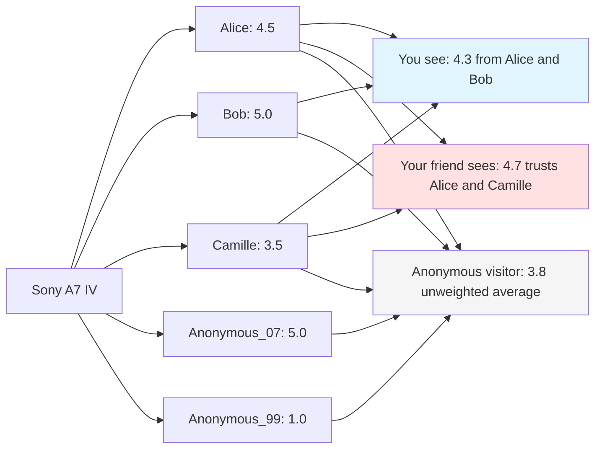
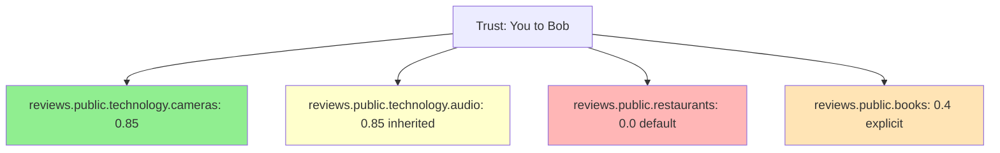
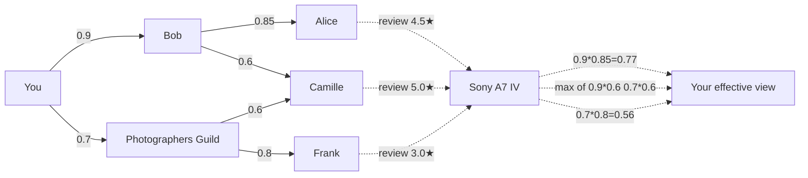
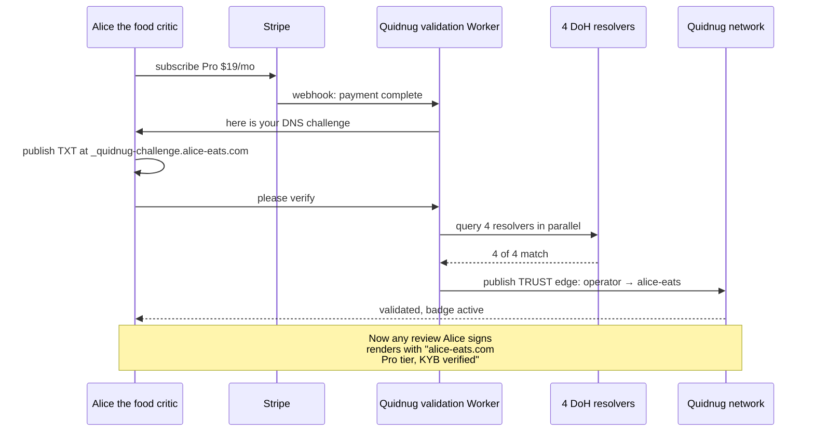
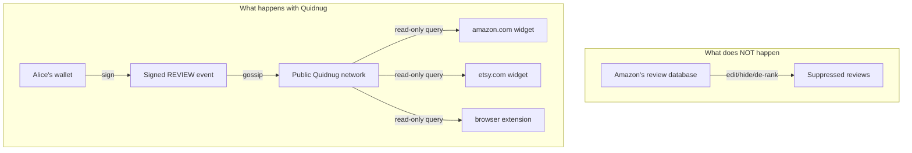

# Quidnug trust-weighted reviews: designer package

> A single-link, self-contained brief. Read top-to-bottom or
> jump to a section via the table of contents. Everything you
> need to start designing is in this file. Cross-references
> point to source material, but you should not need to chase
> any of them to understand the work.

**Audience.** A senior product designer.
**Time budget for first read.** 60-90 minutes.
**Format.** Markdown rendered on GitHub. Mermaid diagrams,
inline SVG, and ASCII wireframes all render natively.
**Contact.** Brian Mortimore, founder, bhmortim@gmail.com.

---

## Table of contents

- [Section 0. TL;DR](#section-0-tldr)
- [Section 1. What you're being asked to design](#section-1-what-youre-being-asked-to-design)
- [Section 2. Why this is interesting design work](#section-2-why-this-is-interesting-design-work)
- [Section 3. The problem (visceral)](#section-3-the-problem-visceral)
- [Section 4. What changes mechanically](#section-4-what-changes-mechanically)
- [Section 5. The complete data inventory](#section-5-the-complete-data-inventory)
- [Section 6. Surfaces and audiences](#section-6-surfaces-and-audiences)
- [Section 7. Six design tensions](#section-7-six-design-tensions)
- [Section 8. Six design directions](#section-8-six-design-directions)
- [Section 9. Wireframes: 8 priority surfaces](#section-9-wireframes-8-priority-surfaces)
- [Section 10. Component primitives library](#section-10-component-primitives-library)
- [Section 11. Open questions for you](#section-11-open-questions-for-you)
- [Section 12. The ask: what we want from you](#section-12-the-ask-what-we-want-from-you)
- [Section 13. Reference material](#section-13-reference-material)
- [Glossary](#glossary)

---

## Section 0. TL;DR

Quidnug is a public protocol for cryptographically-signed,
portable, trust-weighted reviews. It produces ratings that
differ per observer (because trust is personal), are scoped
to topics (Bob is trusted on cameras, not restaurants), and
carry verifiable credentials (the reviewer's
DNS-validated identity, helpfulness history, sponsorship
disclosure).

We need a UI/visual language that:

1. **Glances like a five-star rating** to people who don't
   want to think about it.
2. **Reveals the trust mechanic** to people who are curious.
3. **Stays legible** when embedded in hostile contexts
   (Amazon, WordPress, mobile, browser extension overlay).

The ask in three bullets:

- A coherent visual system covering the headline rating
  primitive, reviewer card, single-review card, and trust
  drilldown.
- An interactive prototype of the "why this rating?" moment
  (the most novel surface).
- Provocative pushback: where you think our framing is wrong.

Skim sections 0-3, study sections 7-9 to react to opinions,
return to section 5-6 when designing specific surfaces.

---

## Section 1. What you're being asked to design

A visual language for **trust-weighted reviews**: a system
where two readers loading the same product page see
different rating numbers, both honest from their own
viewpoints, plus the supporting UI that makes that not feel
broken.

Concretely, eight high-value surfaces:



S4 is the novelty surface (red): it's where the per-observer
mechanic has to land for the user. S1-S3 are the high-volume
surfaces (blue): every page view. S5 is the wedge (orange):
the way casual readers first encounter Quidnug, on top of
existing review sites. S6-S7 are the writer surfaces (green).
S8 is retention (purple).

---

## Section 2. Why this is interesting design work

Most review UIs solved their problem in 1996. Five stars,
"verified purchase," helpful/not-helpful. The shape has not
moved in 30 years because the underlying data has not moved.

Quidnug has new data:

- **Per-observer ratings.** The same product shows 4.3 to
  you, 3.7 to your friend. Both correct.
- **Topical trust.** Reviewers earn reputation per-vertical,
  not in aggregate.
- **Transitive trust paths.** "You trust Bob, Bob trusts
  Alice on cameras, her review counts at 0.68."
- **Verified identity** without crypto-anxiety.
  alice-eats.com is a real domain belonging to a real person
  who can be sued under their real name.
- **Append-only signed events.** No platform can edit, hide,
  or de-rank a review.

Each one of these breaks something about the existing UI
shape. A designer who solves all five at once produces a
visual language that becomes the default for a decade. The
opportunity is comparable to defining what a "Like" button
looks like in 2009 or what a "verified" checkmark means in
2018.

---

## Section 3. The problem (visceral)

**Existing review UIs are not just dated, they are
structurally captured by perverse incentives.**

The platforms that run them earn money in proportion to
transaction volume. Fake reviews drive transactions. The
platform's incentive to police fraud is weaker than the
seller's incentive to commit it. Internal fraud detection
plateaus at the level where consumer trust stays high enough
to keep the marketplace open, not at the level that protects
honest sellers.

### Sized in dollars

- **$152B** in annual US purchasing decisions are influenced
  by fake reviews, per the FTC's 2024 review-fraud rule.
- **30%** of Amazon's review reservoir is suspect at any
  time, per Amazon's own court filings.
- **15-40%** of Google Maps reviews on competitive verticals
  (lawyers, dentists, tourist-zone restaurants) are paid or
  coerced, per independent audits.
- **Multi-billion-dollar** annual scale for "brushing"
  (sending empty boxes to fake addresses to forge
  verified-purchase labels), per the FTC and Reuters.

### Sized in design implication

Every star rating you see online is a **lossy summary of a
graph that was never honestly assembled**. The five stars
have no way to express:

- "These reviews come from your community," vs. "from a bot
  net in Vladivostok."
- "These reviewers know cameras," vs. "these are people who
  reviewed everything from cookware to trucks last Tuesday."
- "This 4.5 has a tight distribution," vs. "this 4.5 is half
  fives and half ones."

Quidnug provides the data. The design challenge is showing
it without overwhelming the user.

---

## Section 4. What changes mechanically

Five concrete shifts. Each one breaks an assumption baked
into existing review UIs.

### 4.1 Per-observer weighting

There is no global rating. Every observer computes their own,
based on their trust graph.



**Design implication.** "4.3 stars" can no longer be the
universal headline. Every rating shows up with a frame: "for
you," "everyone," or "anonymous." The frame must be visible
without dominating.

### 4.2 Topical trust scoping

Trust is per-vertical. Bob is trusted on cameras at 0.85,
restaurants at 0.0 (you've never asked him for restaurant
advice), books at 0.4.



Light-yellow indicates "inherited from parent topic at decay
0.8 per hop."

**Design implication.** A reviewer's credibility badge must
be topic-aware. Alice as a restaurant reviewer is not the
same Alice as a camera reviewer; her credentials surface
must reflect the topic context.

### 4.3 Transitive trust with decay

You don't have to know every reviewer. You inherit trust
through paths.



**Design implication.** The "why this rating?" surface needs
to make these paths legible. Not as a research paper, but as
"Bob's friend's friend, a Tokyo food blogger, gave this 4
stars."

### 4.4 DNS-anchored identity (the credibility floor)

Reviewers and sites can stake real-world domains as their
identity. Lose the domain, lose the rep.



**Design implication.** The reviewer card has to communicate
identity tiers (none / OIDC / Pro / Business+KYB / Partner)
in a way that maps to "how much should I trust this person"
without making the user think about cryptography.

### 4.5 Append-only signed events

Reviews are not stored in the platform's database. They are
signed events on a public network. The platform is a
viewport.



**Design implication.** Edits exist (as appended new events
that supersede), but they are visible. The UI should make
the audit-trail nature feel like a feature, not a paranoia
indicator.

---

## Section 5. The complete data inventory

Every field that might appear on some surface. Designers pick
subsets per surface.

### 5A. The rating itself

| Field                    | Type             | Notes                                               |
|--------------------------|------------------|-----------------------------------------------------|
| Per-observer rating      | float 0-5        | Headline number for this observer                   |
| Anonymous baseline       | float 0-5        | What anyone without a wallet sees                   |
| Personalization delta    | signed float     | Per-observer minus baseline                         |
| Confidence               | 0-100% or label  | How many distinct trust paths fed this number       |
| Polarization             | low / mid / high | Spread of contributor ratings                       |
| Distribution histogram   | array            | Star buckets, weighted                              |
| Recency profile          | timeline         | How old the underlying reviews are                  |

### 5B. Topical context

| Field                | Type             | Notes                                            |
|----------------------|------------------|--------------------------------------------------|
| Topic domain         | string           | "reviews.public.technology.cameras"              |
| Display name         | string           | "Cameras" or "NYC restaurants"                   |
| Ancestors            | array            | Breadcrumb up to root                            |
| Sibling topics       | array            | Other topics this product could fit              |

### 5C. Reviewer credentials

| Field                 | Type            | Notes                                          |
|-----------------------|-----------------|------------------------------------------------|
| Display name          | string          | "alice-eats.com" or pseudonym                  |
| Validated domain      | string or null  | If Pro/Business validated                      |
| Validation tier       | enum            | none / Free / Pro / Business / Partner         |
| KYB status            | bool            | Legal entity verified, Business+               |
| OIDC provider         | string or null  | "Google" / "GitHub" if onboarded that way      |
| Tenure                | date            | First review                                   |
| Reviews in topic      | integer         | Volume in this topic root                      |
| Helpfulness ratio     | 0-1             | Helpful votes from trusted observers           |
| Last activity         | duration        | "active 4 days ago"                            |
| Reputation tier       | enum            | "Top 1% in cameras" / "established" / "new"    |
| Cross-imported       | array           | "247 reviews imported from Amazon"             |

### 5D. Trust path

| Field                         | Type     | Notes                                       |
|-------------------------------|----------|---------------------------------------------|
| Trust source                  | enum     | direct / 2-hop / 3-hop / baseline           |
| Path summary                  | string   | "via Bob (0.68)"                            |
| Path length                   | integer  | 1, 2, 3+                                    |
| Path weight                   | 0-1      | Effective trust after decay                 |
| Alternate paths               | integer  | "+4 other paths reach this reviewer"        |
| Highest-weight intermediary   | reviewer | The most-trusted-by-you who vouches         |

### 5E. Single review

| Field                  | Type            | Notes                                     |
|------------------------|-----------------|-------------------------------------------|
| Timestamp              | ISO datetime    | When written                              |
| Rating                 | float 0-5       | Reviewer's score                          |
| Title                  | string          | Optional headline                         |
| Body                   | markdown        | The text                                  |
| Media                  | array           | Photos, video, audio (signed)             |
| Verified purchase      | bool            | PURCHASE attestation present              |
| Sponsorship disclosure | object or null  | Sponsor, payment, terms                   |
| Edit history           | array           | Append-only edits                         |
| Helpfulness votes      | object          | trusted-yes/no, anonymous-yes/no          |
| Flag state             | object or null  | Moderator flags (if any trusted)          |
| Reply thread           | nested          | Comments and replies                      |

### 5F. Action affordances

| Action                       | Required state            |
|------------------------------|---------------------------|
| Vote helpful / not helpful   | observer signed in        |
| Write a review               | observer signed in        |
| Trust this reviewer manually | observer signed in        |
| Mute this reviewer           | observer signed in        |
| Flag for moderation          | observer signed in        |
| Trust drill-down             | always                    |
| Compare to anonymous         | always                    |
| Subscribe to reviewer        | observer signed in        |
| Share / quote                | always                    |
| Report to support            | always                    |

---

## Section 6. Surfaces and audiences

Same data, different surfaces, different audiences:

| Surface                          | Anonymous reader  | Signed-in reader      | Reviewer       | Site operator      |
|----------------------------------|-------------------|-----------------------|----------------|--------------------|
| S1. Inline product rating        | baseline only     | per-observer + delta  | own visible    | aggregate metrics  |
| S2. Reviewer card                | name + tier       | + your trust path     | own card       | flagging tools     |
| S3. Single review (full)         | full              | + your relevance      | + edit/respond | + moderation       |
| S4. Trust drilldown              | sign in to use    | full graph view       | own incoming   | n/a                |
| S5. Browser-ext overlay          | baseline          | per-observer          | n/a            | n/a                |
| S6. Compose form                 | n/a               | n/a                   | full           | n/a                |
| S7. Reviewer profile             | public history    | + your trust          | own profile    | + moderation       |
| S8. Email digest                 | n/a               | new from your trust   | new responses  | site activity      |
| S9. Search rich result           | aggregate static  | n/a                   | n/a            | n/a                |
| S10. Comparison view             | side-by-side      | per-observer columns  | own across     | n/a                |
| S11. Operator dashboard          | n/a               | n/a                   | n/a            | KPIs, moderation   |

---

## Section 7. Six design tensions

Trade-offs to resolve. Some choices conflict; pick a coherent
stance.

### Tension 1: Richness vs. simplicity

The data above is huge. Showing all of it is overwhelming.
Hiding all of it makes Quidnug look like Amazon with extra
steps. Healthy resolution: progressive disclosure. Headline
glances in 1 second; one tap reveals trust path; second tap
reveals constellation; data-dense view for power users.

### Tension 2: Novelty vs. familiarity

"My friend sees 4.6, I see 4.1" can read as "this site is
broken." Mitigation: always render anonymous baseline
alongside personalized rating. One-tap "what does the crowd
think?" toggle. First-encounter onboarding when delta is
significant.

### Tension 3: Trust signal vs. crypto-anxiety

We can show "TRUST edge from operators.alice-eats.com.network.quidnug.com
at level 0.95." Accurate. Off-putting. Translate
cryptographic facts into trust language: "alice-eats.com (Pro
tier, since 2026)." Hide the technical view; let power users
opt in.

### Tension 4: Universality across verticals

Same component must work for cameras, restaurants,
healthcare, books. Each has different review mores. Healthy:
vertical-specific theming layered on a universal core. Same
contracts, different chrome.

### Tension 5: Embedded in hostile contexts

Browser extension in a sliver of viewport on top of Amazon.
WordPress widget on a page styled by the site owner. Cannot
demand 800px or specific font. Strict CSS isolation (Shadow
DOM). Multiple sizes (`nano`, `compact`, `standard`,
`large`). System font stack with explicit fallbacks. Avoid
color-only signals.

### Tension 6: SEO and accessibility floor

Search-engine crawler needs a number, not animated SVG.
Screen-reader user navigates without seeing visual graph.
Color-blind user needs shape, not just hue. Every visual
emits Schema.org JSON-LD; every visual signal has redundant
text/shape; ARIA roles and live regions; meaningful content
even with CSS disabled.

---

## Section 8. Six design directions

Six coherent points of view. Pick one wholesale, mix two, or
beat them all.

### Direction A: "Five stars, plus one number"

Familiar star rating with a small chip showing per-observer
adjustment.

<svg width="220" height="80" viewBox="0 0 220 80" xmlns="http://www.w3.org/2000/svg">
  <text x="0" y="40" font-family="system-ui" font-size="28" fill="#FFA500">★★★★☆</text>
  <text x="135" y="40" font-family="system-ui" font-size="28" font-weight="bold" fill="#222">4.3</text>
  <rect x="0" y="55" width="80" height="20" rx="10" fill="#E0F2FE" stroke="#0284C7"/>
  <text x="40" y="69" font-family="system-ui" font-size="12" fill="#0284C7" text-anchor="middle">for you +0.4</text>
</svg>

**Elevates:** familiarity, glanceability, easy port to
existing review-shaped sites.
**Suppresses:** trust graph structure, topical scoping.
**Shines on:** browser-extension overlay (S5), WordPress
widget for non-crypto-curious audiences.

### Direction B: "Graph native"

Show the trust network as a literal small graph.

<svg width="320" height="120" viewBox="0 0 320 120" xmlns="http://www.w3.org/2000/svg">
  <circle cx="30" cy="60" r="14" fill="#0284C7"/>
  <text x="30" y="64" font-family="system-ui" font-size="12" fill="white" text-anchor="middle">you</text>
  <line x1="44" y1="60" x2="116" y2="60" stroke="#666" stroke-width="2"/>
  <text x="80" y="55" font-family="system-ui" font-size="10" fill="#666" text-anchor="middle">0.9</text>
  <circle cx="130" cy="60" r="14" fill="#10B981"/>
  <text x="130" y="64" font-family="system-ui" font-size="12" fill="white" text-anchor="middle">Bob</text>
  <line x1="144" y1="60" x2="216" y2="60" stroke="#666" stroke-width="2"/>
  <text x="180" y="55" font-family="system-ui" font-size="10" fill="#666" text-anchor="middle">0.85</text>
  <circle cx="230" cy="60" r="14" fill="#F59E0B"/>
  <text x="230" y="64" font-family="system-ui" font-size="12" fill="white" text-anchor="middle">Alice</text>
  <text x="265" y="64" font-family="system-ui" font-size="14" fill="#222">4.5★</text>
  <text x="160" y="105" font-family="system-ui" font-size="11" fill="#888" text-anchor="middle">effective: 0.9 × 0.85 = 0.77</text>
</svg>

**Elevates:** the network structure, why personalization
exists.
**Suppresses:** simple legibility, fast scanning.
**Shines on:** trust drilldown (S4), expanded reviewer card
(S2).

### Direction C: "Bloomberg terminal"

Dense grid of facts. For data-oriented audiences.

```
┌────────────────────────────────────────┐
│ Sony A7 IV                             │
│ ──────────────────────────             │
│ For you  4.32  Δ +0.31  conf 78%       │
│ Crowd    4.01  ─       conf 92%       │
│ ──────────────────────────             │
│ 247 reviews · 14 trusted · 3.1y old   │
│ ▂▃▄▆█  histogram (your weight)         │
│ ──────────────────────────             │
│ Top voices  weight  trust path         │
│ alice-eats   0.68   you→Bob→Alice      │
│ camerareview 0.51   you→guild→cr       │
│ jdoe.eth     0.34   operator-baseline  │
└────────────────────────────────────────┘
```

**Elevates:** total information density.
**Suppresses:** approachability, brand warmth.
**Shines on:** operator dashboard (S11), expert-witness
profile (S7 power-user mode).

### Direction D: "Narrative voice"

Sentences instead of numbers.

> Five reviewers you trust have rated this camera. Most of
> them (Alice, Bob, Camille) give it 4 to 5 stars; one is
> more cautious (Dan: 3 stars). For you, the camera averages
> to a 4.3. The crowd at large gives it 4.0.

**Elevates:** approachability, low number-anxiety.
**Suppresses:** at-a-glance comparison, terseness.
**Shines on:** email digests (S8), mobile-compact, first-time
onboarding (S4).

### Direction E: "Trust paths as the headline"

Chain of who-trusts-whom is primary; the number is
secondary.

<svg width="380" height="100" viewBox="0 0 380 100" xmlns="http://www.w3.org/2000/svg">
  <rect x="2" y="2" width="376" height="96" rx="8" fill="#FFFBEB" stroke="#F59E0B"/>
  <text x="20" y="30" font-family="system-ui" font-size="14" fill="#78350F">via Bob (cameras 0.85) and 3 others</text>
  <text x="20" y="65" font-family="system-ui" font-size="32" fill="#FFA500">★★★★☆</text>
  <text x="180" y="65" font-family="system-ui" font-size="32" font-weight="bold" fill="#222">4.3</text>
  <text x="240" y="65" font-family="system-ui" font-size="14" fill="#666">for you</text>
  <text x="20" y="88" font-family="system-ui" font-size="11" fill="#888">tap to see all 4 paths</text>
</svg>

**Elevates:** social proof structure, the explicit "why."
**Suppresses:** the rating value itself.
**Shines on:** reviewer card (S2), trust drilldown (S4),
comparison view (S10).

### Direction F: "Ambient signal" (existing aurora family)

Abstract visual primitives encoding multiple dimensions in
shape, color, motion.

<svg width="300" height="120" viewBox="0 0 300 120" xmlns="http://www.w3.org/2000/svg">
  <text x="40" y="20" font-family="system-ui" font-size="11" fill="#666">aurora</text>
  <circle cx="50" cy="60" r="14" fill="#10B981"/>
  <circle cx="50" cy="60" r="28" fill="none" stroke="#10B981" stroke-width="3" stroke-dasharray="6 3"/>
  <text x="50" y="100" font-family="system-ui" font-size="11" fill="#222" text-anchor="middle">4.3 ★</text>
  
  <text x="135" y="20" font-family="system-ui" font-size="11" fill="#666">constellation</text>
  <circle cx="150" cy="60" r="32" fill="none" stroke="#ddd"/>
  <circle cx="150" cy="60" r="20" fill="none" stroke="#ddd"/>
  <circle cx="150" cy="60" r="10" fill="none" stroke="#ddd"/>
  <circle cx="158" cy="55" r="3" fill="#10B981"/>
  <circle cx="142" cy="65" r="4" fill="#F59E0B"/>
  <circle cx="170" cy="58" r="2" fill="#10B981"/>
  <circle cx="135" cy="48" r="3" fill="#EF4444"/>
  <circle cx="178" cy="72" r="2" fill="#10B981"/>
  
  <text x="240" y="20" font-family="system-ui" font-size="11" fill="#666">trace</text>
  <circle cx="220" cy="60" r="6" fill="#0284C7"/>
  <line x1="226" y1="60" x2="244" y2="60" stroke="#666"/>
  <circle cx="250" cy="60" r="6" fill="#10B981"/>
  <line x1="256" y1="60" x2="274" y2="60" stroke="#666"/>
  <circle cx="280" cy="60" r="6" fill="#F59E0B"/>
</svg>

**Elevates:** distinctive visual identity, multi-dimensional
encoding in small space.
**Suppresses:** explicit numerical comparison, immediate
legibility for new users.
**Shines on:** brand mark of Quidnug-powered reviews,
hero ratings on detail pages, marketing.

### Mixing

The strongest design probably mixes 2-3 directions across
surfaces. A starting hypothesis to react to:

- **A** on browser-extension overlay (familiar context).
- **F** as brand mark in hero areas of detail pages.
- **B/E** in trust drilldown (where education is welcome).
- **D** in email and mobile-compact.
- **C** only on operator dashboard.

Build one underlying token/layout system that renders all
five and let consumers pick mode per context.

---

## Section 9. Wireframes: 8 priority surfaces

ASCII wireframes describe layout and information hierarchy,
not visual style. Translate to your visual language.

### S1. Inline product-page rating

```
NANO (≤80px wide; product grid card)
─────────────────────
 ◉ 4.3
─────────────────────

COMPACT (≤240px wide; list view)
────────────────────────────────
 ◉ 4.3 ★  for you  +0.4
 (247 reviews · 14 you-trust)
────────────────────────────────

LARGE (full-width hero on detail page)
────────────────────────────────────────────
 ◉◌                 4.3
                    For you (Sony A7 IV)
                    +0.4 vs. crowd · 78% confidence

 247 reviews · 14 from people you trust · 3.1y of history
 ▂▃▄▆█  weighted-for-you distribution
 [why this rating?] [see crowd view] [write a review]
────────────────────────────────────────────
```

### S2. Reviewer card

```
COMPACT (inside a review)
──────────────────────────────────────
 alice-eats.com ✓Pro · KYB
 Restaurants in NYC · 247 reviews · 4d ago
 You trust her: via Bob (0.68 effective)
──────────────────────────────────────

EXPANDED (on hover or in profile preview)
─────────────────────────────────────────────────────
 alice-eats.com  ✓ Pro-tier  ✓ KYB verified
 ─────────────────────────────────────────
 247 reviews · helpful 87% · active 4d ago · since 2026
 Topics: Restaurants (NYC, JP), Books (food writing)
 ─────────────────────────────────────────
 Trust paths from you:
   direct: not yet (you can [trust] her)
   via:   Bob (you 0.9 → Bob 0.85 → Alice = 0.68)
          Photographers Guild (you 0.7 → guild 0.6 → Alice = 0.42)
 ─────────────────────────────────────────
 [trust]  [follow]  [her profile]  [mute]
─────────────────────────────────────────────────────
```

### S3. Single review card (full)

The atomic unit of content. Most-viewed surface.

```
─────────────────────────────────────────────────────
 alice-eats.com  ✓Pro KYB  ★★★★½  4.5
 Restaurants in NYC · 4 days ago · verified meal · sponsored: no
 ─────────────────────────────────────────
 # Crisp acidity, careful service
 
 The chef's tasting menu is built around seasonal
 brassicas, and the wine pairings show genuine wit
 (a 2018 Soave with the cabbage course made me smile).
 
 Service was attentive without hovering; we were 
 there 2.5 hours and never felt rushed.
 ─────────────────────────────────────────
 [📷 4 photos] [🎧 1 audio note]
 ─────────────────────────────────────────
 87 found this helpful (12 from people you trust)
 [helpful] [not helpful] [reply] [share]
 ─────────────────────────────────────────
 You trust this reviewer via Bob and 2 others.
 [why this rating?]
─────────────────────────────────────────────────────
```

Note "sponsored: no" is always present, never absent. A
sponsored review reads "sponsored: yes (acmebrand.com paid
$200 · disclosed)."

### S4. Trust drilldown ("why this rating?")

The novelty surface. Modal or full-page.

```
─────────────────────────────────────────────────────
 Why your Sony A7 IV rating is 4.3 (vs crowd's 4.0)
 ─────────────────────────────────────────
 14 reviewers contribute weight from your view:
 
 [interactive graph here]
 
   you ●─────────► Bob ●────────► Alice ●  4.5★
                       └────────► Camille ●  5.0★
                       
        ●──────► Photographers Guild ●─────► Dan ●  3.0★
                                       └───► Eve ●  4.5★
        
        ●──────► (operator-baseline) ───► 8 more ●●●●●●●●  avg 4.1★
 ─────────────────────────────────────────
 What moves the number for you:
   + 4 of your direct trust voices average 4.4
   + 3 reviewers via Bob average 4.6
   - 1 reviewer via Guild gave it 3.0 (Dan; he hates the autofocus)
 ─────────────────────────────────────────
 Compare to the crowd's 4.0 (everyone, equal weight)
 [show crowd view]   [adjust your trust]
─────────────────────────────────────────────────────
```

### S5. Browser-extension overlay

Lives on top of Amazon, Yelp, Google Maps. Tight space.
Glanceable in <2 seconds. Direction A core.

```
COLLAPSED (~60×24px next to existing site rating)
──────────────────────────
 ◉ 4.3 for you  ▾
──────────────────────────

EXPANDED (~280×360px popover when clicked)
────────────────────────────────────
 Sony A7 IV
 ─────────────────────────
 Quidnug for you:  4.3 ★
 Quidnug crowd:    4.0 ★
 Amazon shows:     4.5 ★ (247 reviews)
                   ↑ 30% of these flagged suspicious
                     by Quidnug auditors

 14 reviewers in your trust graph contribute.
 Top: alice-eats (0.68w), Bob (0.55w)

 [see full breakdown on quidnug.com]
 [write a review here]
────────────────────────────────────
```

The "30% flagged suspicious" is the wedge: Quidnug overlays
audit data on top of Amazon's existing reviews, exposing the
fake-review tax.

### S6. Review compose form

Where reviewers do the work. Friction = fewer reviews.

```
─────────────────────────────────────────────────────
 Reviewing: Sony A7 IV
 Camera, made by Sony · ASIN B0BJZ123 · Schema.org match ✓
 ─────────────────────────────────────────
 Topic: Cameras (suggested)
 [cameras  ▾]  not this? [restaurants] [audio] [other]
 ─────────────────────────────────────────
 Your rating:
 ★★★★☆ ☆           4 of 5
 ─────────────────────────────────────────
 Title: [______________________________________]
 ─────────────────────────────────────────
 Review:
 ┌──────────────────────────────────────────┐
 │                                            │
 │                                            │
 │  Markdown supported                        │
 └──────────────────────────────────────────┘
 [📷 add photo] [🎧 add audio]
 ─────────────────────────────────────────
 Disclosure: 
 ( ) Not sponsored
 ( ) Sponsored or comped (you'll disclose details)
 ( ) I work for the maker / sell this product
 ─────────────────────────────────────────
 Sign with: alice-eats.com (Pro tier, signed-in via wallet)
 [post review]   [save draft]
─────────────────────────────────────────────────────
```

Disclosure radio is required (no default), forcing explicit
answer. "Sign with" shows reviewer who they're publishing as.

### S7. Reviewer profile page

The professional reviewer's home.

```
─────────────────────────────────────────────────────
 alice-eats.com  ✓Pro  ✓KYB  since 2026-04-12
 ─────────────────────────────────────────
 247 reviews · helpfulness 87% · active 4 days ago
 ─────────────────────────────────────────
 Topics:
   Restaurants (NYC, JP)         182 reviews   avg 4.1
   Books (food writing)           41 reviews   avg 4.4
   Travel (food destinations)     24 reviews   avg 3.8
 ─────────────────────────────────────────
 Trust from you:
   You don't directly trust Alice.
   You reach her via Bob (cameras: 0.85) at 0.68 weight.
   [trust directly]
 ─────────────────────────────────────────
 Recent reviews
   ★★★★☆  Le Bernardin — 2026-04-21
   ★★★★½  Joji Wine Bar — 2026-04-15
   ★★★☆☆  Pinch Chinese — 2026-04-08
   [more →]
 ─────────────────────────────────────────
 Cross-imported history:
   247 reviews from Yelp (verified by alice-eats.com 2026-03-15)
 ─────────────────────────────────────────
 [follow]  [trust on a topic]  [send tip]  [contact]
─────────────────────────────────────────────────────
```

"Send tip" reflects new economic role: pay reviewers
directly.

### S8. Email digest

Direction D. Once a week or per-event.

```
Subject: This week in your trust graph

   Bob (someone you trust on cameras) wrote a 5-star
   review of the Sony A7 IV. He notes the autofocus
   has improved noticeably in firmware 1.20.
   → Read

   Three reviewers you trust on restaurants visited
   spots in Tokyo last week. Average rating: 4.4.
   Top spot: a 9-seat counter in Yoyogi-Uehara.
   → See all three

   The Photographers Guild added Camille (camille.photo)
   as a member; you transitively trust her now (0.42
   effective). 47 of her past reviews are now visible
   in your feed.
   → Welcome Camille

[manage subscriptions]  [trust settings]  [unsubscribe]
```

---

## Section 10. Component primitives library

Atomic components used across surfaces. Build once, reuse.

| Component                     | Purpose                                                            | Variants                       |
|-------------------------------|--------------------------------------------------------------------|--------------------------------|
| Rating mark                   | Single visual representation of a rating value                     | nano, compact, standard, large |
| Personalization chip          | "+0.4 for you" / "for you" / "everyone" indicator                  | positive, negative, neutral    |
| Confidence indicator          | How solid the underlying graph is                                  | low, mid, high; or % bar       |
| Polarization indicator        | Whether contributors agree                                         | tight, mid, wide               |
| Trust path summary            | "via Bob (0.68)" / "directly" / "operator baseline"                | direct, transitive, baseline   |
| Reviewer credential badge     | Pro / Business / KYB / OIDC tier with tooltip                      | tier-specific                  |
| Disclosure ribbon             | "sponsored: yes/no" prominently placed on every review             | mandatory presence             |
| Verified-purchase mark        | Distinct from validation tier; about a specific PURCHASE event     | validated / unvalidated        |
| Topic breadcrumb              | "Technology > Cameras > DSLR" or "Restaurants in NYC"              | full, abbreviated              |
| Helpfulness counter           | Trusted-by-you / total split                                       | with optional drilldown        |
| Flag indicator                | When a moderator you trust has flagged                             | warning, hidden-by-default     |
| Reviewer name lockup          | Display name + validated domain + tier badge                       | full, compact                  |

---

## Section 11. Open questions for you

We don't have answers yet. Push back if our framing is
wrong.

1. **First-encounter onboarding.** When a logged-in user
   sees a rating noticeably different from the anonymous
   baseline for the first time, do we surface that actively
   (modal, banner) or wait for them to ask? Both have
   failure modes.

2. **Trust-path privacy.** Showing "via Bob" reveals Bob is
   in the user's trust graph to anyone with shoulder view.
   Acceptable trade-off, or should we degrade gracefully
   ("via 3 trusted contacts" without names by default)?

3. **Polarization signal weight.** A 4.3 rating where
   contributors range 1-5 is meaningfully different from a
   4.3 where they range 4-5. First-class glanceable signal,
   or power-user detail?

4. **Cross-vertical reviewer identity.** Alice writes
   restaurant reviews and tech reviews. Should her card
   render the same in both contexts, or specialize per-topic
   ("Alice on restaurants" vs "Alice on cameras")?

5. **Sponsored-review treatment.** Fold into main flow with
   clear ribbon? Show in separate "sponsored" tab? Hide
   unless user opts in?

6. **Cold-start anonymous experience.** A first-time visitor
   with no wallet sees only anonymous baseline. How do we
   communicate "personalize this" without nagging?

7. **Mobile constraints.** A trust-path graph on 320px is
   nearly unusable. Collapse to Direction D narrative?
   Sparser variant?

8. **Aesthetic.** Quidnug's brand currently reads
   "serious crypto-protocol" (dark mode, monospace,
   technical). Does the consumer review UI inherit that, or
   present a warmer face?

9. **Density on operator dashboard.** Direction C is most
   information-dense, but is it the right paradigm? Inherit
   from financial trading, dev tools (Datadog, Grafana), CRM
   (Salesforce, HubSpot), or invent?

10. **Negative space.** Where do we leave room for things
    we haven't designed yet? Future-proof slots: video
    reviews, debate threads, expert-witness CV exports,
    brand response letters.

---

## Section 12. The ask: what we want from you

In priority order. Anything in this set moves us forward.

1. **A coherent visual language proposal** (1-2 directions
   or a hybrid). High-fidelity mocks of the headline rating
   primitive at all four sizes (nano, compact, standard,
   large).
2. **Mocks of S1, S2, S3, S4** in the chosen language.
3. **Animated/interactive prototype of the trust drilldown
   (S4)** showing the why-this-rating moment. This is
   the surface where the novelty has to land. We'd rather
   have one great prototype here than ten static screens.
4. **A component spec sheet** covering the primitives in
   Section 10 with tokens (color, type, spacing) and
   accessibility notes.
5. **Mobile variants** of S1 and S3.
6. **Browser-extension overlay (S5)** at expanded and
   collapsed.
7. **Email digest template (S8)** with copywriting hints.
8. **Provocative reactions to Section 11's open
   questions:** where you'd push back on our framing.

Innovation beyond this brief is welcome. If you see the
problem fundamentally differently, the brief is wrong, not
you.

### Format & medium

- We work in Figma. A single Figma file shared with the
  Quidnug team is ideal. Frames named per surface (S1, S2,
  ...) help us cross-reference.
- For the animated prototype: Figma prototype mode is fine,
  Principle/Rive/After-Effects fine, a recorded screen
  capture is fine. Whatever lets you express the motion.
- A short Loom (5-10 min) walking us through your reasoning
  is more valuable than 50 pages of static rationale.

### Timeline

We'd like a first conversation within 2 weeks of you reading
this, mocks for S1-S4 within 4 weeks of that, and the
prototype + component spec within 8 weeks. We can flex on
all of this; the date pressure is "before mid-summer 2026,
when we're trying to launch the public network."

### Compensation

Discuss with Brian (bhmortim@gmail.com). Options:
- Fixed-price project for the deliverables above.
- Hourly with a cap.
- Equity-tilted arrangement (Quidnug LLC will be formed in
  the next 4-6 weeks; pre-formation it's contractor work
  with the LLC as named successor counter-party).
- Combination.

---

## Section 13. Reference material

### Real-world precedents

Not for direct copying. Anchor expectations.

| Reference                          | What's relevant                                                      |
|------------------------------------|----------------------------------------------------------------------|
| [Substack post header](https://substack.com) | Author + tier + paywall in compact lockup. Reviewer card analogue. |
| [Stripe dashboard](https://stripe.com)       | Dense data without coldness. Color use restrained. Charts as supporting material. |
| [Linear issue cards](https://linear.app)     | Information hierarchy in tight space. Hover-to-expand patterns.     |
| [Goodreads review](https://www.goodreads.com)| Long-form reading with reviewer credibility.                       |
| Bloomberg terminal                            | Direction C exemplar.                                               |
| Apple App Store reviews                       | Five stars + verified purchase + helpfulness. Shape consumers expect. |
| [Wirecutter article](https://www.nytimes.com/wirecutter/) | Editorial trust at the publication level.                |
| Reddit comment trees                          | Threaded reply patterns; voting that visibly reorders.              |
| [Bandcamp purchase page](https://bandcamp.com)| Verified-purchase shown without crypto-aesthetic; warm.            |
| [Mastodon profile cards](https://joinmastodon.org) | Federated identity rendered approachably.                     |
| GitHub commit graph                           | Visualizing activity over time without overwhelming.                |

### Source material in this repo

If you want to go deeper. Each is self-contained.

- [`UseCases/trust-weighted-reviews/README.md`](../../UseCases/trust-weighted-reviews/README.md) — the strategic case (market size, attack catalog).
- [`UseCases/trust-weighted-reviews/architecture.md`](../../UseCases/trust-weighted-reviews/architecture.md) — system design (how the network works).
- [`UseCases/trust-weighted-reviews/threat-model.md`](../../UseCases/trust-weighted-reviews/threat-model.md) — fifteen attacks and mitigations.
- [`examples/reviews-and-comments/PROTOCOL.md`](../../examples/reviews-and-comments/PROTOCOL.md) — QRP-0001, the wire protocol.
- [`examples/reviews-and-comments/algorithm.md`](../../examples/reviews-and-comments/algorithm.md) — the rating algorithm.
- [`examples/reviews-and-comments/bootstrap-trust.md`](../../examples/reviews-and-comments/bootstrap-trust.md) — how new reviewers build trust.
- [`docs/reviews/rating-visualization.md`](rating-visualization.md) — existing aurora/constellation/trace primitives.
- [`docs/design/0023-dns-anchored-attestation.md`](../design/0023-dns-anchored-attestation.md) — QDP-0023, the DNS validation spec.

You do not need to read any of these to do the design work.
This package is designed to be sufficient on its own.

### Where to ask questions

- Primary: **Brian Mortimore**, bhmortim@gmail.com.
- Working repo: github.com (link will be provided when shared
  privately).
- Live demo of the existing widget family: [examples/reviews-and-comments/demo/](../../examples/reviews-and-comments/demo/).

---

## Glossary

For your reference. We've translated cryptographic terms into
plain language here so you don't need a separate doc.

| Term                   | Plain meaning                                                                        |
|------------------------|--------------------------------------------------------------------------------------|
| Quid                   | A reviewer's unique identity (a 16-character ID). Users never type it.               |
| Trust edge             | "I trust X at level Y on topic Z." A signed assertion.                              |
| Topic / domain         | Hierarchical category like "reviews.public.technology.cameras."                      |
| Per-observer rating    | The rating a specific user sees, weighted by their trust graph.                     |
| Anonymous baseline     | The rating any visitor sees without a wallet; operator-rooted weighting.            |
| Personalization delta  | Per-observer minus baseline. The "for you" adjustment.                              |
| Confidence             | How many distinct trust paths fed the rating.                                       |
| Polarization           | Spread of contributor ratings; "trusted sources agree vs split."                    |
| Trust path             | Chain of edges: you → Bob → Alice → review.                                         |
| Validation tier        | Quidnug's commercial product. Free / Pro / Business / Partner.                      |
| KYB                    | Know-your-business: legal-entity verification (Stripe Identity etc.).               |
| OIDC bridge            | "Sign in with Google" path that mints a custodial quid.                             |
| Validated domain       | A domain (alice-eats.com) the reviewer has cryptographically tied to.               |
| Disclosure             | First-class event marking a review as sponsored, comped, or affiliated.             |
| PURCHASE attestation   | Signed event by a validated seller confirming an actual transaction.                |
| Aurora / constellation / trace | Existing visual primitives in `rating-visualization.md`; one option of many. |

---

## End of brief

Total page count if printed: roughly 30 pages. Estimated read
time end-to-end: 75-90 minutes. You can ignore everything
after Section 9 and still produce excellent work; later
sections are reference.

Thank you for reading. We're excited to see what you make.

Brian Mortimore
bhmortim@gmail.com
